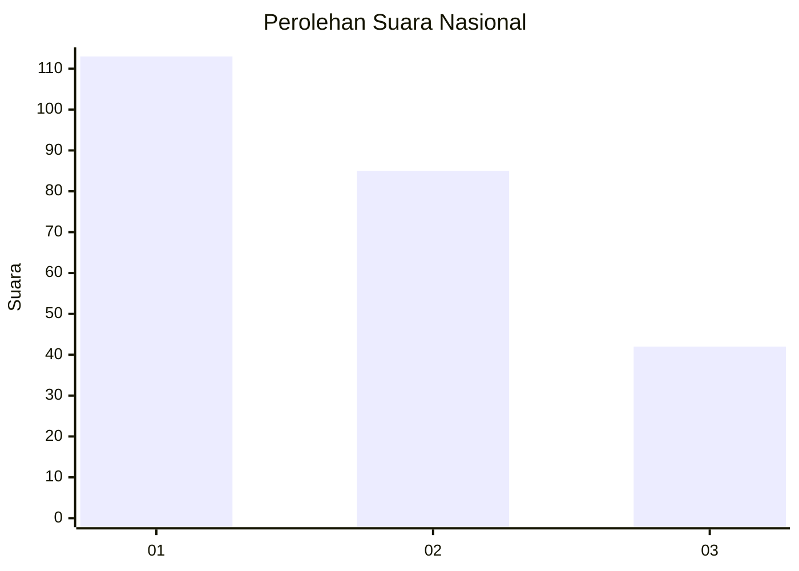
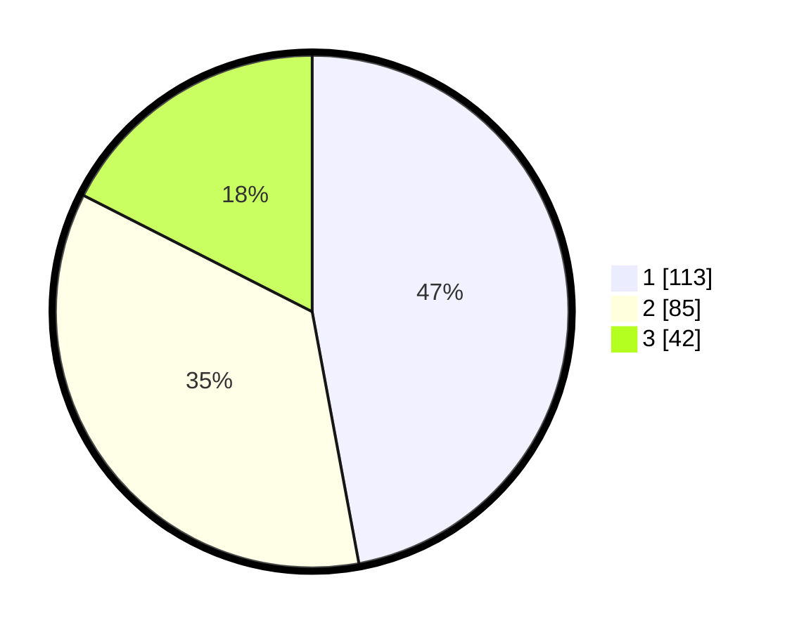

# Hasil

## Grafik

## Tabel

| No.    | Nama Paslon    | Suara | Suara (raw) | Persentase |
|:------ |:-------------- | -----:| -----------:| ----------:|
| 100025 | ANIES MUHAIMIN | 113   | [113][p-1]  | 47,08      |
| 100026 | PRABOWO GIBRAN | 85    | [85][p-2]   | 35,42      |
| 100027 | GANJAR MAHFUD  | 42    | [42][p-3]   | 17,50      |

[p-1]: https://github.com/gigit-pemilu/pemilu-2024/blob/main/pilpres/hitung-suara/sub/31-dki-jakarta/sub/75-jakarta-timur/sub/01-matraman/sub/1003-kayu-manis/sub/014-tps/sub/paslon-1.txt
[p-2]: https://github.com/gigit-pemilu/pemilu-2024/blob/main/pilpres/hitung-suara/sub/31-dki-jakarta/sub/75-jakarta-timur/sub/01-matraman/sub/1003-kayu-manis/sub/014-tps/sub/paslon-2.txt
[p-3]: https://github.com/gigit-pemilu/pemilu-2024/blob/main/pilpres/hitung-suara/sub/31-dki-jakarta/sub/75-jakarta-timur/sub/01-matraman/sub/1003-kayu-manis/sub/014-tps/sub/paslon-3.txt

## Foto C Plano

https://sirekap-obj-formc.kpu.go.id/808a/pemilu/ppwp/31/75/01/10/03/3175011003014-20240229-211754--5133c549-48d4-4b18-9e6d-75c11cf7c8f1.jpg

https://sirekap-obj-formc.kpu.go.id/808a/pemilu/ppwp/31/75/01/10/03/3175011003014-20240215-020722--152e5134-853a-4dfa-b81a-805343a6491e.jpg

https://sirekap-obj-formc.kpu.go.id/808a/pemilu/ppwp/31/75/01/10/03/3175011003014-20240215-022604--35a1d1ee-a3a5-49c9-b330-472e890ea2ba.jpg

## Metadata

| Key        | Value               |
| ---------- | ------------------- |
| Time Stamp | 2024-02-29 22:00:00 |

