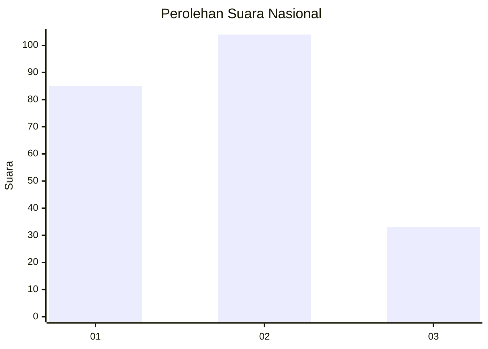
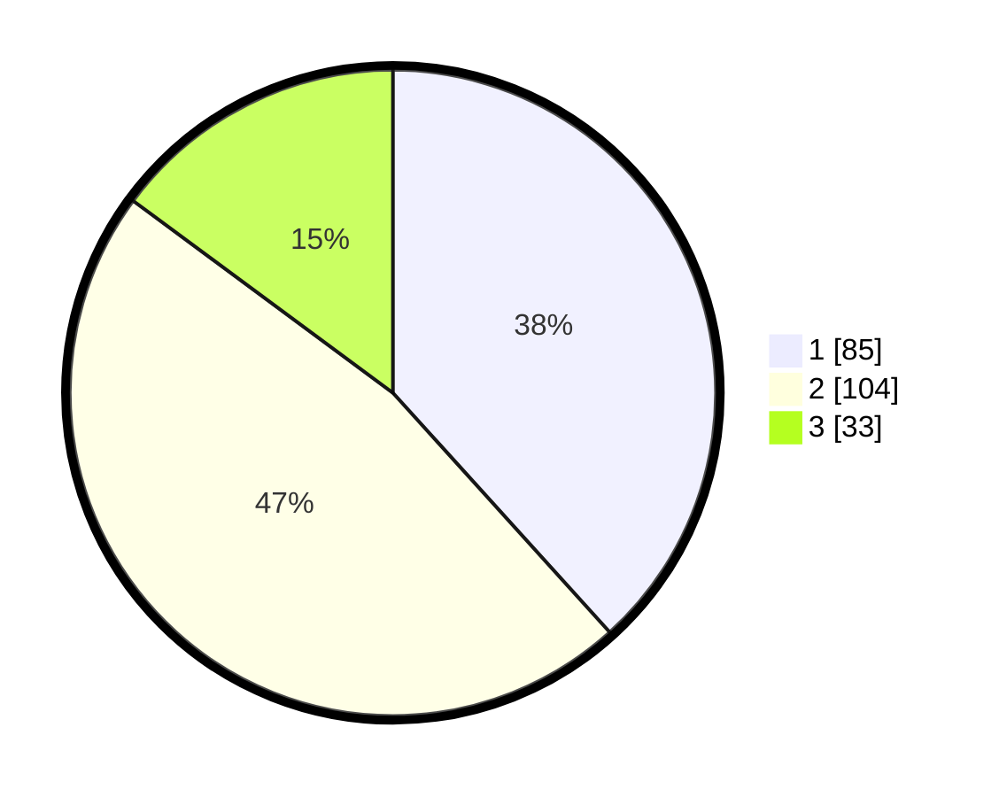

# Hasil

## Grafik

## Tabel

| No.    | Nama Paslon    | Suara | Suara (raw) | Persentase |
|:------ |:-------------- | -----:| -----------:| ----------:|
| 100025 | ANIES MUHAIMIN | 85    | [85][p-1]   | 38,29      |
| 100026 | PRABOWO GIBRAN | 104   | [104][p-2]  | 46,85      |
| 100027 | GANJAR MAHFUD  | 33    | [33][p-3]   | 14,86      |

[p-1]: https://github.com/gigit-pemilu/pemilu-2024/blob/main/pilpres/hitung-suara/sub/31-dki-jakarta/sub/75-jakarta-timur/sub/01-matraman/sub/1003-kayu-manis/sub/029-tps/sub/paslon-1.txt
[p-2]: https://github.com/gigit-pemilu/pemilu-2024/blob/main/pilpres/hitung-suara/sub/31-dki-jakarta/sub/75-jakarta-timur/sub/01-matraman/sub/1003-kayu-manis/sub/029-tps/sub/paslon-2.txt
[p-3]: https://github.com/gigit-pemilu/pemilu-2024/blob/main/pilpres/hitung-suara/sub/31-dki-jakarta/sub/75-jakarta-timur/sub/01-matraman/sub/1003-kayu-manis/sub/029-tps/sub/paslon-3.txt

## Foto C Plano

https://sirekap-obj-formc.kpu.go.id/dc02/pemilu/ppwp/31/75/01/10/03/3175011003029-20240214-201959--241c375c-c70f-4fda-9d7b-96c5231d857a.jpg

https://sirekap-obj-formc.kpu.go.id/dc02/pemilu/ppwp/31/75/01/10/03/3175011003029-20240214-202003--4005c3de-454a-4009-8f67-5630d0e3e32c.jpg

https://sirekap-obj-formc.kpu.go.id/dc02/pemilu/ppwp/31/75/01/10/03/3175011003029-20240214-202007--2d5e051f-3f9d-4c87-8763-f2b9c544f818.jpg

## Metadata

| Key        | Value               |
| ---------- | ------------------- |
| Time Stamp | 2024-02-15 15:30:25 |

