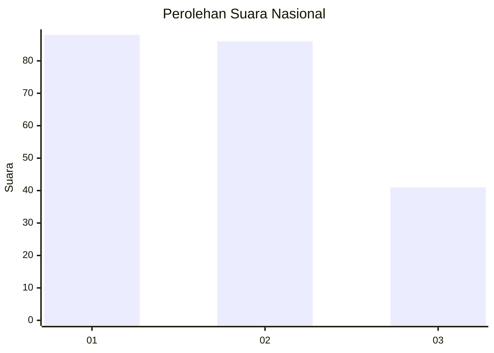
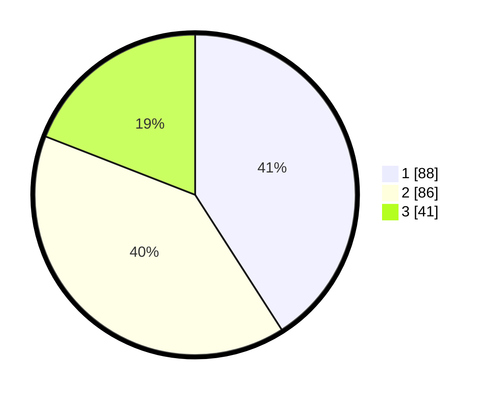

# Hasil

## Grafik

## Tabel

| No.    | Nama Paslon    | Suara | Suara (raw) | Persentase |
|:------ |:-------------- | -----:| -----------:| ----------:|
| 100025 | ANIES MUHAIMIN | 88    | [88][p-1]   | 40,93      |
| 100026 | PRABOWO GIBRAN | 86    | [86][p-2]   | 40,00      |
| 100027 | GANJAR MAHFUD  | 41    | [41][p-3]   | 19,07      |

[p-1]: https://github.com/gigit-pemilu/pemilu-2024/blob/main/pilpres/hitung-suara/sub/31-dki-jakarta/sub/75-jakarta-timur/sub/01-matraman/sub/1003-kayu-manis/sub/036-tps/sub/paslon-1.txt
[p-2]: https://github.com/gigit-pemilu/pemilu-2024/blob/main/pilpres/hitung-suara/sub/31-dki-jakarta/sub/75-jakarta-timur/sub/01-matraman/sub/1003-kayu-manis/sub/036-tps/sub/paslon-2.txt
[p-3]: https://github.com/gigit-pemilu/pemilu-2024/blob/main/pilpres/hitung-suara/sub/31-dki-jakarta/sub/75-jakarta-timur/sub/01-matraman/sub/1003-kayu-manis/sub/036-tps/sub/paslon-3.txt

## Foto C Plano

https://sirekap-obj-formc.kpu.go.id/5685/pemilu/ppwp/31/75/01/10/03/3175011003036-20240214-221523--491a6a1b-5a89-48d5-adde-fca6b6ffe098.jpg

https://sirekap-obj-formc.kpu.go.id/5685/pemilu/ppwp/31/75/01/10/03/3175011003036-20240214-215705--2c044b80-14e8-4981-8734-2cb53c00d62e.jpg

https://sirekap-obj-formc.kpu.go.id/5685/pemilu/ppwp/31/75/01/10/03/3175011003036-20240214-215828--498e3ab8-f735-4f90-8577-78559c6bb6fe.jpg

## Metadata

| Key        | Value               |
| ---------- | ------------------- |
| Time Stamp | 2024-02-16 21:01:00 |

