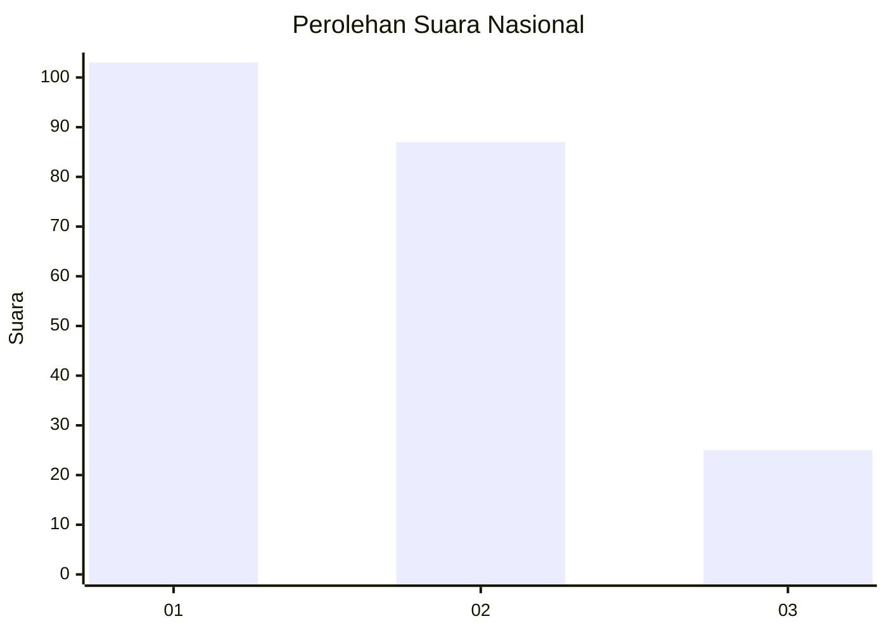
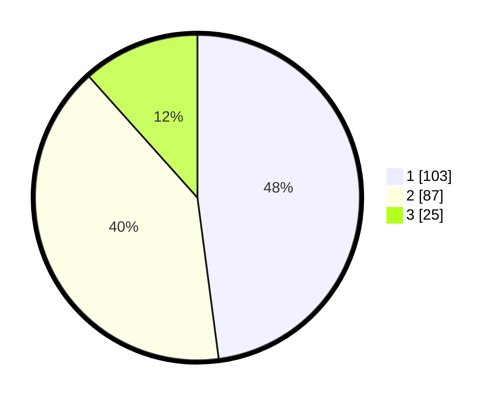

# Hasil

## Grafik

## Tabel

| No.    | Nama Paslon    | Suara | Suara (raw) | Persentase |
|:------ |:-------------- | -----:| -----------:| ----------:|
| 100025 | ANIES MUHAIMIN | 103   | [103][p-1]  | 47,91      |
| 100026 | PRABOWO GIBRAN | 87    | [87][p-2]   | 40,47      |
| 100027 | GANJAR MAHFUD  | 25    | [25][p-3]   | 11,63      |

[p-1]: https://github.com/gigit-pemilu/pemilu-2024/blob/main/pilpres/hitung-suara/sub/31-dki-jakarta/sub/75-jakarta-timur/sub/01-matraman/sub/1003-kayu-manis/sub/037-tps/sub/paslon-1.txt
[p-2]: https://github.com/gigit-pemilu/pemilu-2024/blob/main/pilpres/hitung-suara/sub/31-dki-jakarta/sub/75-jakarta-timur/sub/01-matraman/sub/1003-kayu-manis/sub/037-tps/sub/paslon-2.txt
[p-3]: https://github.com/gigit-pemilu/pemilu-2024/blob/main/pilpres/hitung-suara/sub/31-dki-jakarta/sub/75-jakarta-timur/sub/01-matraman/sub/1003-kayu-manis/sub/037-tps/sub/paslon-3.txt

## Foto C Plano

https://sirekap-obj-formc.kpu.go.id/fbc4/pemilu/ppwp/31/75/01/10/03/3175011003037-20240214-214615--f163affb-a0b6-420e-b980-c21d300f4608.jpg

https://sirekap-obj-formc.kpu.go.id/fbc4/pemilu/ppwp/31/75/01/10/03/3175011003037-20240214-214705--cd978874-4d53-4d78-9137-2429892c2354.jpg

https://sirekap-obj-formc.kpu.go.id/fbc4/pemilu/ppwp/31/75/01/10/03/3175011003037-20240214-214752--9e3bd801-9ae3-4aee-b237-7a333fc278d9.jpg

## Metadata

| Key        | Value               |
| ---------- | ------------------- |
| Time Stamp | 2024-02-16 14:30:33 |

