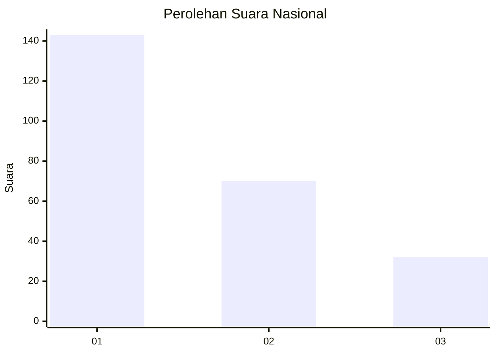
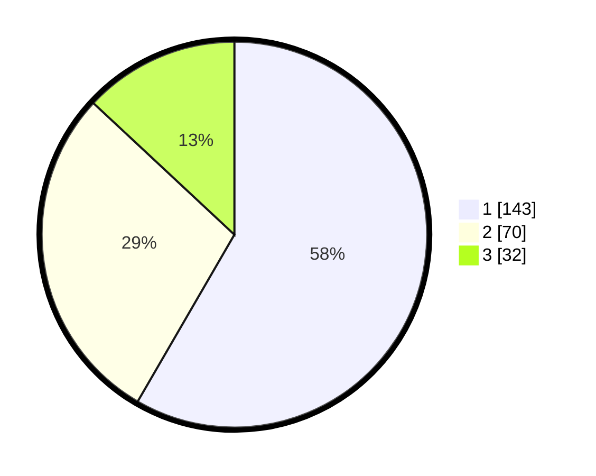

# Hasil

## Grafik

## Tabel

| No. | Nama Paslon    | Suara | Suara (raw) | Persentase |
|:--- |:-------------- | -----:| -----------:| ----------:|
| 1   | ANIES MUHAIMIN | 143   | [143][p-1]  | 58,37      |
| 2   | PRABOWO GIBRAN | 70    | [70][p-2]   | 28,57      |
| 3   | GANJAR MAHFUD  | 32    | [32][p-3]   | 13,06      |

[p-1]: https://github.com/gigit-pemilu/pemilu-2024/blob/main/pilpres/hitung-suara/sub/31-dki-jakarta/sub/75-jakarta-timur/sub/01-matraman/sub/1003-kayu-manis/sub/042-tps/sub/paslon-1.txt
[p-2]: https://github.com/gigit-pemilu/pemilu-2024/blob/main/pilpres/hitung-suara/sub/31-dki-jakarta/sub/75-jakarta-timur/sub/01-matraman/sub/1003-kayu-manis/sub/042-tps/sub/paslon-2.txt
[p-3]: https://github.com/gigit-pemilu/pemilu-2024/blob/main/pilpres/hitung-suara/sub/31-dki-jakarta/sub/75-jakarta-timur/sub/01-matraman/sub/1003-kayu-manis/sub/042-tps/sub/paslon-3.txt

## Foto C Plano

https://sirekap-obj-formc.kpu.go.id/6150/pemilu/ppwp/31/75/01/10/03/3175011003042-20240214-221620--9ea3a583-2935-4d5c-a6be-280acc7b11d2.jpg

https://sirekap-obj-formc.kpu.go.id/6150/pemilu/ppwp/31/75/01/10/03/3175011003042-20240214-221826--38d58f77-0ed9-4c76-a047-f7427819c7a1.jpg

https://sirekap-obj-formc.kpu.go.id/6150/pemilu/ppwp/31/75/01/10/03/3175011003042-20240214-221936--278169f0-c491-4e6b-9212-85c2e9fe8866.jpg

## Metadata

| Key        | Value               |
| ---------- | ------------------- |
| Time Stamp | 2024-02-15 15:00:29 |

