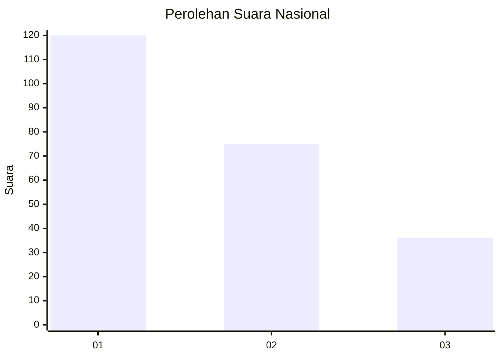
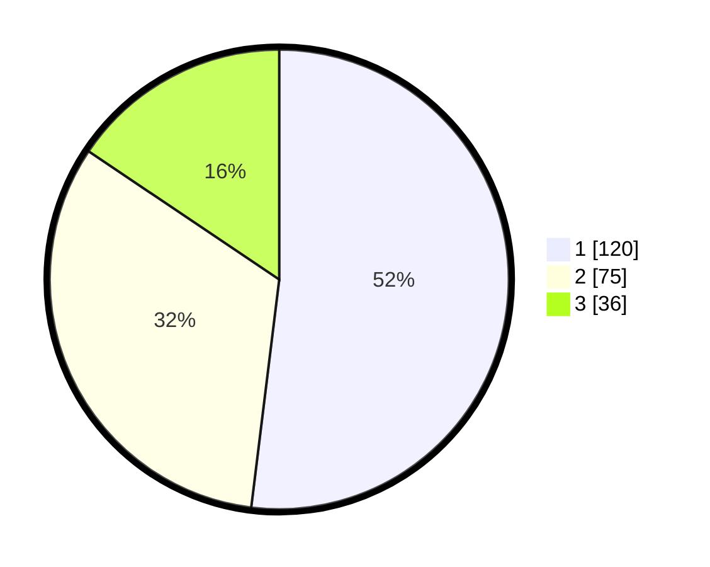

# Hasil

## Grafik

## Tabel

| No.    | Nama Paslon    | Suara | Suara (raw) | Persentase |
|:------ |:-------------- | -----:| -----------:| ----------:|
| 100025 | ANIES MUHAIMIN | 120   | [120][p-1]  | 51,95      |
| 100026 | PRABOWO GIBRAN | 75    | [75][p-2]   | 32,47      |
| 100027 | GANJAR MAHFUD  | 36    | [36][p-3]   | 15,58      |

[p-1]: https://github.com/gigit-pemilu/pemilu-2024/blob/main/pilpres/hitung-suara/sub/31-dki-jakarta/sub/75-jakarta-timur/sub/01-matraman/sub/1003-kayu-manis/sub/043-tps/sub/paslon-1.txt
[p-2]: https://github.com/gigit-pemilu/pemilu-2024/blob/main/pilpres/hitung-suara/sub/31-dki-jakarta/sub/75-jakarta-timur/sub/01-matraman/sub/1003-kayu-manis/sub/043-tps/sub/paslon-2.txt
[p-3]: https://github.com/gigit-pemilu/pemilu-2024/blob/main/pilpres/hitung-suara/sub/31-dki-jakarta/sub/75-jakarta-timur/sub/01-matraman/sub/1003-kayu-manis/sub/043-tps/sub/paslon-3.txt

## Foto C Plano

https://sirekap-obj-formc.kpu.go.id/ef70/pemilu/ppwp/31/75/01/10/03/3175011003043-20240214-204408--8f0405a2-4095-4263-9cbb-e3082c9539fd.jpg

https://sirekap-obj-formc.kpu.go.id/ef70/pemilu/ppwp/31/75/01/10/03/3175011003043-20240214-220901--b292efdf-f529-41b9-94c9-96d06a6f621f.jpg

https://sirekap-obj-formc.kpu.go.id/ef70/pemilu/ppwp/31/75/01/10/03/3175011003043-20240214-204615--fcfdbbea-71ba-48b0-8ad5-46a33267093e.jpg

## Metadata

| Key        | Value               |
| ---------- | ------------------- |
| Time Stamp | 2024-02-15 15:30:25 |

