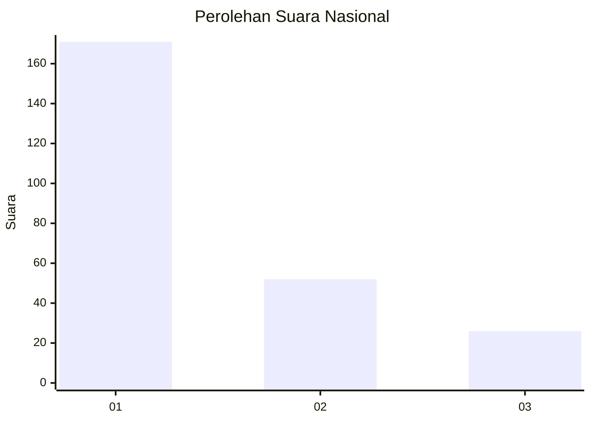
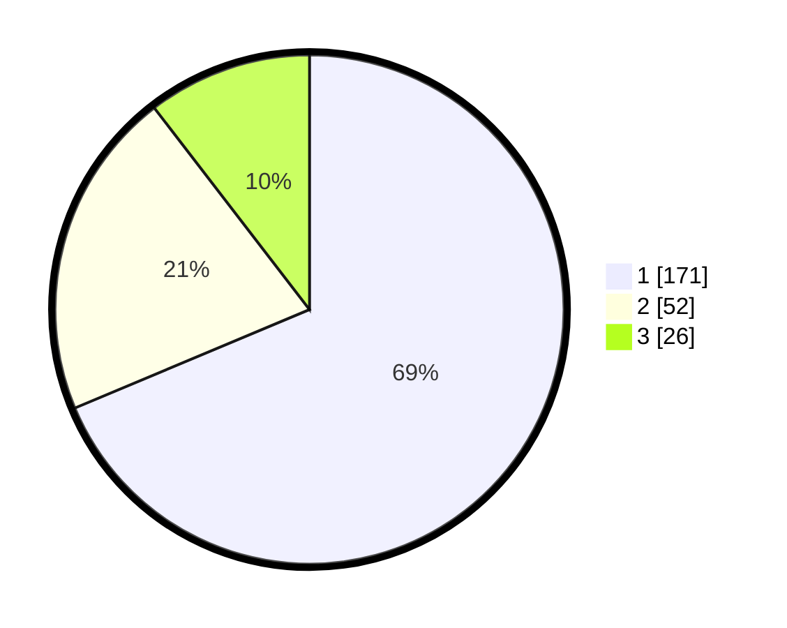

# Hasil

## Grafik

## Tabel

| No.    | Nama Paslon    | Suara | Suara (raw) | Persentase |
|:------ |:-------------- | -----:| -----------:| ----------:|
| 100025 | ANIES MUHAIMIN | 171   | [171][p-1]  | 68,67      |
| 100026 | PRABOWO GIBRAN | 52    | [52][p-2]   | 20,88      |
| 100027 | GANJAR MAHFUD  | 26    | [26][p-3]   | 10,44      |

[p-1]: https://github.com/gigit-pemilu/pemilu-2024/blob/main/pilpres/hitung-suara/sub/31-dki-jakarta/sub/75-jakarta-timur/sub/01-matraman/sub/1003-kayu-manis/sub/046-tps/sub/paslon-1.txt
[p-2]: https://github.com/gigit-pemilu/pemilu-2024/blob/main/pilpres/hitung-suara/sub/31-dki-jakarta/sub/75-jakarta-timur/sub/01-matraman/sub/1003-kayu-manis/sub/046-tps/sub/paslon-2.txt
[p-3]: https://github.com/gigit-pemilu/pemilu-2024/blob/main/pilpres/hitung-suara/sub/31-dki-jakarta/sub/75-jakarta-timur/sub/01-matraman/sub/1003-kayu-manis/sub/046-tps/sub/paslon-3.txt

## Foto C Plano

https://sirekap-obj-formc.kpu.go.id/a073/pemilu/ppwp/31/75/01/10/03/3175011003046-20240214-215901--44919773-6a05-4c70-94c6-7d27d212dc67.jpg

https://sirekap-obj-formc.kpu.go.id/a073/pemilu/ppwp/31/75/01/10/03/3175011003046-20240214-230433--a64fa616-9f58-42c3-996e-403b49a971e4.jpg

https://sirekap-obj-formc.kpu.go.id/a073/pemilu/ppwp/31/75/01/10/03/3175011003046-20240214-230559--5c8523e5-b12b-480d-baeb-40cf797c20b6.jpg

## Metadata

| Key        | Value               |
| ---------- | ------------------- |
| Time Stamp | 2024-02-15 15:30:25 |

