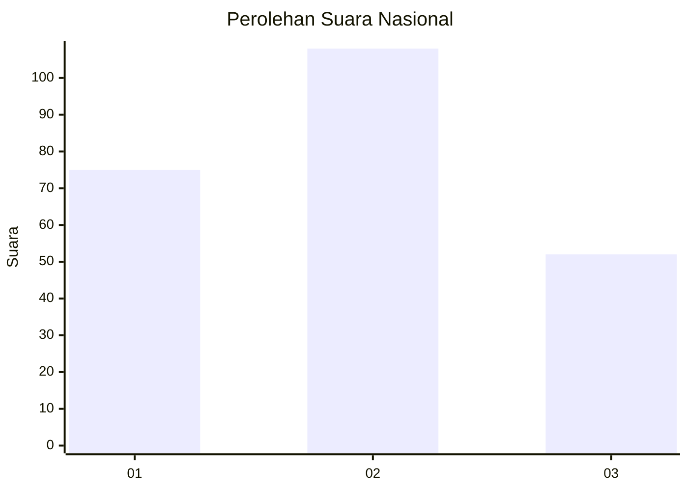
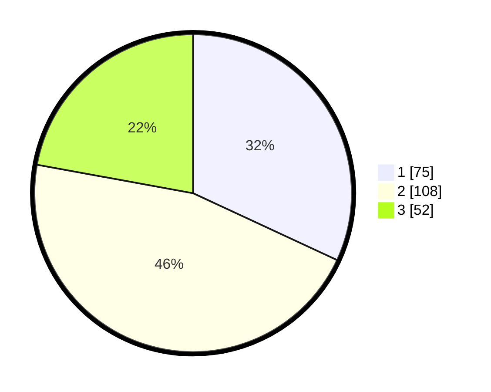

# Hasil

## Grafik

## Tabel

| No.    | Nama Paslon    | Suara | Suara (raw) | Persentase |
|:------ |:-------------- | -----:| -----------:| ----------:|
| 100025 | ANIES MUHAIMIN | 75    | [75][p-1]   | 31,91      |
| 100026 | PRABOWO GIBRAN | 108   | [108][p-2]  | 45,96      |
| 100027 | GANJAR MAHFUD  | 52    | [52][p-3]   | 22,13      |

[p-1]: https://github.com/gigit-pemilu/pemilu-2024/blob/main/pilpres/hitung-suara/sub/31-dki-jakarta/sub/75-jakarta-timur/sub/01-matraman/sub/1003-kayu-manis/sub/047-tps/sub/paslon-1.txt
[p-2]: https://github.com/gigit-pemilu/pemilu-2024/blob/main/pilpres/hitung-suara/sub/31-dki-jakarta/sub/75-jakarta-timur/sub/01-matraman/sub/1003-kayu-manis/sub/047-tps/sub/paslon-2.txt
[p-3]: https://github.com/gigit-pemilu/pemilu-2024/blob/main/pilpres/hitung-suara/sub/31-dki-jakarta/sub/75-jakarta-timur/sub/01-matraman/sub/1003-kayu-manis/sub/047-tps/sub/paslon-3.txt

## Foto C Plano

https://sirekap-obj-formc.kpu.go.id/9bde/pemilu/ppwp/31/75/01/10/03/3175011003047-20240214-162225--3dbfc04d-8355-49de-a2f6-ead2b899c490.jpg

https://sirekap-obj-formc.kpu.go.id/9bde/pemilu/ppwp/31/75/01/10/03/3175011003047-20240214-155518--50934ad3-3421-490b-a86a-5b76c9e03e8b.jpg

https://sirekap-obj-formc.kpu.go.id/9bde/pemilu/ppwp/31/75/01/10/03/3175011003047-20240214-155851--a64983c9-d09d-419d-aacf-6d4b95156a56.jpg

## Metadata

| Key        | Value               |
| ---------- | ------------------- |
| Time Stamp | 2024-02-15 17:30:25 |

