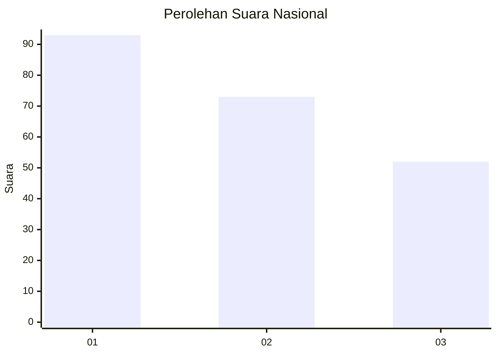
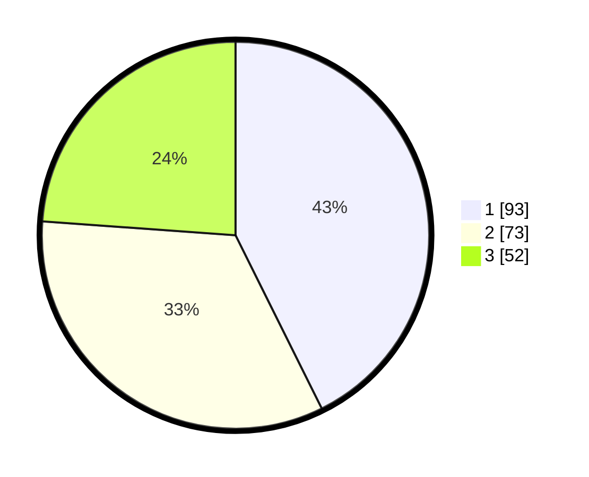

# Hasil

## Grafik

## Tabel

| No.    | Nama Paslon    | Suara | Suara (raw) | Persentase |
|:------ |:-------------- | -----:| -----------:| ----------:|
| 100025 | ANIES MUHAIMIN | 93    | [93][p-1]   | 42,66      |
| 100026 | PRABOWO GIBRAN | 73    | [73][p-2]   | 33,49      |
| 100027 | GANJAR MAHFUD  | 52    | [52][p-3]   | 23,85      |

[p-1]: https://github.com/gigit-pemilu/pemilu-2024/blob/main/pilpres/hitung-suara/sub/31-dki-jakarta/sub/75-jakarta-timur/sub/01-matraman/sub/1003-kayu-manis/sub/054-tps/sub/paslon-1.txt
[p-2]: https://github.com/gigit-pemilu/pemilu-2024/blob/main/pilpres/hitung-suara/sub/31-dki-jakarta/sub/75-jakarta-timur/sub/01-matraman/sub/1003-kayu-manis/sub/054-tps/sub/paslon-2.txt
[p-3]: https://github.com/gigit-pemilu/pemilu-2024/blob/main/pilpres/hitung-suara/sub/31-dki-jakarta/sub/75-jakarta-timur/sub/01-matraman/sub/1003-kayu-manis/sub/054-tps/sub/paslon-3.txt

## Foto C Plano

https://sirekap-obj-formc.kpu.go.id/42b0/pemilu/ppwp/31/75/01/10/03/3175011003054-20240214-211657--9c3d5d9d-4455-4ba9-a757-efe24ab5c51d.jpg

https://sirekap-obj-formc.kpu.go.id/42b0/pemilu/ppwp/31/75/01/10/03/3175011003054-20240214-203825--3ae81445-2953-4a83-a1b2-11752670e3e0.jpg

https://sirekap-obj-formc.kpu.go.id/42b0/pemilu/ppwp/31/75/01/10/03/3175011003054-20240214-211956--56e383da-45f2-4caa-a098-7c76f52249a1.jpg

## Metadata

| Key        | Value               |
| ---------- | ------------------- |
| Time Stamp | 2024-02-16 21:01:00 |

