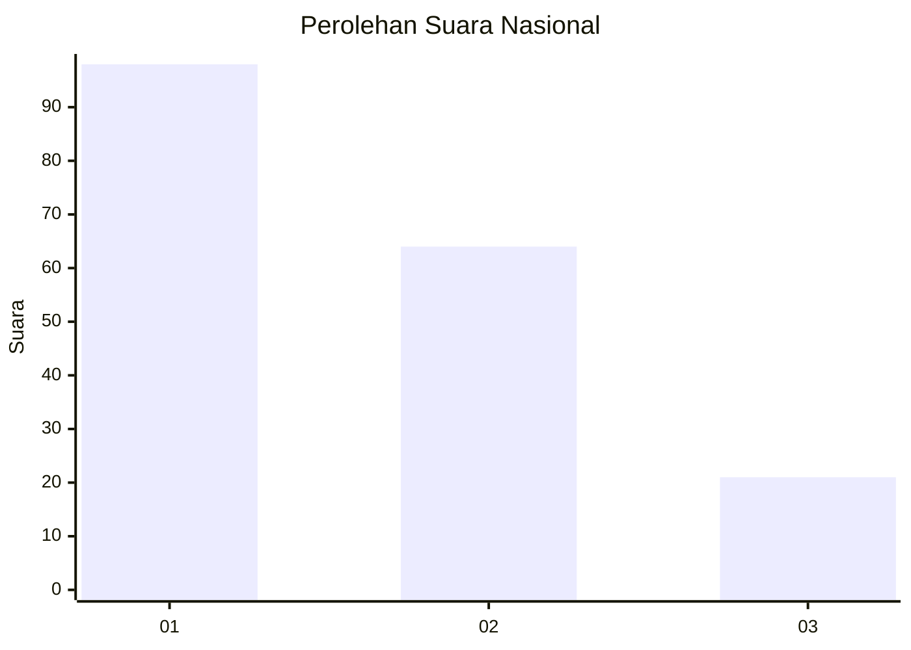
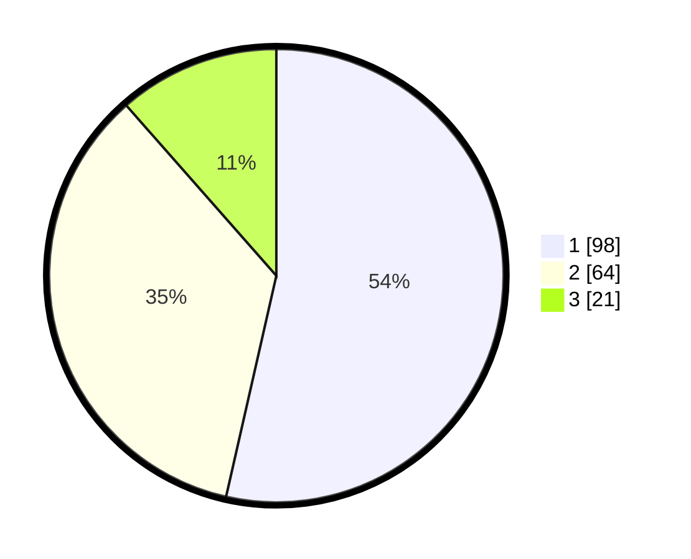

# Hasil

## Grafik

## Tabel

| No.    | Nama Paslon    | Suara | Suara (raw) | Persentase |
|:------ |:-------------- | -----:| -----------:| ----------:|
| 100025 | ANIES MUHAIMIN | 98    | [98][p-1]   | 53,55      |
| 100026 | PRABOWO GIBRAN | 64    | [64][p-2]   | 34,97      |
| 100027 | GANJAR MAHFUD  | 21    | [21][p-3]   | 11,48      |

[p-1]: https://github.com/gigit-pemilu/pemilu-2024/blob/main/pilpres/hitung-suara/sub/31-dki-jakarta/sub/75-jakarta-timur/sub/01-matraman/sub/1003-kayu-manis/sub/058-tps/sub/paslon-1.txt
[p-2]: https://github.com/gigit-pemilu/pemilu-2024/blob/main/pilpres/hitung-suara/sub/31-dki-jakarta/sub/75-jakarta-timur/sub/01-matraman/sub/1003-kayu-manis/sub/058-tps/sub/paslon-2.txt
[p-3]: https://github.com/gigit-pemilu/pemilu-2024/blob/main/pilpres/hitung-suara/sub/31-dki-jakarta/sub/75-jakarta-timur/sub/01-matraman/sub/1003-kayu-manis/sub/058-tps/sub/paslon-3.txt

## Foto C Plano

https://sirekap-obj-formc.kpu.go.id/3a69/pemilu/ppwp/31/75/01/10/03/3175011003058-20240214-200547--64ff92ad-0d05-482e-a027-e1e7d5d63768.jpg

https://sirekap-obj-formc.kpu.go.id/3a69/pemilu/ppwp/31/75/01/10/03/3175011003058-20240214-200312--1af24c54-1439-4d54-aea5-9fd122a0e779.jpg

https://sirekap-obj-formc.kpu.go.id/3a69/pemilu/ppwp/31/75/01/10/03/3175011003058-20240214-200430--325dcd24-cc3b-4db0-a924-25b3614e6236.jpg

## Metadata

| Key        | Value               |
| ---------- | ------------------- |
| Time Stamp | 2024-02-16 21:01:00 |

