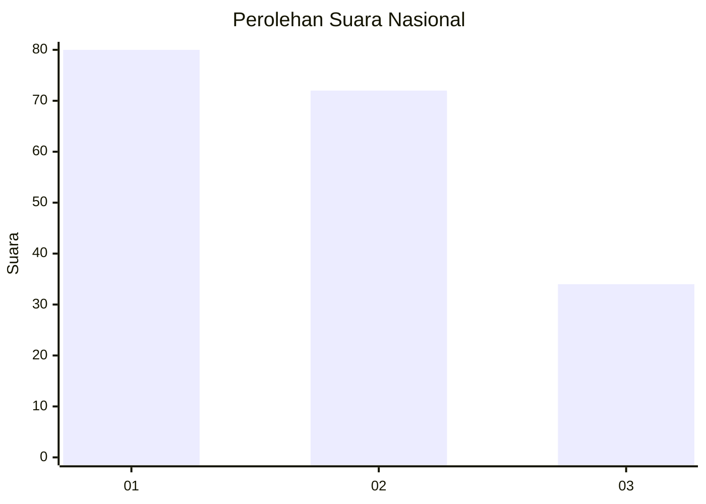
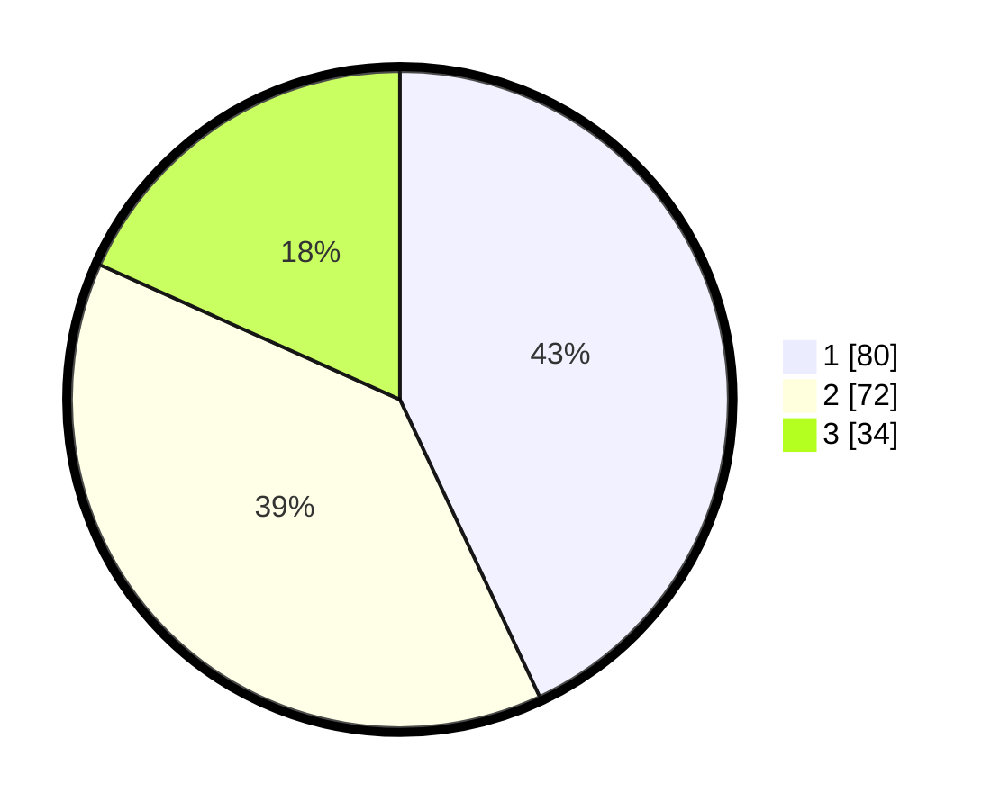

# Hasil

## Grafik

## Tabel

| No.    | Nama Paslon    | Suara | Suara (raw) | Persentase |
|:------ |:-------------- | -----:| -----------:| ----------:|
| 100025 | ANIES MUHAIMIN | 80    | [80][p-1]   | 43,01      |
| 100026 | PRABOWO GIBRAN | 72    | [72][p-2]   | 38,71      |
| 100027 | GANJAR MAHFUD  | 34    | [34][p-3]   | 18,28      |

[p-1]: https://github.com/gigit-pemilu/pemilu-2024/blob/main/pilpres/hitung-suara/sub/31-dki-jakarta/sub/75-jakarta-timur/sub/01-matraman/sub/1003-kayu-manis/sub/064-tps/sub/paslon-1.txt
[p-2]: https://github.com/gigit-pemilu/pemilu-2024/blob/main/pilpres/hitung-suara/sub/31-dki-jakarta/sub/75-jakarta-timur/sub/01-matraman/sub/1003-kayu-manis/sub/064-tps/sub/paslon-2.txt
[p-3]: https://github.com/gigit-pemilu/pemilu-2024/blob/main/pilpres/hitung-suara/sub/31-dki-jakarta/sub/75-jakarta-timur/sub/01-matraman/sub/1003-kayu-manis/sub/064-tps/sub/paslon-3.txt

## Foto C Plano

https://sirekap-obj-formc.kpu.go.id/15a7/pemilu/ppwp/31/75/01/10/03/3175011003064-20240214-203154--db4031a8-a78c-46f3-bf8c-e7e7a60f83c1.jpg

https://sirekap-obj-formc.kpu.go.id/15a7/pemilu/ppwp/31/75/01/10/03/3175011003064-20240214-203700--3e634c43-67aa-4f53-af03-819285d32ffa.jpg

https://sirekap-obj-formc.kpu.go.id/15a7/pemilu/ppwp/31/75/01/10/03/3175011003064-20240214-203838--7b53168a-99d9-476b-b093-27212d2a97ef.jpg

## Metadata

| Key        | Value               |
| ---------- | ------------------- |
| Time Stamp | 2024-02-16 21:01:00 |

