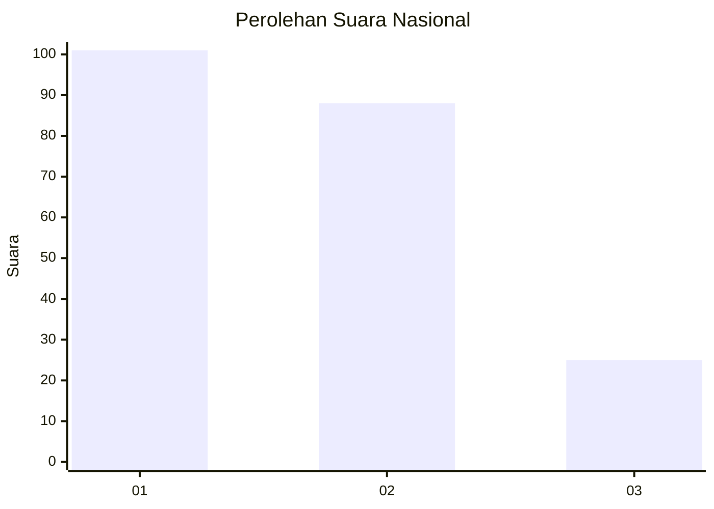
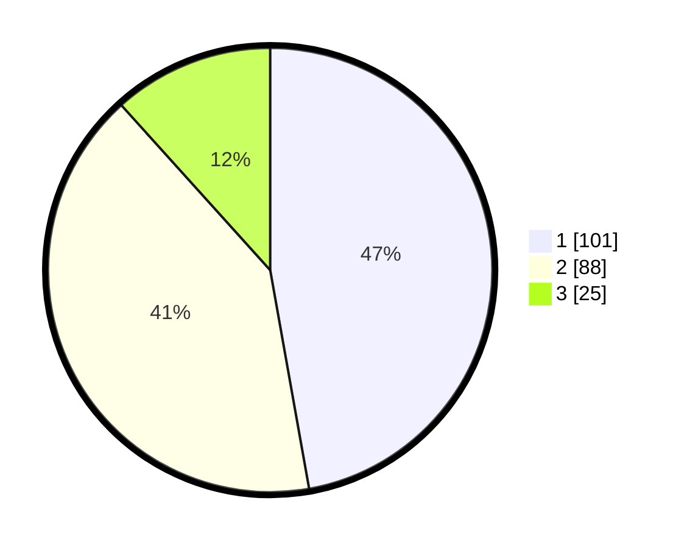

# Hasil

## Grafik

## Tabel

| No.    | Nama Paslon    | Suara | Suara (raw) | Persentase |
|:------ |:-------------- | -----:| -----------:| ----------:|
| 100025 | ANIES MUHAIMIN | 101   | [101][p-1]  | 47,20      |
| 100026 | PRABOWO GIBRAN | 88    | [88][p-2]   | 41,12      |
| 100027 | GANJAR MAHFUD  | 25    | [25][p-3]   | 11,68      |

[p-1]: https://github.com/gigit-pemilu/pemilu-2024/blob/main/pilpres/hitung-suara/sub/31-dki-jakarta/sub/75-jakarta-timur/sub/01-matraman/sub/1003-kayu-manis/sub/069-tps/sub/paslon-1.txt
[p-2]: https://github.com/gigit-pemilu/pemilu-2024/blob/main/pilpres/hitung-suara/sub/31-dki-jakarta/sub/75-jakarta-timur/sub/01-matraman/sub/1003-kayu-manis/sub/069-tps/sub/paslon-2.txt
[p-3]: https://github.com/gigit-pemilu/pemilu-2024/blob/main/pilpres/hitung-suara/sub/31-dki-jakarta/sub/75-jakarta-timur/sub/01-matraman/sub/1003-kayu-manis/sub/069-tps/sub/paslon-3.txt

## Foto C Plano

https://sirekap-obj-formc.kpu.go.id/9956/pemilu/ppwp/31/75/01/10/03/3175011003069-20240214-215524--396536cc-ecf2-4c70-ba38-1cac7cda6b8b.jpg

https://sirekap-obj-formc.kpu.go.id/9956/pemilu/ppwp/31/75/01/10/03/3175011003069-20240214-215647--3d41379e-f6b5-4eaf-aec2-2c5fb41c0ad2.jpg

https://sirekap-obj-formc.kpu.go.id/9956/pemilu/ppwp/31/75/01/10/03/3175011003069-20240214-215950--9589bb91-10f6-4e2d-a698-e391a42c5f85.jpg

## Metadata

| Key        | Value               |
| ---------- | ------------------- |
| Time Stamp | 2024-02-15 15:30:25 |

