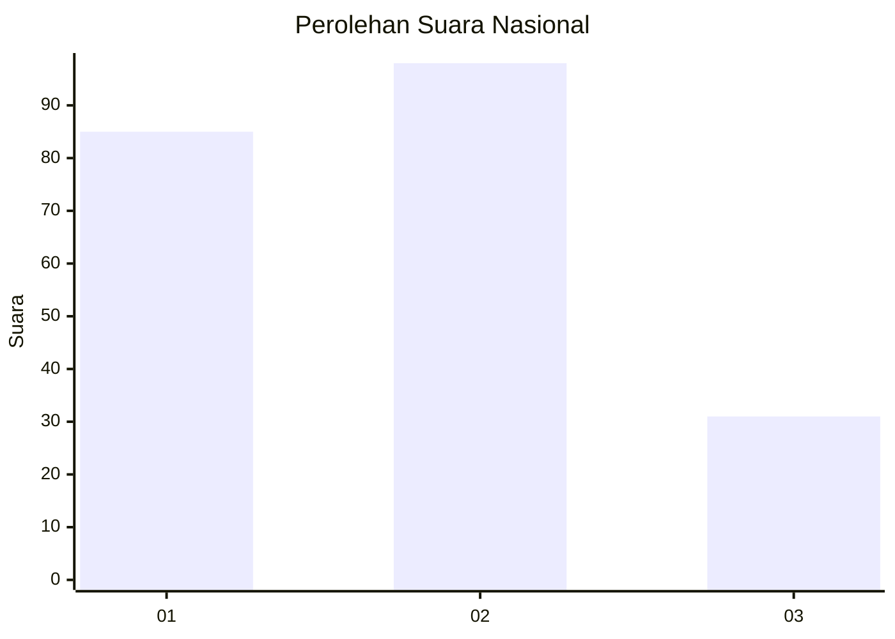
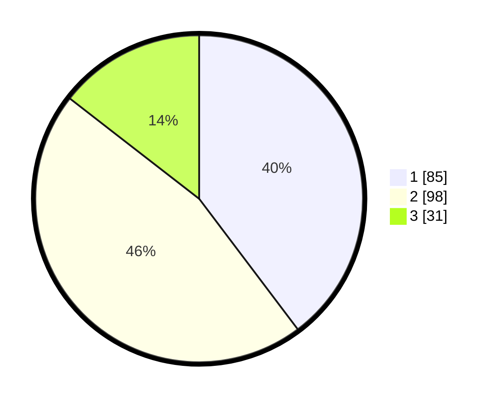

# Hasil

## Grafik

## Tabel

| No.    | Nama Paslon    | Suara | Suara (raw) | Persentase |
|:------ |:-------------- | -----:| -----------:| ----------:|
| 100025 | ANIES MUHAIMIN | 85    | [85][p-1]   | 39,72      |
| 100026 | PRABOWO GIBRAN | 98    | [98][p-2]   | 45,79      |
| 100027 | GANJAR MAHFUD  | 31    | [31][p-3]   | 14,49      |

[p-1]: https://github.com/gigit-pemilu/pemilu-2024/blob/main/pilpres/hitung-suara/sub/31-dki-jakarta/sub/75-jakarta-timur/sub/01-matraman/sub/1003-kayu-manis/sub/076-tps/sub/paslon-1.txt
[p-2]: https://github.com/gigit-pemilu/pemilu-2024/blob/main/pilpres/hitung-suara/sub/31-dki-jakarta/sub/75-jakarta-timur/sub/01-matraman/sub/1003-kayu-manis/sub/076-tps/sub/paslon-2.txt
[p-3]: https://github.com/gigit-pemilu/pemilu-2024/blob/main/pilpres/hitung-suara/sub/31-dki-jakarta/sub/75-jakarta-timur/sub/01-matraman/sub/1003-kayu-manis/sub/076-tps/sub/paslon-3.txt

## Foto C Plano

https://sirekap-obj-formc.kpu.go.id/bcea/pemilu/ppwp/31/75/01/10/03/3175011003076-20240214-223026--9ebfeced-1986-4b83-9c27-c513ac623d21.jpg

https://sirekap-obj-formc.kpu.go.id/bcea/pemilu/ppwp/31/75/01/10/03/3175011003076-20240214-223103--fee8af5e-11ce-4409-bbad-19bc7ebe6ae2.jpg

https://sirekap-obj-formc.kpu.go.id/bcea/pemilu/ppwp/31/75/01/10/03/3175011003076-20240214-223134--e9f1c51b-d4b4-45a8-81e7-7f03d7270aa0.jpg

## Metadata

| Key        | Value               |
| ---------- | ------------------- |
| Time Stamp | 2024-02-15 16:00:26 |

