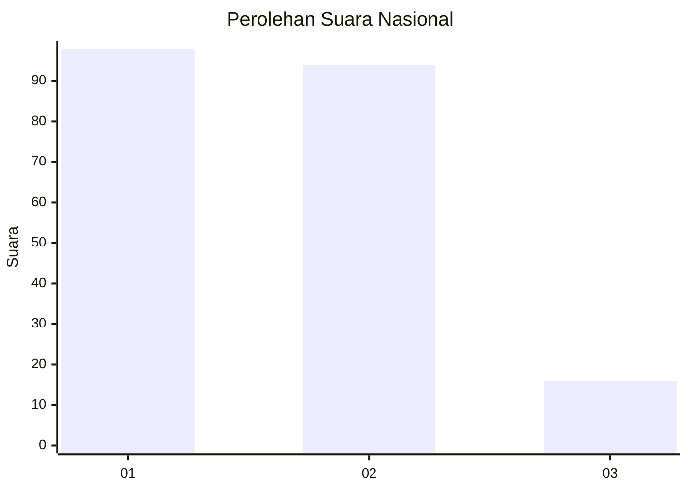
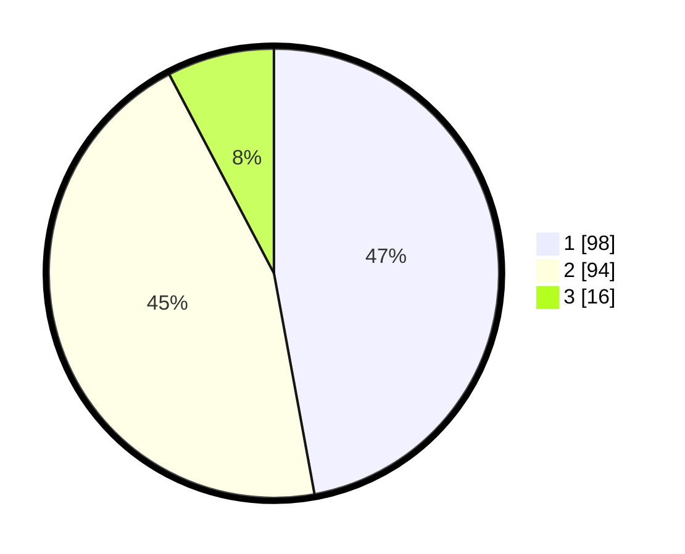

# Hasil

## Grafik

## Tabel

| No.    | Nama Paslon    | Suara | Suara (raw) | Persentase |
|:------ |:-------------- | -----:| -----------:| ----------:|
| 100025 | ANIES MUHAIMIN | 98    | [98][p-1]   | 47,12      |
| 100026 | PRABOWO GIBRAN | 94    | [94][p-2]   | 45,19      |
| 100027 | GANJAR MAHFUD  | 16    | [16][p-3]   | 7,69       |

[p-1]: https://github.com/gigit-pemilu/pemilu-2024/blob/main/pilpres/hitung-suara/sub/31-dki-jakarta/sub/75-jakarta-timur/sub/01-matraman/sub/1004-palmeriam/sub/005-tps/sub/paslon-1.txt
[p-2]: https://github.com/gigit-pemilu/pemilu-2024/blob/main/pilpres/hitung-suara/sub/31-dki-jakarta/sub/75-jakarta-timur/sub/01-matraman/sub/1004-palmeriam/sub/005-tps/sub/paslon-2.txt
[p-3]: https://github.com/gigit-pemilu/pemilu-2024/blob/main/pilpres/hitung-suara/sub/31-dki-jakarta/sub/75-jakarta-timur/sub/01-matraman/sub/1004-palmeriam/sub/005-tps/sub/paslon-3.txt

## Foto C Plano

https://sirekap-obj-formc.kpu.go.id/378e/pemilu/ppwp/31/75/01/10/04/3175011004005-20240215-015818--35440c85-64d9-49ef-b02f-60b1a76640b3.jpg

https://sirekap-obj-formc.kpu.go.id/378e/pemilu/ppwp/31/75/01/10/04/3175011004005-20240215-023028--5e935e2f-5cc6-4aa9-a9f1-354ceba4f41a.jpg

https://sirekap-obj-formc.kpu.go.id/378e/pemilu/ppwp/31/75/01/10/04/3175011004005-20240215-020103--b2fd773a-bb0a-427d-b835-f87f6280327d.jpg

## Metadata

| Key        | Value               |
| ---------- | ------------------- |
| Time Stamp | 2024-02-15 16:00:26 |

