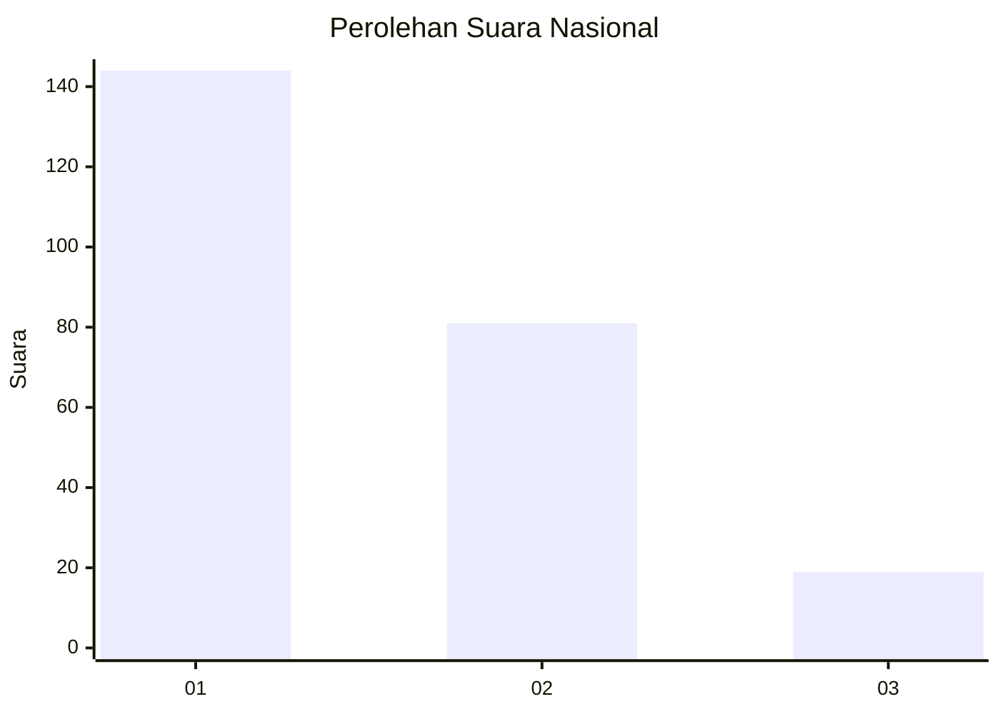
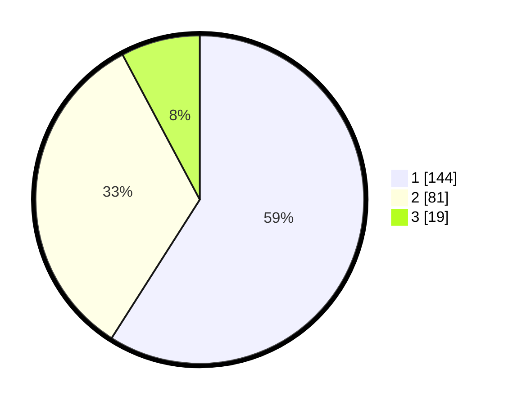

# Hasil

## Grafik

## Tabel

| No.    | Nama Paslon    | Suara | Suara (raw) | Persentase |
|:------ |:-------------- | -----:| -----------:| ----------:|
| 100025 | ANIES MUHAIMIN | 144   | [144][p-1]  | 59,02      |
| 100026 | PRABOWO GIBRAN | 81    | [81][p-2]   | 33,20      |
| 100027 | GANJAR MAHFUD  | 19    | [19][p-3]   | 7,79       |

[p-1]: https://github.com/gigit-pemilu/pemilu-2024/blob/main/pilpres/hitung-suara/sub/31-dki-jakarta/sub/75-jakarta-timur/sub/01-matraman/sub/1004-palmeriam/sub/009-tps/sub/paslon-1.txt
[p-2]: https://github.com/gigit-pemilu/pemilu-2024/blob/main/pilpres/hitung-suara/sub/31-dki-jakarta/sub/75-jakarta-timur/sub/01-matraman/sub/1004-palmeriam/sub/009-tps/sub/paslon-2.txt
[p-3]: https://github.com/gigit-pemilu/pemilu-2024/blob/main/pilpres/hitung-suara/sub/31-dki-jakarta/sub/75-jakarta-timur/sub/01-matraman/sub/1004-palmeriam/sub/009-tps/sub/paslon-3.txt

## Foto C Plano

https://sirekap-obj-formc.kpu.go.id/1dec/pemilu/ppwp/31/75/01/10/04/3175011004009-20240215-022308--0c9b0488-104f-4be4-bf6d-3c9e7a64b539.jpg

https://sirekap-obj-formc.kpu.go.id/1dec/pemilu/ppwp/31/75/01/10/04/3175011004009-20240215-022415--48cd09f5-1688-46c6-b02f-611fb7a06af2.jpg

https://sirekap-obj-formc.kpu.go.id/1dec/pemilu/ppwp/31/75/01/10/04/3175011004009-20240215-022518--708f6f11-19fb-4290-860d-34fcb9ae9ead.jpg

## Metadata

| Key        | Value               |
| ---------- | ------------------- |
| Time Stamp | 2024-02-15 15:00:29 |

