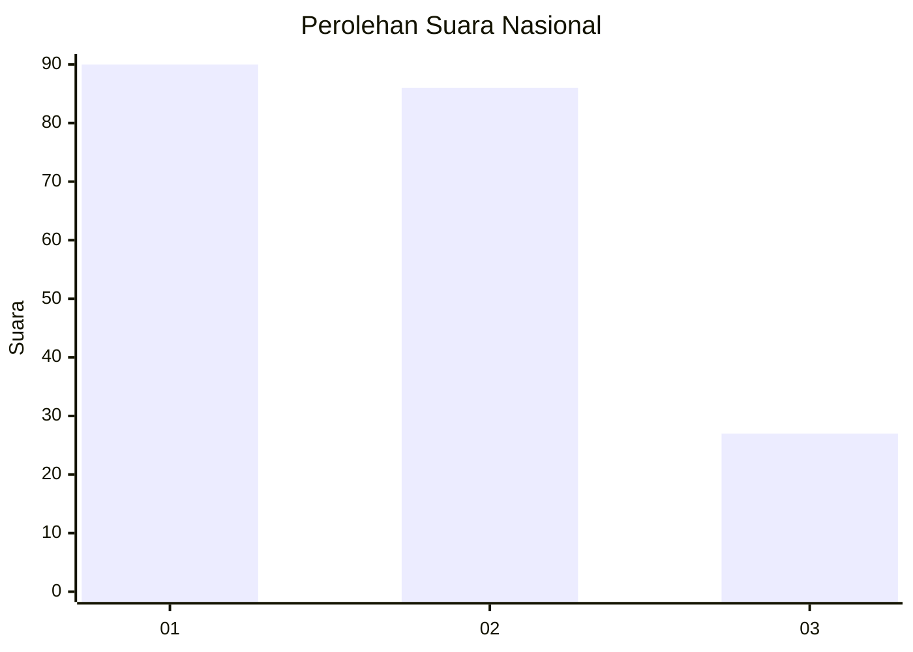
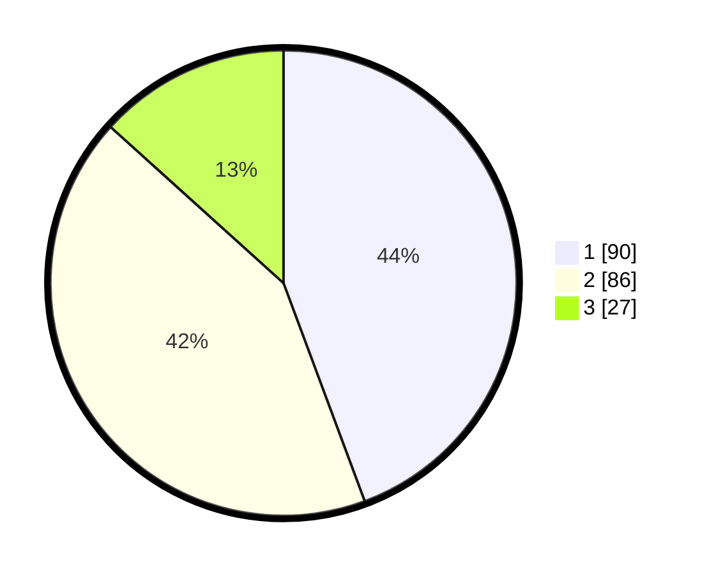

# Hasil

## Grafik

## Tabel

| No.    | Nama Paslon    | Suara | Suara (raw) | Persentase |
|:------ |:-------------- | -----:| -----------:| ----------:|
| 100025 | ANIES MUHAIMIN | 90    | [90][p-1]   | 44,33      |
| 100026 | PRABOWO GIBRAN | 86    | [86][p-2]   | 42,36      |
| 100027 | GANJAR MAHFUD  | 27    | [27][p-3]   | 13,30      |

[p-1]: https://github.com/gigit-pemilu/pemilu-2024/blob/main/pilpres/hitung-suara/sub/31-dki-jakarta/sub/75-jakarta-timur/sub/01-matraman/sub/1004-palmeriam/sub/023-tps/sub/paslon-1.txt
[p-2]: https://github.com/gigit-pemilu/pemilu-2024/blob/main/pilpres/hitung-suara/sub/31-dki-jakarta/sub/75-jakarta-timur/sub/01-matraman/sub/1004-palmeriam/sub/023-tps/sub/paslon-2.txt
[p-3]: https://github.com/gigit-pemilu/pemilu-2024/blob/main/pilpres/hitung-suara/sub/31-dki-jakarta/sub/75-jakarta-timur/sub/01-matraman/sub/1004-palmeriam/sub/023-tps/sub/paslon-3.txt

## Foto C Plano

https://sirekap-obj-formc.kpu.go.id/ae24/pemilu/ppwp/31/75/01/10/04/3175011004023-20240215-043421--8b6ae0d4-5393-4703-8936-8e1e84527b2b.jpg

https://sirekap-obj-formc.kpu.go.id/ae24/pemilu/ppwp/31/75/01/10/04/3175011004023-20240215-043525--6363a040-d6f9-471c-aca2-580e4d24ef1d.jpg

https://sirekap-obj-formc.kpu.go.id/ae24/pemilu/ppwp/31/75/01/10/04/3175011004023-20240215-043610--7b89aec5-4275-4052-971c-c5dc0c3ed8f4.jpg

## Metadata

| Key        | Value               |
| ---------- | ------------------- |
| Time Stamp | 2024-02-16 21:01:00 |

