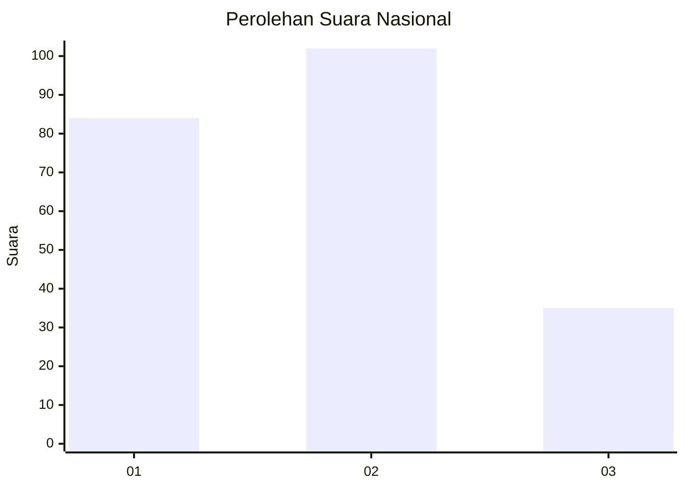
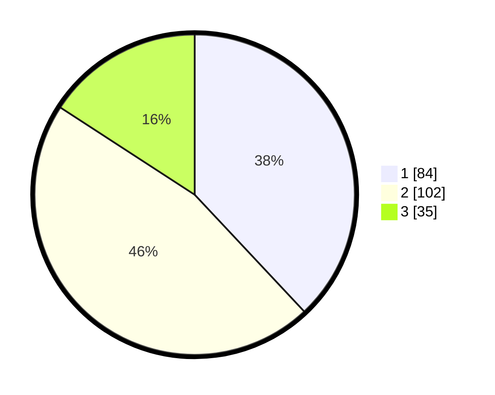

# Hasil

## Grafik

## Tabel

| No.    | Nama Paslon    | Suara | Suara (raw) | Persentase |
|:------ |:-------------- | -----:| -----------:| ----------:|
| 100025 | ANIES MUHAIMIN | 84    | [84][p-1]   | 38,01      |
| 100026 | PRABOWO GIBRAN | 102   | [102][p-2]  | 46,15      |
| 100027 | GANJAR MAHFUD  | 35    | [35][p-3]   | 15,84      |

[p-1]: https://github.com/gigit-pemilu/pemilu-2024/blob/main/pilpres/hitung-suara/sub/31-dki-jakarta/sub/75-jakarta-timur/sub/01-matraman/sub/1004-palmeriam/sub/033-tps/sub/paslon-1.txt
[p-2]: https://github.com/gigit-pemilu/pemilu-2024/blob/main/pilpres/hitung-suara/sub/31-dki-jakarta/sub/75-jakarta-timur/sub/01-matraman/sub/1004-palmeriam/sub/033-tps/sub/paslon-2.txt
[p-3]: https://github.com/gigit-pemilu/pemilu-2024/blob/main/pilpres/hitung-suara/sub/31-dki-jakarta/sub/75-jakarta-timur/sub/01-matraman/sub/1004-palmeriam/sub/033-tps/sub/paslon-3.txt

## Foto C Plano

https://sirekap-obj-formc.kpu.go.id/79f8/pemilu/ppwp/31/75/01/10/04/3175011004033-20240215-023255--96a4467f-9585-4045-bdf9-269ab2ec53fc.jpg

https://sirekap-obj-formc.kpu.go.id/79f8/pemilu/ppwp/31/75/01/10/04/3175011004033-20240215-023306--3a0a3d06-2eeb-4e4b-b725-8fccd7bfe7b3.jpg

https://sirekap-obj-formc.kpu.go.id/79f8/pemilu/ppwp/31/75/01/10/04/3175011004033-20240215-023315--ac332ab6-1058-4e97-a0f1-50ed48385588.jpg

## Metadata

| Key        | Value               |
| ---------- | ------------------- |
| Time Stamp | 2024-02-15 15:00:29 |

