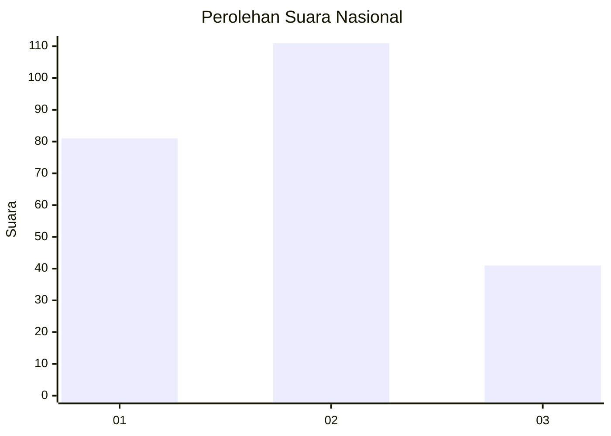
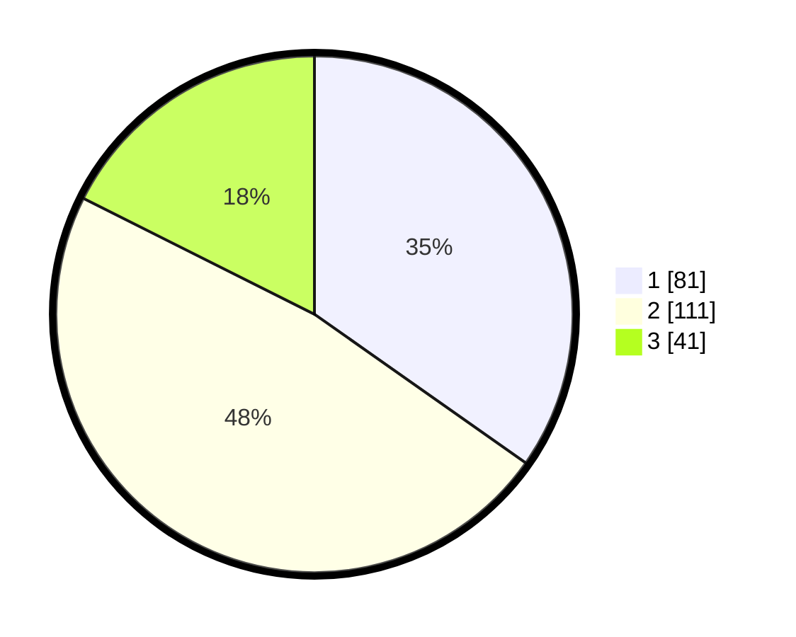

# Hasil

## Grafik

## Tabel

| No.    | Nama Paslon    | Suara | Suara (raw) | Persentase |
|:------ |:-------------- | -----:| -----------:| ----------:|
| 100025 | ANIES MUHAIMIN | 81    | [81][p-1]   | 34,76      |
| 100026 | PRABOWO GIBRAN | 111   | [111][p-2]  | 47,64      |
| 100027 | GANJAR MAHFUD  | 41    | [41][p-3]   | 17,60      |

[p-1]: https://github.com/gigit-pemilu/pemilu-2024/blob/main/pilpres/hitung-suara/sub/31-dki-jakarta/sub/75-jakarta-timur/sub/01-matraman/sub/1004-palmeriam/sub/042-tps/sub/paslon-1.txt
[p-2]: https://github.com/gigit-pemilu/pemilu-2024/blob/main/pilpres/hitung-suara/sub/31-dki-jakarta/sub/75-jakarta-timur/sub/01-matraman/sub/1004-palmeriam/sub/042-tps/sub/paslon-2.txt
[p-3]: https://github.com/gigit-pemilu/pemilu-2024/blob/main/pilpres/hitung-suara/sub/31-dki-jakarta/sub/75-jakarta-timur/sub/01-matraman/sub/1004-palmeriam/sub/042-tps/sub/paslon-3.txt

## Foto C Plano

https://sirekap-obj-formc.kpu.go.id/f7cd/pemilu/ppwp/31/75/01/10/04/3175011004042-20240216-202912--aaa18994-f30e-4877-a4a7-98074c775621.jpg

https://sirekap-obj-formc.kpu.go.id/f7cd/pemilu/ppwp/31/75/01/10/04/3175011004042-20240216-203559--a5ee47e9-2dd3-4a57-9319-69547d3799ff.jpg

https://sirekap-obj-formc.kpu.go.id/f7cd/pemilu/ppwp/31/75/01/10/04/3175011004042-20240216-123459--0dd62c52-769d-4ab2-a983-0ab3b3ced108.jpg

## Metadata

| Key        | Value               |
| ---------- | ------------------- |
| Time Stamp | 2024-02-24 22:31:28 |

