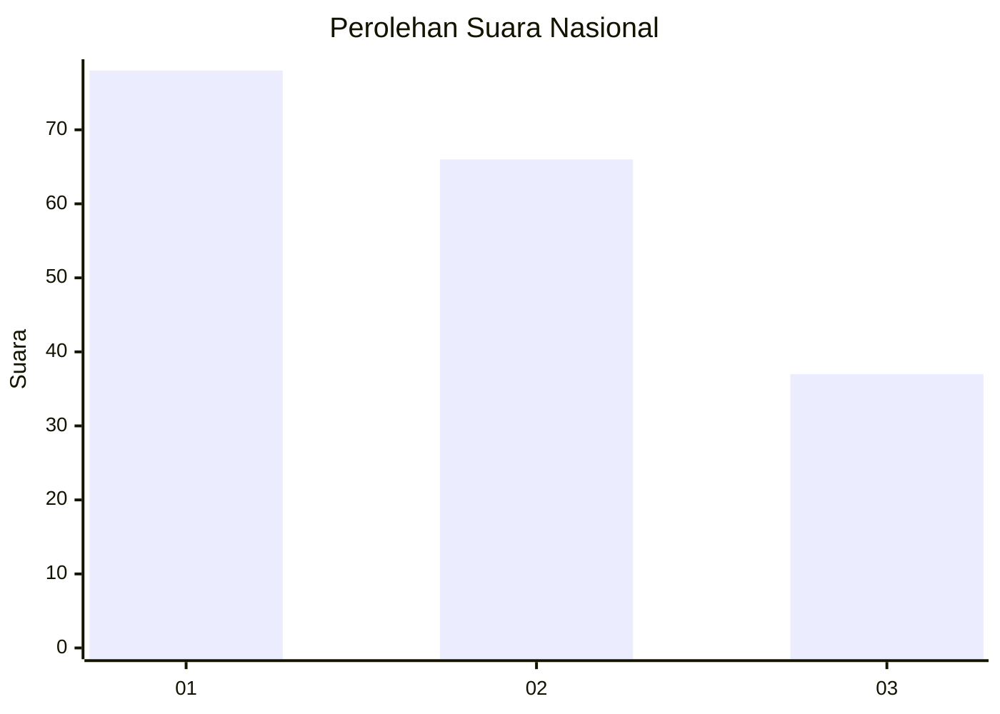
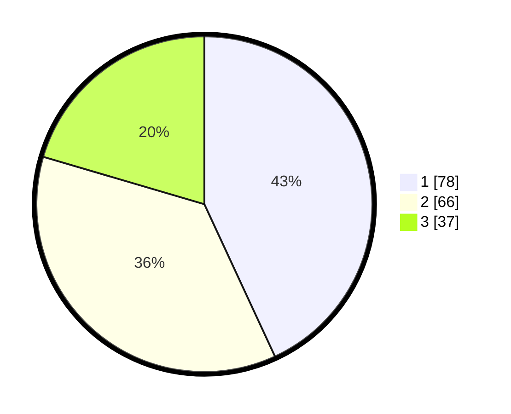

# Hasil

## Grafik

## Tabel

| No.    | Nama Paslon    | Suara | Suara (raw) | Persentase |
|:------ |:-------------- | -----:| -----------:| ----------:|
| 100025 | ANIES MUHAIMIN | 78    | [78][p-1]   | 43,09      |
| 100026 | PRABOWO GIBRAN | 66    | [66][p-2]   | 36,46      |
| 100027 | GANJAR MAHFUD  | 37    | [37][p-3]   | 20,44      |

[p-1]: https://github.com/gigit-pemilu/pemilu-2024/blob/main/pilpres/hitung-suara/sub/31-dki-jakarta/sub/75-jakarta-timur/sub/01-matraman/sub/1004-palmeriam/sub/043-tps/sub/paslon-1.txt
[p-2]: https://github.com/gigit-pemilu/pemilu-2024/blob/main/pilpres/hitung-suara/sub/31-dki-jakarta/sub/75-jakarta-timur/sub/01-matraman/sub/1004-palmeriam/sub/043-tps/sub/paslon-2.txt
[p-3]: https://github.com/gigit-pemilu/pemilu-2024/blob/main/pilpres/hitung-suara/sub/31-dki-jakarta/sub/75-jakarta-timur/sub/01-matraman/sub/1004-palmeriam/sub/043-tps/sub/paslon-3.txt

## Foto C Plano

https://sirekap-obj-formc.kpu.go.id/2add/pemilu/ppwp/31/75/01/10/04/3175011004043-20240214-214525--28dac179-b3d0-44cc-8b9b-1c115bcc6045.jpg

https://sirekap-obj-formc.kpu.go.id/2add/pemilu/ppwp/31/75/01/10/04/3175011004043-20240214-204534--d8233226-fd80-4ca4-9b38-e3c0436e18d4.jpg

https://sirekap-obj-formc.kpu.go.id/2add/pemilu/ppwp/31/75/01/10/04/3175011004043-20240214-204546--8bce246d-d90b-452f-913f-d57267f3f675.jpg

## Metadata

| Key        | Value               |
| ---------- | ------------------- |
| Time Stamp | 2024-02-15 00:41:44 |

