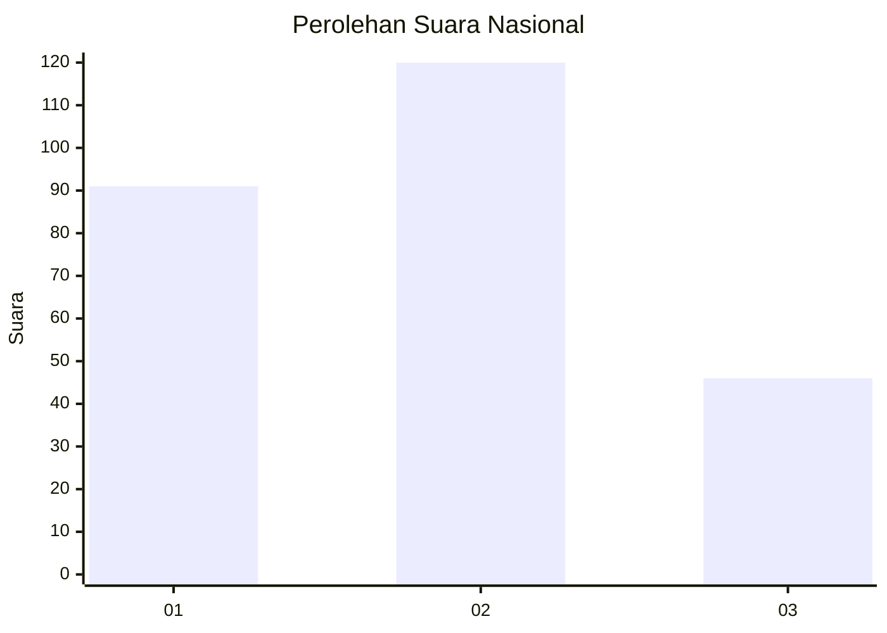
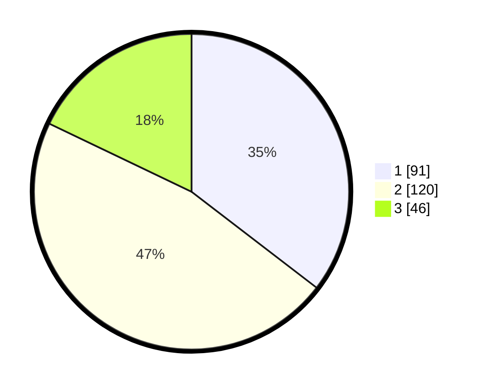

# Hasil

## Grafik

## Tabel

| No.    | Nama Paslon    | Suara | Suara (raw) | Persentase |
|:------ |:-------------- | -----:| -----------:| ----------:|
| 100025 | ANIES MUHAIMIN | 91    | [91][p-1]   | 35,41      |
| 100026 | PRABOWO GIBRAN | 120   | [120][p-2]  | 46,69      |
| 100027 | GANJAR MAHFUD  | 46    | [46][p-3]   | 17,90      |

[p-1]: https://github.com/gigit-pemilu/pemilu-2024/blob/main/pilpres/hitung-suara/sub/31-dki-jakarta/sub/75-jakarta-timur/sub/01-matraman/sub/1004-palmeriam/sub/061-tps/sub/paslon-1.txt
[p-2]: https://github.com/gigit-pemilu/pemilu-2024/blob/main/pilpres/hitung-suara/sub/31-dki-jakarta/sub/75-jakarta-timur/sub/01-matraman/sub/1004-palmeriam/sub/061-tps/sub/paslon-2.txt
[p-3]: https://github.com/gigit-pemilu/pemilu-2024/blob/main/pilpres/hitung-suara/sub/31-dki-jakarta/sub/75-jakarta-timur/sub/01-matraman/sub/1004-palmeriam/sub/061-tps/sub/paslon-3.txt

## Foto C Plano

https://sirekap-obj-formc.kpu.go.id/358d/pemilu/ppwp/31/75/01/10/04/3175011004061-20240215-104622--32252be0-e645-4e0e-8f80-c8c2f77dda14.jpg

https://sirekap-obj-formc.kpu.go.id/358d/pemilu/ppwp/31/75/01/10/04/3175011004061-20240215-104743--2eae21b7-dcbd-4e11-b5e0-8b173cb70dd5.jpg

https://sirekap-obj-formc.kpu.go.id/358d/pemilu/ppwp/31/75/01/10/04/3175011004061-20240215-104852--5be6f955-cd01-4fcb-993c-a836d349ff3b.jpg

## Metadata

| Key        | Value               |
| ---------- | ------------------- |
| Time Stamp | 2024-02-15 16:30:25 |

