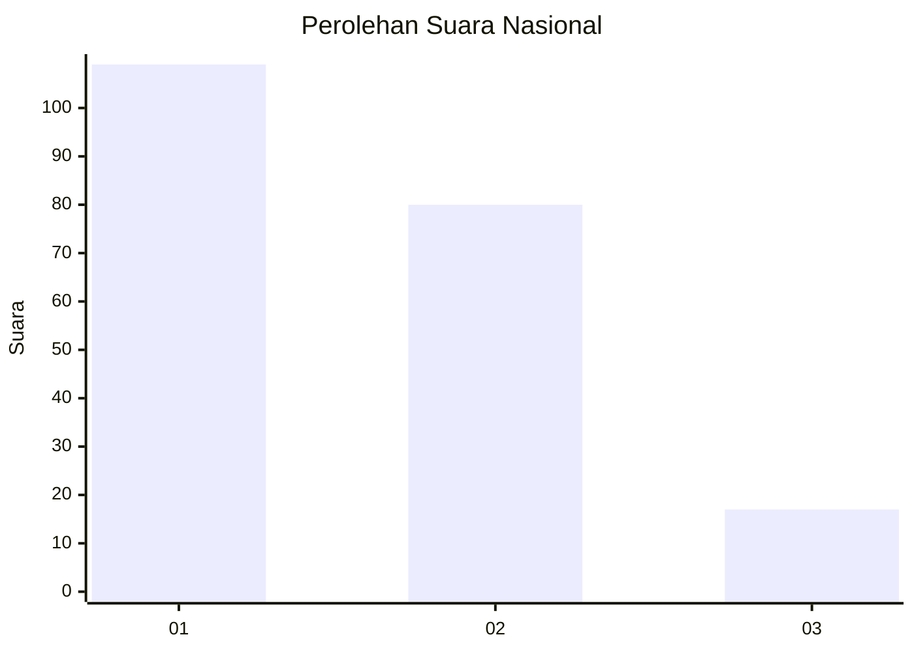
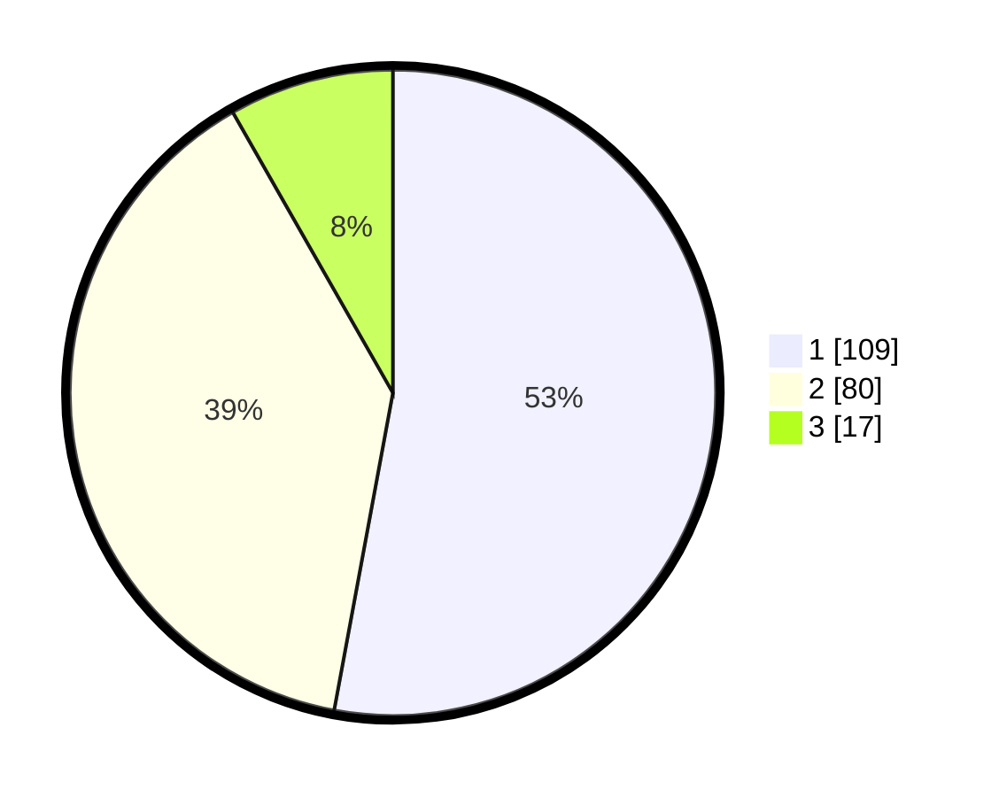

# Hasil

## Grafik

## Tabel

| No.    | Nama Paslon    | Suara | Suara (raw) | Persentase |
|:------ |:-------------- | -----:| -----------:| ----------:|
| 100025 | ANIES MUHAIMIN | 109   | [109][p-1]  | 52,91      |
| 100026 | PRABOWO GIBRAN | 80    | [80][p-2]   | 38,83      |
| 100027 | GANJAR MAHFUD  | 17    | [17][p-3]   | 8,25       |

[p-1]: https://github.com/gigit-pemilu/pemilu-2024/blob/main/pilpres/hitung-suara/sub/31-dki-jakarta/sub/75-jakarta-timur/sub/01-matraman/sub/1005-kebon-manggis/sub/002-tps/sub/paslon-1.txt
[p-2]: https://github.com/gigit-pemilu/pemilu-2024/blob/main/pilpres/hitung-suara/sub/31-dki-jakarta/sub/75-jakarta-timur/sub/01-matraman/sub/1005-kebon-manggis/sub/002-tps/sub/paslon-2.txt
[p-3]: https://github.com/gigit-pemilu/pemilu-2024/blob/main/pilpres/hitung-suara/sub/31-dki-jakarta/sub/75-jakarta-timur/sub/01-matraman/sub/1005-kebon-manggis/sub/002-tps/sub/paslon-3.txt

## Foto C Plano

https://sirekap-obj-formc.kpu.go.id/1f9d/pemilu/ppwp/31/75/01/10/05/3175011005002-20240216-160826--4f7e1ce5-7d08-406b-8874-d08f3034269f.jpg

https://sirekap-obj-formc.kpu.go.id/1f9d/pemilu/ppwp/31/75/01/10/05/3175011005002-20240216-160416--e840645b-0bdf-44f3-8511-681ed15de644.jpg

https://sirekap-obj-formc.kpu.go.id/1f9d/pemilu/ppwp/31/75/01/10/05/3175011005002-20240216-160457--522301e7-3178-4b32-8045-b3c2d0488388.jpg

## Metadata

| Key        | Value               |
| ---------- | ------------------- |
| Time Stamp | 2024-02-17 17:00:04 |

