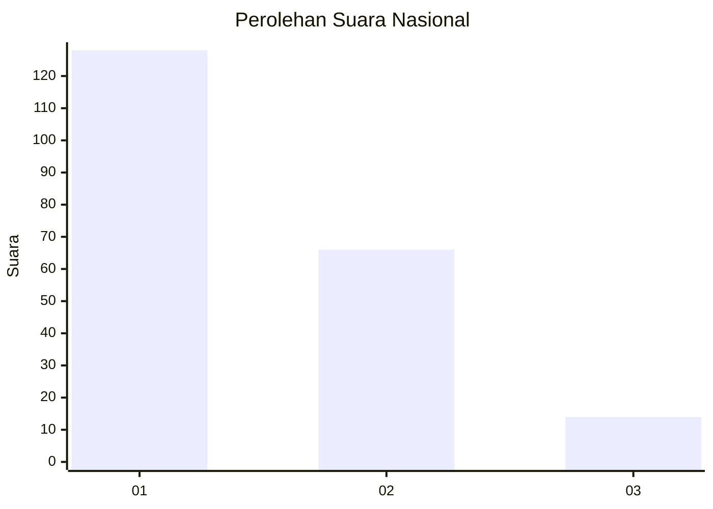
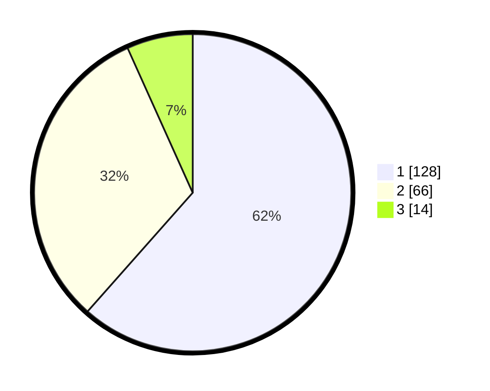

# Hasil

## Grafik

## Tabel

| No.    | Nama Paslon    | Suara | Suara (raw) | Persentase |
|:------ |:-------------- | -----:| -----------:| ----------:|
| 100025 | ANIES MUHAIMIN | 128   | [128][p-1]  | 61,54      |
| 100026 | PRABOWO GIBRAN | 66    | [66][p-2]   | 31,73      |
| 100027 | GANJAR MAHFUD  | 14    | [14][p-3]   | 6,73       |

[p-1]: https://github.com/gigit-pemilu/pemilu-2024/blob/main/pilpres/hitung-suara/sub/31-dki-jakarta/sub/75-jakarta-timur/sub/01-matraman/sub/1005-kebon-manggis/sub/003-tps/sub/paslon-1.txt
[p-2]: https://github.com/gigit-pemilu/pemilu-2024/blob/main/pilpres/hitung-suara/sub/31-dki-jakarta/sub/75-jakarta-timur/sub/01-matraman/sub/1005-kebon-manggis/sub/003-tps/sub/paslon-2.txt
[p-3]: https://github.com/gigit-pemilu/pemilu-2024/blob/main/pilpres/hitung-suara/sub/31-dki-jakarta/sub/75-jakarta-timur/sub/01-matraman/sub/1005-kebon-manggis/sub/003-tps/sub/paslon-3.txt

## Foto C Plano

https://sirekap-obj-formc.kpu.go.id/9919/pemilu/ppwp/31/75/01/10/05/3175011005003-20240214-234414--0290c950-2d10-4fb3-8215-fdd53f3e7088.jpg

https://sirekap-obj-formc.kpu.go.id/9919/pemilu/ppwp/31/75/01/10/05/3175011005003-20240214-234453--320e23d7-683f-4df7-b5d1-dbeea816c149.jpg

https://sirekap-obj-formc.kpu.go.id/9919/pemilu/ppwp/31/75/01/10/05/3175011005003-20240214-234542--3a76b85e-e028-4a1c-914a-5c5d49444971.jpg

## Metadata

| Key        | Value               |
| ---------- | ------------------- |
| Time Stamp | 2024-02-15 16:30:25 |

