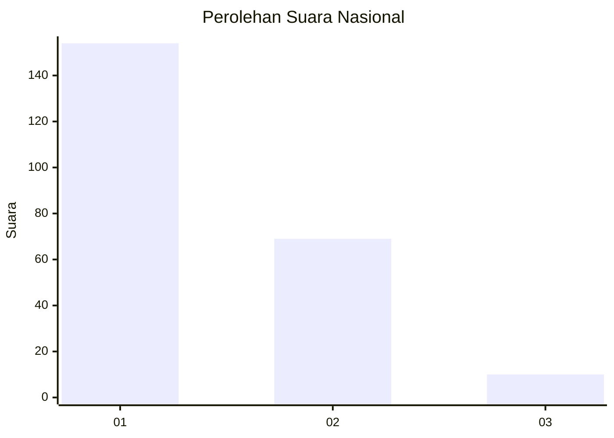
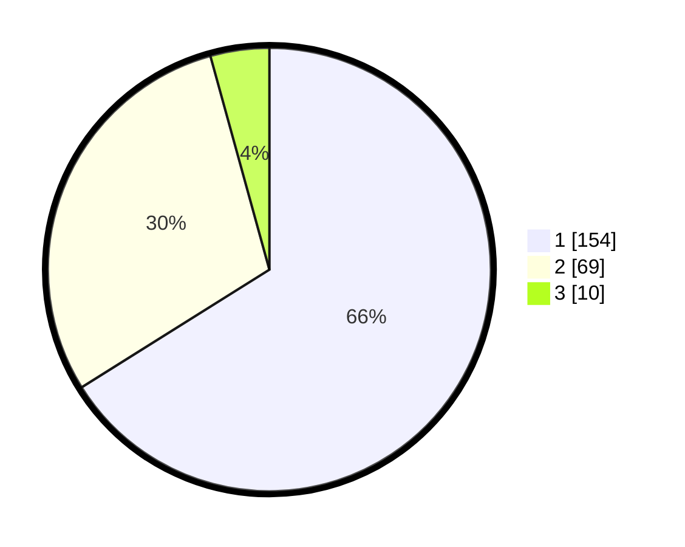

# Hasil

## Grafik

## Tabel

| No.    | Nama Paslon    | Suara | Suara (raw) | Persentase |
|:------ |:-------------- | -----:| -----------:| ----------:|
| 100025 | ANIES MUHAIMIN | 154   | [154][p-1]  | 66,09      |
| 100026 | PRABOWO GIBRAN | 69    | [69][p-2]   | 29,61      |
| 100027 | GANJAR MAHFUD  | 10    | [10][p-3]   | 4,29       |

[p-1]: https://github.com/gigit-pemilu/pemilu-2024/blob/main/pilpres/hitung-suara/sub/31-dki-jakarta/sub/75-jakarta-timur/sub/01-matraman/sub/1005-kebon-manggis/sub/014-tps/sub/paslon-1.txt
[p-2]: https://github.com/gigit-pemilu/pemilu-2024/blob/main/pilpres/hitung-suara/sub/31-dki-jakarta/sub/75-jakarta-timur/sub/01-matraman/sub/1005-kebon-manggis/sub/014-tps/sub/paslon-2.txt
[p-3]: https://github.com/gigit-pemilu/pemilu-2024/blob/main/pilpres/hitung-suara/sub/31-dki-jakarta/sub/75-jakarta-timur/sub/01-matraman/sub/1005-kebon-manggis/sub/014-tps/sub/paslon-3.txt

## Foto C Plano

https://sirekap-obj-formc.kpu.go.id/4c11/pemilu/ppwp/31/75/01/10/05/3175011005014-20240215-013801--73ef6f48-0c32-483b-8da9-90918991ceee.jpg

https://sirekap-obj-formc.kpu.go.id/4c11/pemilu/ppwp/31/75/01/10/05/3175011005014-20240215-013842--19b034de-f59d-466e-8eaa-ad89e8a4d55b.jpg

https://sirekap-obj-formc.kpu.go.id/4c11/pemilu/ppwp/31/75/01/10/05/3175011005014-20240215-013924--0a008b21-b3c5-49b7-9229-7e60a1062617.jpg

## Metadata

| Key        | Value               |
| ---------- | ------------------- |
| Time Stamp | 2024-02-15 15:00:29 |

