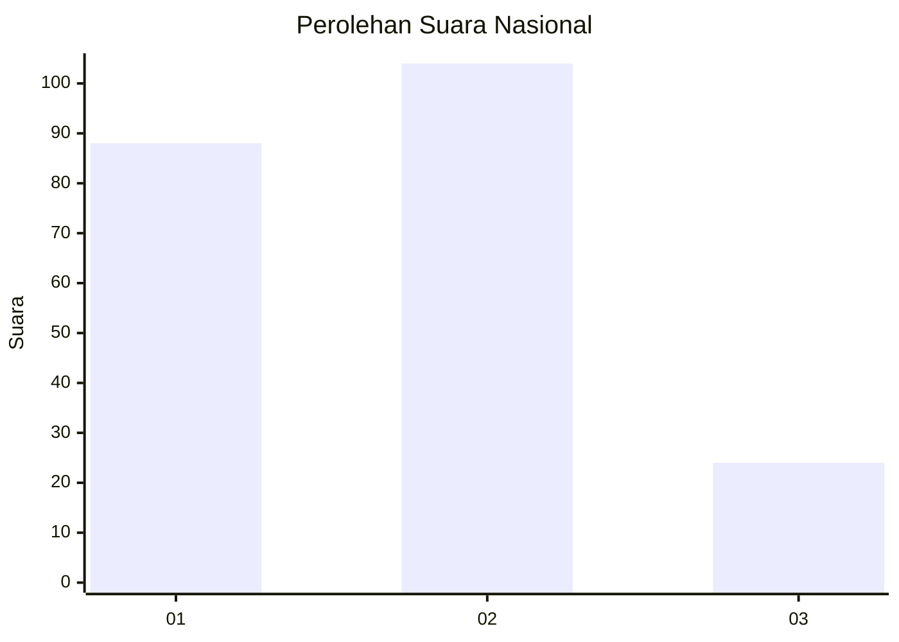
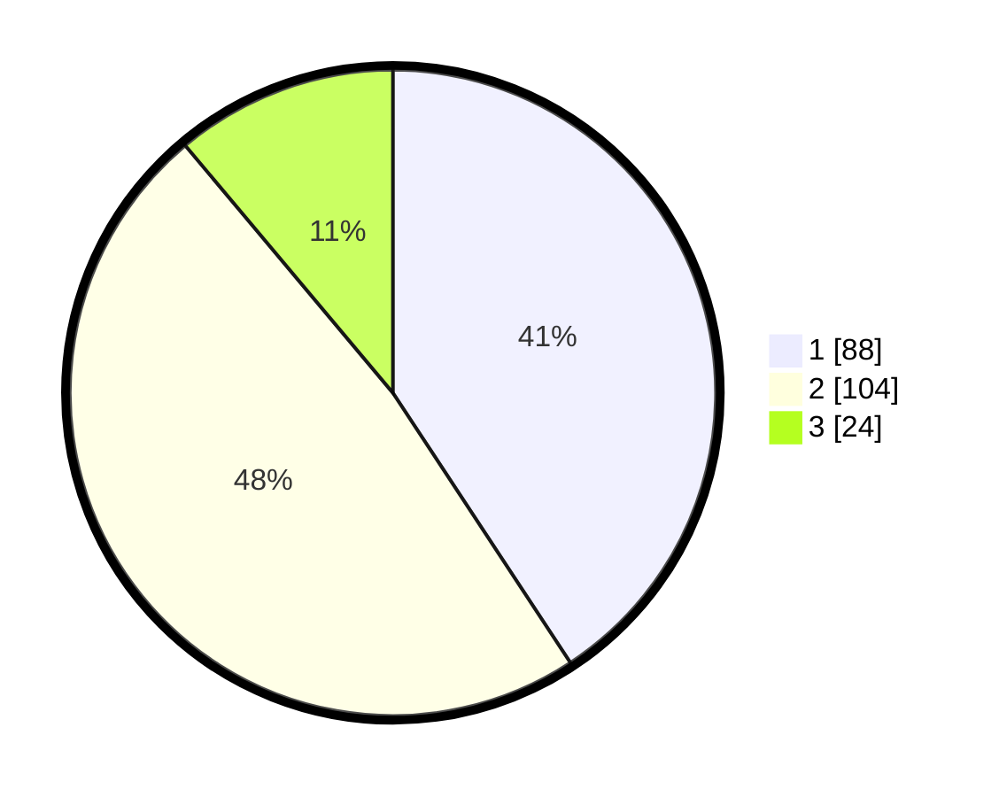

# Hasil

## Grafik

## Tabel

| No.    | Nama Paslon    | Suara | Suara (raw) | Persentase |
|:------ |:-------------- | -----:| -----------:| ----------:|
| 100025 | ANIES MUHAIMIN | 88    | [88][p-1]   | 40,74      |
| 100026 | PRABOWO GIBRAN | 104   | [104][p-2]  | 48,15      |
| 100027 | GANJAR MAHFUD  | 24    | [24][p-3]   | 11,11      |

[p-1]: https://github.com/gigit-pemilu/pemilu-2024/blob/main/pilpres/hitung-suara/sub/31-dki-jakarta/sub/75-jakarta-timur/sub/01-matraman/sub/1005-kebon-manggis/sub/030-tps/sub/paslon-1.txt
[p-2]: https://github.com/gigit-pemilu/pemilu-2024/blob/main/pilpres/hitung-suara/sub/31-dki-jakarta/sub/75-jakarta-timur/sub/01-matraman/sub/1005-kebon-manggis/sub/030-tps/sub/paslon-2.txt
[p-3]: https://github.com/gigit-pemilu/pemilu-2024/blob/main/pilpres/hitung-suara/sub/31-dki-jakarta/sub/75-jakarta-timur/sub/01-matraman/sub/1005-kebon-manggis/sub/030-tps/sub/paslon-3.txt

## Foto C Plano

https://sirekap-obj-formc.kpu.go.id/f210/pemilu/ppwp/31/75/01/10/05/3175011005030-20240214-223315--064681fd-12ce-49e6-9673-2d7e17eab6e7.jpg

https://sirekap-obj-formc.kpu.go.id/f210/pemilu/ppwp/31/75/01/10/05/3175011005030-20240214-223514--75403931-5a7c-4a33-b5c9-0aff4ffa2cc4.jpg

https://sirekap-obj-formc.kpu.go.id/f210/pemilu/ppwp/31/75/01/10/05/3175011005030-20240214-223646--132f16a3-53a9-441f-95e7-b68fbfb49514.jpg

## Metadata

| Key        | Value               |
| ---------- | ------------------- |
| Time Stamp | 2024-02-15 16:30:25 |

