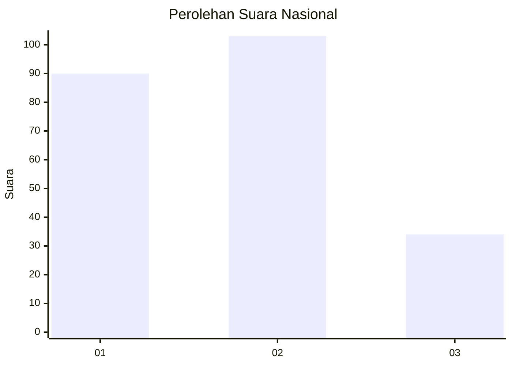
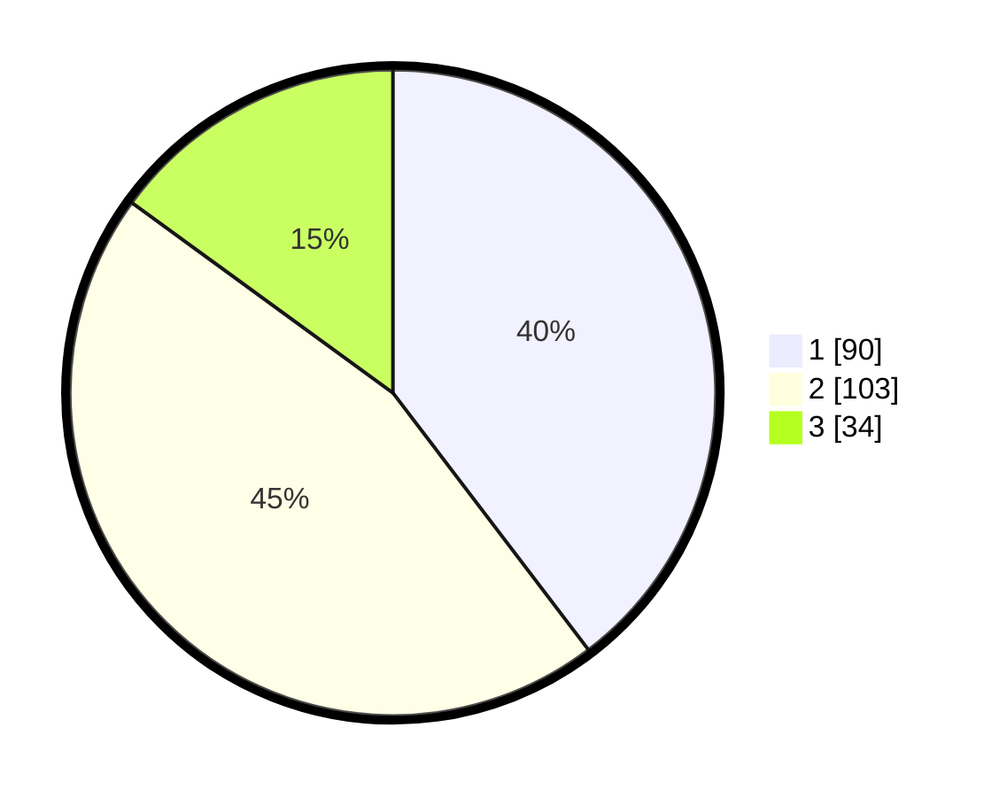

# Hasil

## Grafik

## Tabel

| No.    | Nama Paslon    | Suara | Suara (raw) | Persentase |
|:------ |:-------------- | -----:| -----------:| ----------:|
| 100025 | ANIES MUHAIMIN | 90    | [90][p-1]   | 39,65      |
| 100026 | PRABOWO GIBRAN | 103   | [103][p-2]  | 45,37      |
| 100027 | GANJAR MAHFUD  | 34    | [34][p-3]   | 14,98      |

[p-1]: https://github.com/gigit-pemilu/pemilu-2024/blob/main/pilpres/hitung-suara/sub/31-dki-jakarta/sub/75-jakarta-timur/sub/01-matraman/sub/1005-kebon-manggis/sub/034-tps/sub/paslon-1.txt
[p-2]: https://github.com/gigit-pemilu/pemilu-2024/blob/main/pilpres/hitung-suara/sub/31-dki-jakarta/sub/75-jakarta-timur/sub/01-matraman/sub/1005-kebon-manggis/sub/034-tps/sub/paslon-2.txt
[p-3]: https://github.com/gigit-pemilu/pemilu-2024/blob/main/pilpres/hitung-suara/sub/31-dki-jakarta/sub/75-jakarta-timur/sub/01-matraman/sub/1005-kebon-manggis/sub/034-tps/sub/paslon-3.txt

## Foto C Plano

https://sirekap-obj-formc.kpu.go.id/3850/pemilu/ppwp/31/75/01/10/05/3175011005034-20240214-215610--7ba45f0e-c141-4bc3-807d-5e2c0e1b8211.jpg

https://sirekap-obj-formc.kpu.go.id/3850/pemilu/ppwp/31/75/01/10/05/3175011005034-20240214-215801--61b39fee-781c-417b-a4b5-91abb40a2a6c.jpg

https://sirekap-obj-formc.kpu.go.id/3850/pemilu/ppwp/31/75/01/10/05/3175011005034-20240214-220237--3ef138e9-44f0-48e7-a4d7-5719e52d4b17.jpg

## Metadata

| Key        | Value               |
| ---------- | ------------------- |
| Time Stamp | 2024-02-15 16:30:25 |

