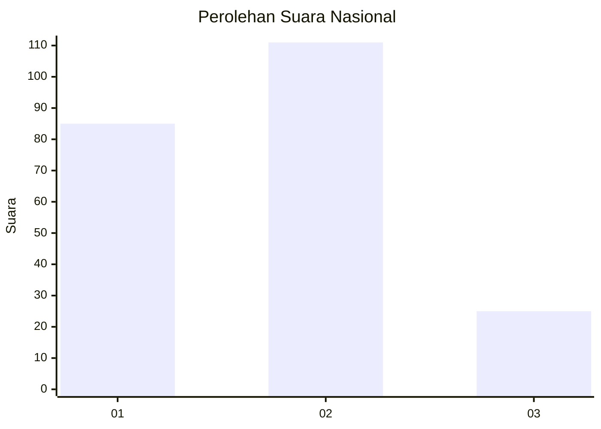
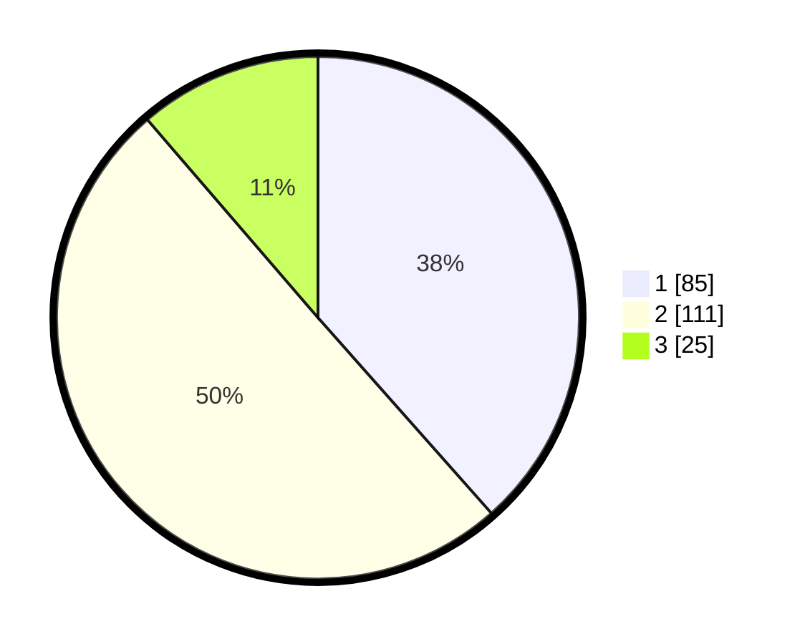

# Hasil

## Grafik

## Tabel

| No.    | Nama Paslon    | Suara | Suara (raw) | Persentase |
|:------ |:-------------- | -----:| -----------:| ----------:|
| 100025 | ANIES MUHAIMIN | 85    | [85][p-1]   | 38,46      |
| 100026 | PRABOWO GIBRAN | 111   | [111][p-2]  | 50,23      |
| 100027 | GANJAR MAHFUD  | 25    | [25][p-3]   | 11,31      |

[p-1]: https://github.com/gigit-pemilu/pemilu-2024/blob/main/pilpres/hitung-suara/sub/31-dki-jakarta/sub/75-jakarta-timur/sub/01-matraman/sub/1005-kebon-manggis/sub/038-tps/sub/paslon-1.txt
[p-2]: https://github.com/gigit-pemilu/pemilu-2024/blob/main/pilpres/hitung-suara/sub/31-dki-jakarta/sub/75-jakarta-timur/sub/01-matraman/sub/1005-kebon-manggis/sub/038-tps/sub/paslon-2.txt
[p-3]: https://github.com/gigit-pemilu/pemilu-2024/blob/main/pilpres/hitung-suara/sub/31-dki-jakarta/sub/75-jakarta-timur/sub/01-matraman/sub/1005-kebon-manggis/sub/038-tps/sub/paslon-3.txt

## Foto C Plano

https://sirekap-obj-formc.kpu.go.id/e3f8/pemilu/ppwp/31/75/01/10/05/3175011005038-20240214-230459--89106f0b-6456-488a-9665-b68bf910524f.jpg

https://sirekap-obj-formc.kpu.go.id/e3f8/pemilu/ppwp/31/75/01/10/05/3175011005038-20240214-155738--7dfcbef2-24ed-4737-be27-0c7fc107ba04.jpg

https://sirekap-obj-formc.kpu.go.id/e3f8/pemilu/ppwp/31/75/01/10/05/3175011005038-20240214-160105--18fa5237-55f2-4d96-a29f-7ccaf6d9f268.jpg

## Metadata

| Key        | Value               |
| ---------- | ------------------- |
| Time Stamp | 2024-02-17 17:00:04 |

