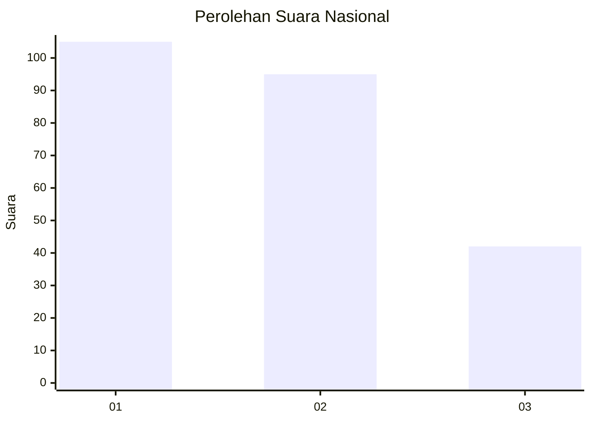
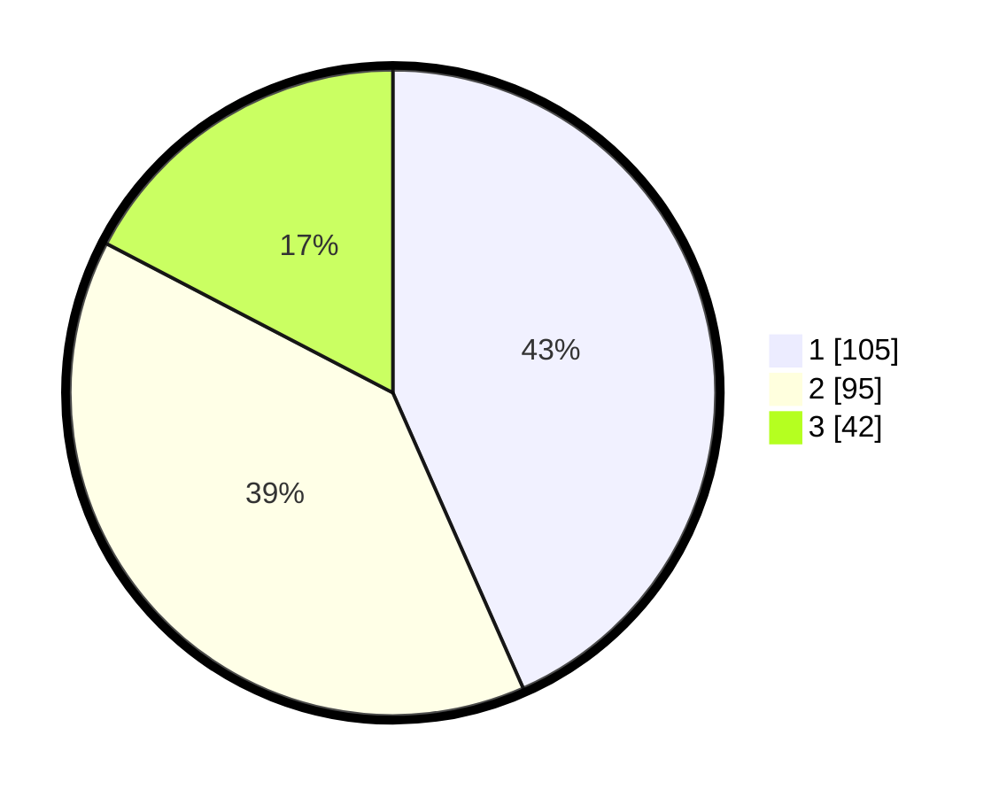

# Hasil

## Grafik

## Tabel

| No.    | Nama Paslon    | Suara | Suara (raw) | Persentase |
|:------ |:-------------- | -----:| -----------:| ----------:|
| 100025 | ANIES MUHAIMIN | 105   | [105][p-1]  | 43,39      |
| 100026 | PRABOWO GIBRAN | 95    | [95][p-2]   | 39,26      |
| 100027 | GANJAR MAHFUD  | 42    | [42][p-3]   | 17,36      |

[p-1]: https://github.com/gigit-pemilu/pemilu-2024/blob/main/pilpres/hitung-suara/sub/31-dki-jakarta/sub/75-jakarta-timur/sub/01-matraman/sub/1005-kebon-manggis/sub/046-tps/sub/paslon-1.txt
[p-2]: https://github.com/gigit-pemilu/pemilu-2024/blob/main/pilpres/hitung-suara/sub/31-dki-jakarta/sub/75-jakarta-timur/sub/01-matraman/sub/1005-kebon-manggis/sub/046-tps/sub/paslon-2.txt
[p-3]: https://github.com/gigit-pemilu/pemilu-2024/blob/main/pilpres/hitung-suara/sub/31-dki-jakarta/sub/75-jakarta-timur/sub/01-matraman/sub/1005-kebon-manggis/sub/046-tps/sub/paslon-3.txt

## Foto C Plano

https://sirekap-obj-formc.kpu.go.id/9a18/pemilu/ppwp/31/75/01/10/05/3175011005046-20240214-195054--e84f151b-55fd-446d-8763-fc0b4472344b.jpg

https://sirekap-obj-formc.kpu.go.id/9a18/pemilu/ppwp/31/75/01/10/05/3175011005046-20240214-202522--aae69467-96a6-4f85-9bc9-7a623b7e688d.jpg

https://sirekap-obj-formc.kpu.go.id/9a18/pemilu/ppwp/31/75/01/10/05/3175011005046-20240214-202602--5db84fb5-e34d-4baf-a615-272297b6a587.jpg

## Metadata

| Key        | Value               |
| ---------- | ------------------- |
| Time Stamp | 2024-02-15 12:00:28 |

