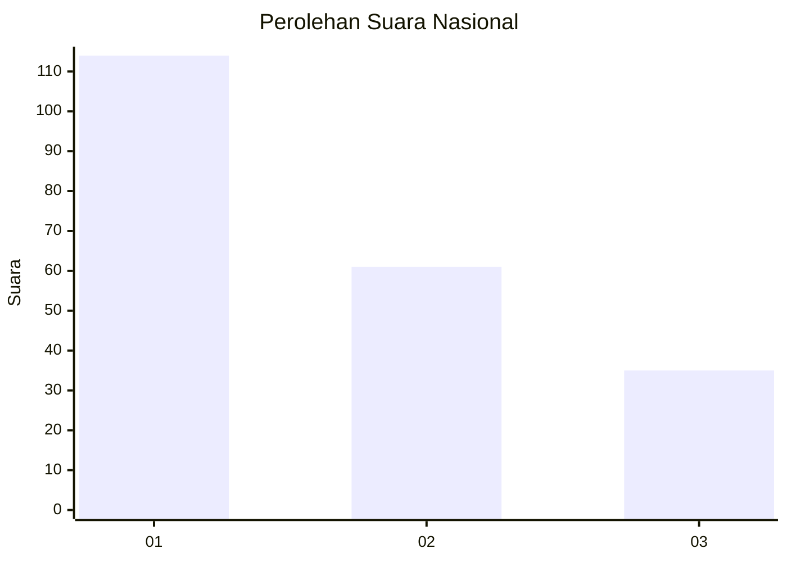
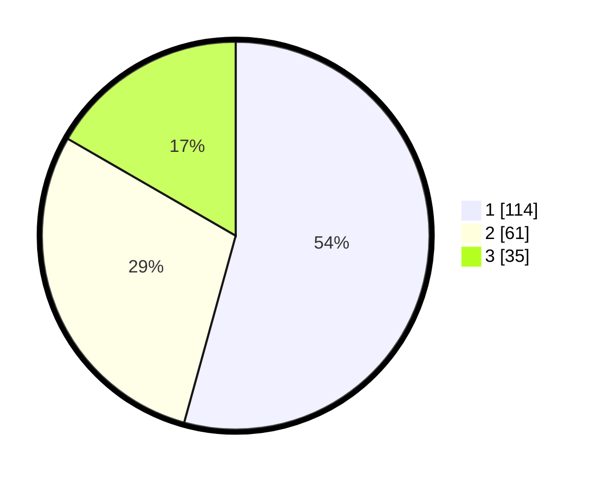

# Hasil

## Grafik

## Tabel

| No.    | Nama Paslon    | Suara | Suara (raw) | Persentase |
|:------ |:-------------- | -----:| -----------:| ----------:|
| 100025 | ANIES MUHAIMIN | 114   | [114][p-1]  | 54,29      |
| 100026 | PRABOWO GIBRAN | 61    | [61][p-2]   | 29,05      |
| 100027 | GANJAR MAHFUD  | 35    | [35][p-3]   | 16,67      |

[p-1]: https://github.com/gigit-pemilu/pemilu-2024/blob/main/pilpres/hitung-suara/sub/31-dki-jakarta/sub/75-jakarta-timur/sub/01-matraman/sub/1006-utan-kayu-selatan/sub/001-tps/sub/paslon-1.txt
[p-2]: https://github.com/gigit-pemilu/pemilu-2024/blob/main/pilpres/hitung-suara/sub/31-dki-jakarta/sub/75-jakarta-timur/sub/01-matraman/sub/1006-utan-kayu-selatan/sub/001-tps/sub/paslon-2.txt
[p-3]: https://github.com/gigit-pemilu/pemilu-2024/blob/main/pilpres/hitung-suara/sub/31-dki-jakarta/sub/75-jakarta-timur/sub/01-matraman/sub/1006-utan-kayu-selatan/sub/001-tps/sub/paslon-3.txt

## Foto C Plano

https://sirekap-obj-formc.kpu.go.id/6623/pemilu/ppwp/31/75/01/10/06/3175011006001-20240216-145509--ea9e1b16-3120-46da-93cb-5c18fd59a5eb.jpg

https://sirekap-obj-formc.kpu.go.id/6623/pemilu/ppwp/31/75/01/10/06/3175011006001-20240216-145739--acc6ca12-5f44-406b-8f08-207091a3a624.jpg

https://sirekap-obj-formc.kpu.go.id/6623/pemilu/ppwp/31/75/01/10/06/3175011006001-20240216-145914--7b225d0b-2271-45b9-aa75-cdd0cfbc528a.jpg

## Metadata

| Key        | Value               |
| ---------- | ------------------- |
| Time Stamp | 2024-02-17 17:00:04 |

