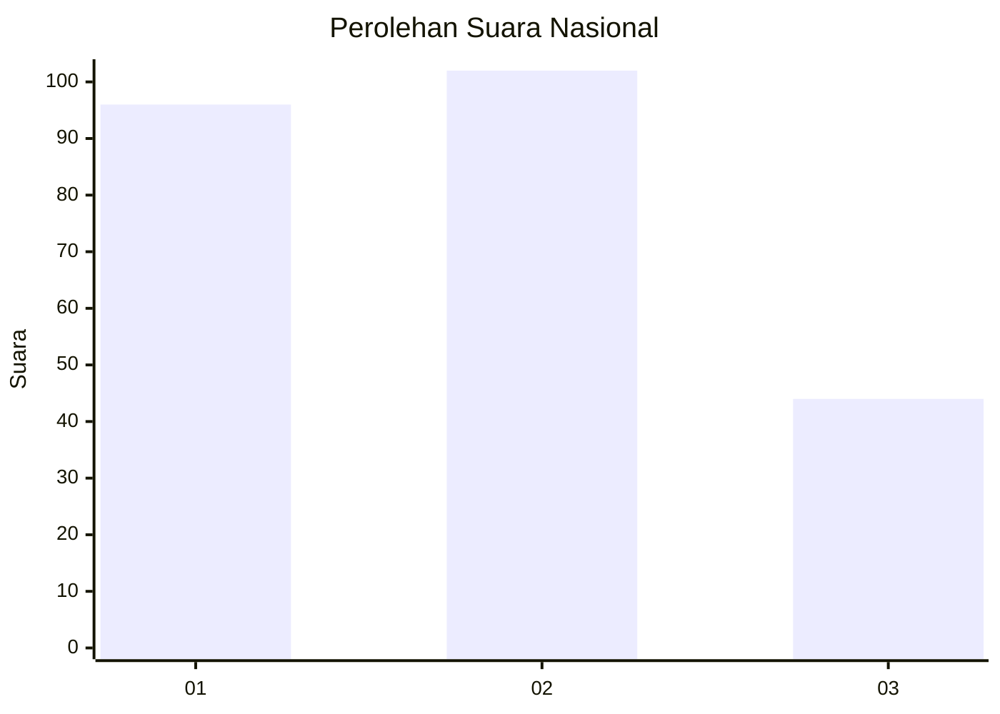
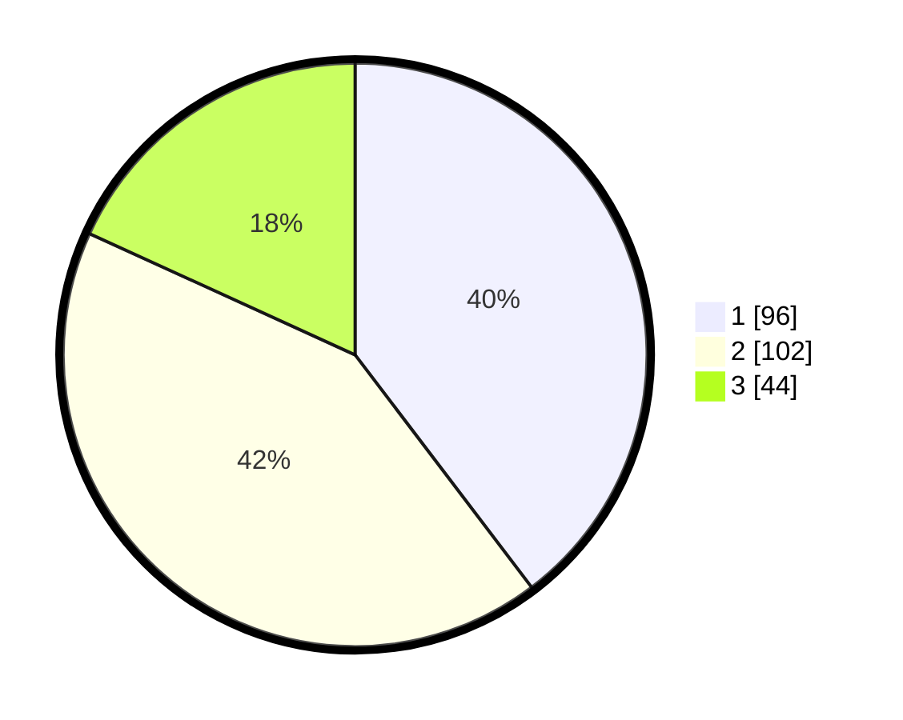

# Hasil

## Grafik

## Tabel

| No.    | Nama Paslon    | Suara | Suara (raw) | Persentase |
|:------ |:-------------- | -----:| -----------:| ----------:|
| 100025 | ANIES MUHAIMIN | 96    | [96][p-1]   | 39,67      |
| 100026 | PRABOWO GIBRAN | 102   | [102][p-2]  | 42,15      |
| 100027 | GANJAR MAHFUD  | 44    | [44][p-3]   | 18,18      |

[p-1]: https://github.com/gigit-pemilu/pemilu-2024/blob/main/pilpres/hitung-suara/sub/31-dki-jakarta/sub/75-jakarta-timur/sub/01-matraman/sub/1006-utan-kayu-selatan/sub/005-tps/sub/paslon-1.txt
[p-2]: https://github.com/gigit-pemilu/pemilu-2024/blob/main/pilpres/hitung-suara/sub/31-dki-jakarta/sub/75-jakarta-timur/sub/01-matraman/sub/1006-utan-kayu-selatan/sub/005-tps/sub/paslon-2.txt
[p-3]: https://github.com/gigit-pemilu/pemilu-2024/blob/main/pilpres/hitung-suara/sub/31-dki-jakarta/sub/75-jakarta-timur/sub/01-matraman/sub/1006-utan-kayu-selatan/sub/005-tps/sub/paslon-3.txt

## Foto C Plano

https://sirekap-obj-formc.kpu.go.id/b7f3/pemilu/ppwp/31/75/01/10/06/3175011006005-20240215-023302--aac47a6d-43e8-4cc6-85dd-b9c74f23aea2.jpg

https://sirekap-obj-formc.kpu.go.id/b7f3/pemilu/ppwp/31/75/01/10/06/3175011006005-20240215-023307--f77b9527-fd93-4c04-aa5f-d0039ffa6255.jpg

https://sirekap-obj-formc.kpu.go.id/b7f3/pemilu/ppwp/31/75/01/10/06/3175011006005-20240215-023310--a654df44-04ea-4c83-b070-437d3e5efc08.jpg

## Metadata

| Key        | Value               |
| ---------- | ------------------- |
| Time Stamp | 2024-02-15 16:30:25 |

