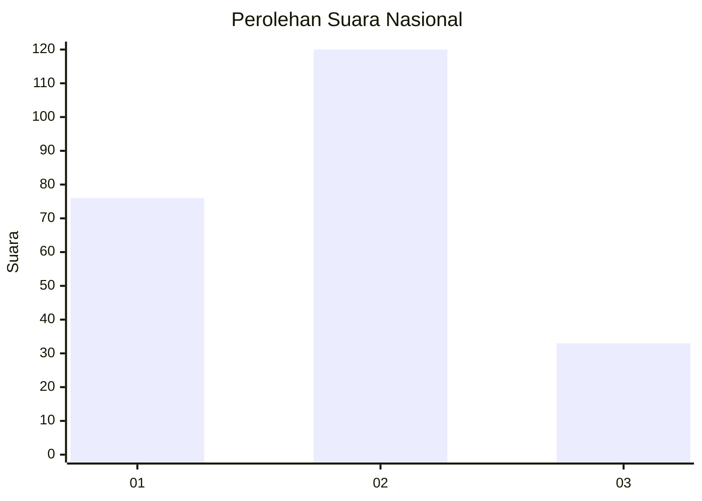
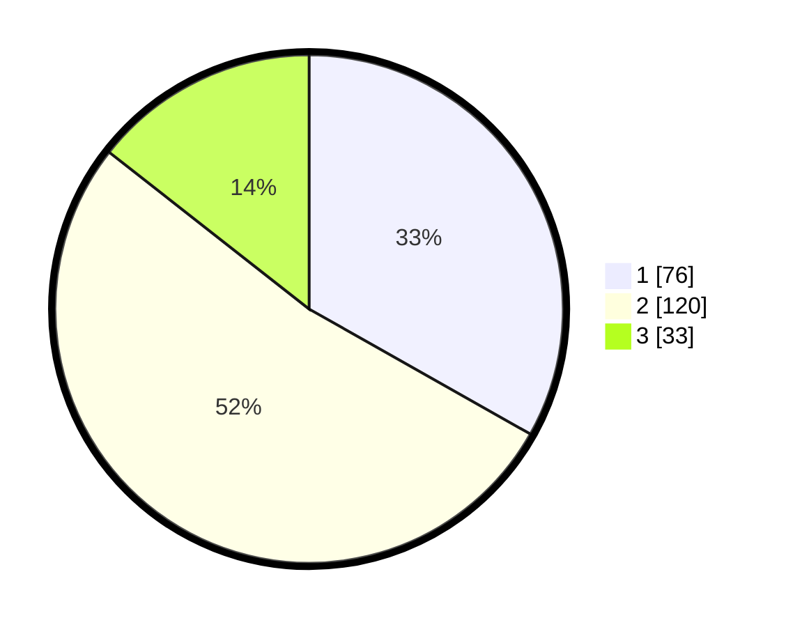

# Hasil

## Grafik

## Tabel

| No.    | Nama Paslon    | Suara | Suara (raw) | Persentase |
|:------ |:-------------- | -----:| -----------:| ----------:|
| 100025 | ANIES MUHAIMIN | 76    | [76][p-1]   | 33,19      |
| 100026 | PRABOWO GIBRAN | 120   | [120][p-2]  | 52,40      |
| 100027 | GANJAR MAHFUD  | 33    | [33][p-3]   | 14,41      |

[p-1]: https://github.com/gigit-pemilu/pemilu-2024/blob/main/pilpres/hitung-suara/sub/31-dki-jakarta/sub/75-jakarta-timur/sub/01-matraman/sub/1006-utan-kayu-selatan/sub/010-tps/sub/paslon-1.txt
[p-2]: https://github.com/gigit-pemilu/pemilu-2024/blob/main/pilpres/hitung-suara/sub/31-dki-jakarta/sub/75-jakarta-timur/sub/01-matraman/sub/1006-utan-kayu-selatan/sub/010-tps/sub/paslon-2.txt
[p-3]: https://github.com/gigit-pemilu/pemilu-2024/blob/main/pilpres/hitung-suara/sub/31-dki-jakarta/sub/75-jakarta-timur/sub/01-matraman/sub/1006-utan-kayu-selatan/sub/010-tps/sub/paslon-3.txt

## Foto C Plano

https://sirekap-obj-formc.kpu.go.id/5448/pemilu/ppwp/31/75/01/10/06/3175011006010-20240214-214124--0b91a50b-85b9-4901-bc77-9ea6a6b30cc8.jpg

https://sirekap-obj-formc.kpu.go.id/5448/pemilu/ppwp/31/75/01/10/06/3175011006010-20240214-214605--9d6c69da-6e55-4102-b878-2da8db726412.jpg

https://sirekap-obj-formc.kpu.go.id/5448/pemilu/ppwp/31/75/01/10/06/3175011006010-20240214-214803--d8a2135b-5601-4943-ace9-5f5e45ff6189.jpg

## Metadata

| Key        | Value               |
| ---------- | ------------------- |
| Time Stamp | 2024-02-15 15:00:29 |

