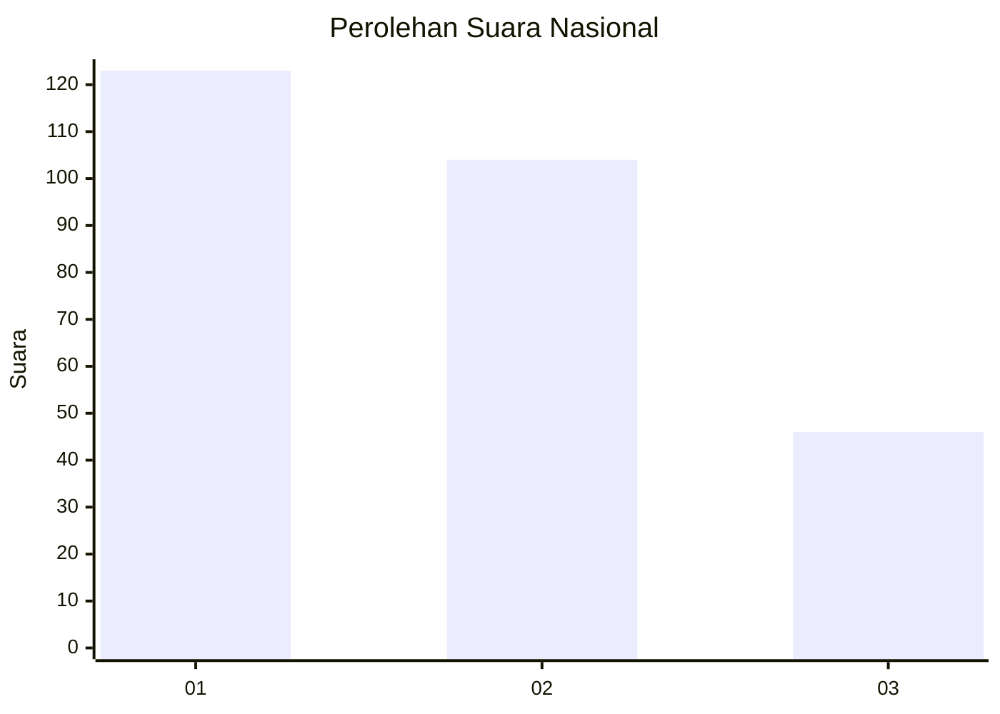
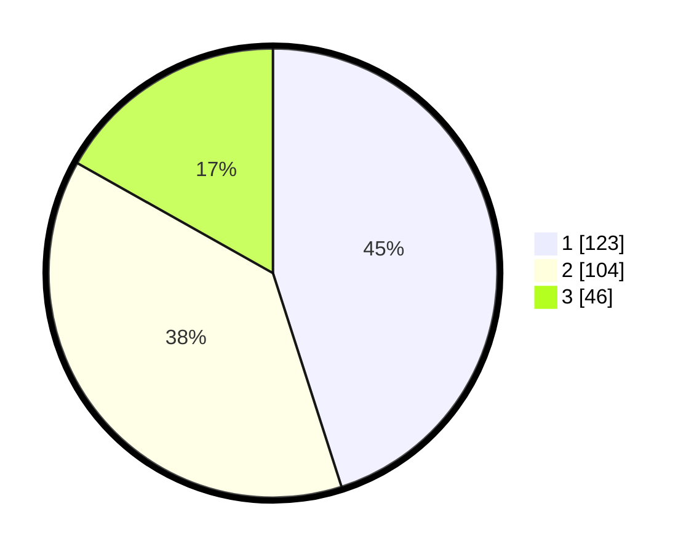

# Hasil

## Grafik

## Tabel

| No.    | Nama Paslon    | Suara | Suara (raw) | Persentase |
|:------ |:-------------- | -----:| -----------:| ----------:|
| 100025 | ANIES MUHAIMIN | 123   | [123][p-1]  | 45,05      |
| 100026 | PRABOWO GIBRAN | 104   | [104][p-2]  | 38,10      |
| 100027 | GANJAR MAHFUD  | 46    | [46][p-3]   | 16,85      |

[p-1]: https://github.com/gigit-pemilu/pemilu-2024/blob/main/pilpres/hitung-suara/sub/31-dki-jakarta/sub/75-jakarta-timur/sub/01-matraman/sub/1006-utan-kayu-selatan/sub/015-tps/sub/paslon-1.txt
[p-2]: https://github.com/gigit-pemilu/pemilu-2024/blob/main/pilpres/hitung-suara/sub/31-dki-jakarta/sub/75-jakarta-timur/sub/01-matraman/sub/1006-utan-kayu-selatan/sub/015-tps/sub/paslon-2.txt
[p-3]: https://github.com/gigit-pemilu/pemilu-2024/blob/main/pilpres/hitung-suara/sub/31-dki-jakarta/sub/75-jakarta-timur/sub/01-matraman/sub/1006-utan-kayu-selatan/sub/015-tps/sub/paslon-3.txt

## Foto C Plano

https://sirekap-obj-formc.kpu.go.id/9806/pemilu/ppwp/31/75/01/10/06/3175011006015-20240214-222506--92714f7d-be16-4685-a843-f19fc9505d22.jpg

https://sirekap-obj-formc.kpu.go.id/9806/pemilu/ppwp/31/75/01/10/06/3175011006015-20240214-222515--259388ca-feca-487f-8737-2b8276fc931f.jpg

https://sirekap-obj-formc.kpu.go.id/9806/pemilu/ppwp/31/75/01/10/06/3175011006015-20240214-222520--3f4f9060-581a-4b71-891c-f107927e5b54.jpg

## Metadata

| Key        | Value               |
| ---------- | ------------------- |
| Time Stamp | 2024-02-15 16:30:25 |

