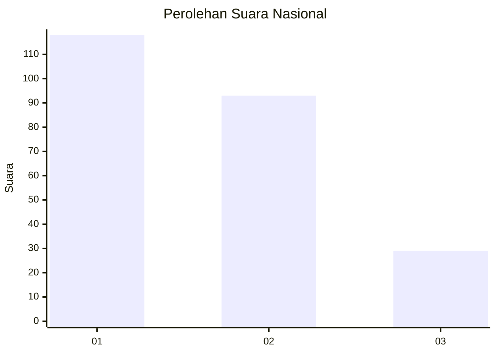
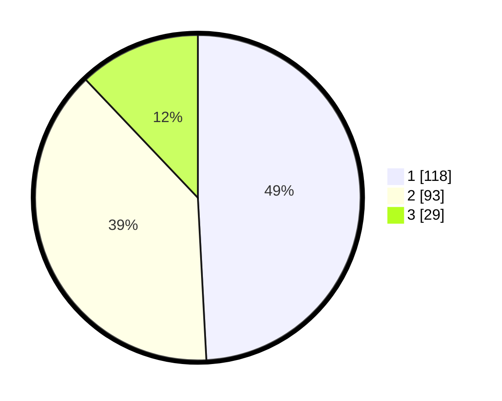

# Hasil

## Grafik

## Tabel

| No.    | Nama Paslon    | Suara | Suara (raw) | Persentase |
|:------ |:-------------- | -----:| -----------:| ----------:|
| 100025 | ANIES MUHAIMIN | 118   | [118][p-1]  | 49,17      |
| 100026 | PRABOWO GIBRAN | 93    | [93][p-2]   | 38,75      |
| 100027 | GANJAR MAHFUD  | 29    | [29][p-3]   | 12,08      |

[p-1]: https://github.com/gigit-pemilu/pemilu-2024/blob/main/pilpres/hitung-suara/sub/31-dki-jakarta/sub/75-jakarta-timur/sub/01-matraman/sub/1006-utan-kayu-selatan/sub/034-tps/sub/paslon-1.txt
[p-2]: https://github.com/gigit-pemilu/pemilu-2024/blob/main/pilpres/hitung-suara/sub/31-dki-jakarta/sub/75-jakarta-timur/sub/01-matraman/sub/1006-utan-kayu-selatan/sub/034-tps/sub/paslon-2.txt
[p-3]: https://github.com/gigit-pemilu/pemilu-2024/blob/main/pilpres/hitung-suara/sub/31-dki-jakarta/sub/75-jakarta-timur/sub/01-matraman/sub/1006-utan-kayu-selatan/sub/034-tps/sub/paslon-3.txt

## Foto C Plano

https://sirekap-obj-formc.kpu.go.id/2ffb/pemilu/ppwp/31/75/01/10/06/3175011006034-20240214-195420--934ff1d2-1b5b-4042-9046-9c1ca6ac3b75.jpg

https://sirekap-obj-formc.kpu.go.id/2ffb/pemilu/ppwp/31/75/01/10/06/3175011006034-20240214-233827--2e644813-05ad-44b0-ab85-4e03ec36fbae.jpg

https://sirekap-obj-formc.kpu.go.id/2ffb/pemilu/ppwp/31/75/01/10/06/3175011006034-20240214-195736--7d6965e7-a227-4c1c-be83-9fb2e0f88711.jpg

## Metadata

| Key        | Value               |
| ---------- | ------------------- |
| Time Stamp | 2024-02-15 15:00:29 |

