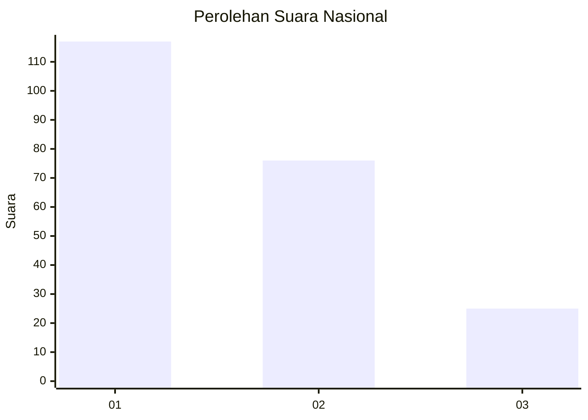
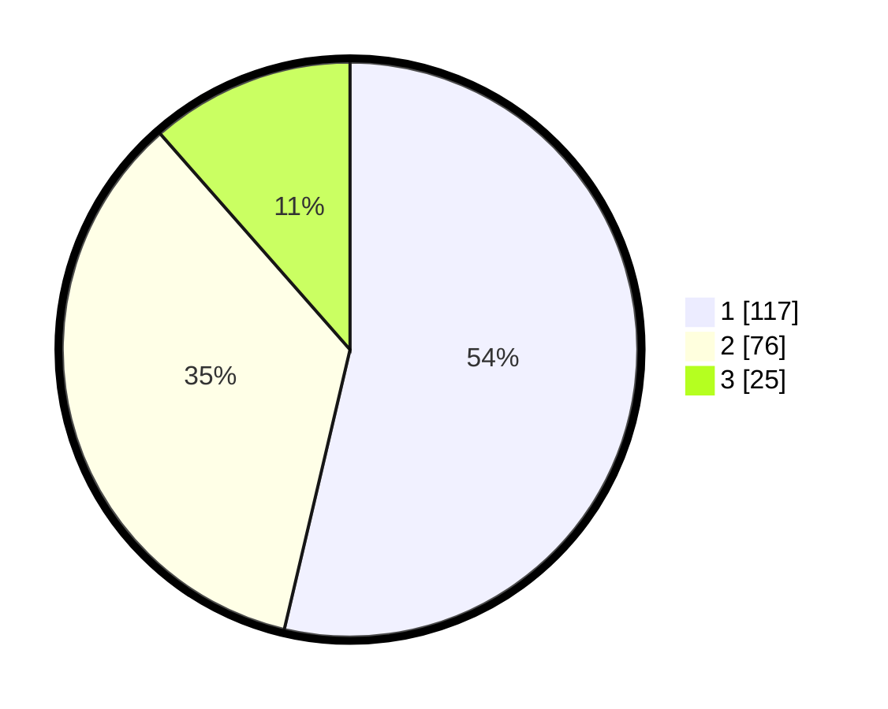

# Hasil

## Grafik

## Tabel

| No.    | Nama Paslon    | Suara | Suara (raw) | Persentase |
|:------ |:-------------- | -----:| -----------:| ----------:|
| 100025 | ANIES MUHAIMIN | 117   | [117][p-1]  | 53,67      |
| 100026 | PRABOWO GIBRAN | 76    | [76][p-2]   | 34,86      |
| 100027 | GANJAR MAHFUD  | 25    | [25][p-3]   | 11,47      |

[p-1]: https://github.com/gigit-pemilu/pemilu-2024/blob/main/pilpres/hitung-suara/sub/31-dki-jakarta/sub/75-jakarta-timur/sub/01-matraman/sub/1006-utan-kayu-selatan/sub/040-tps/sub/paslon-1.txt
[p-2]: https://github.com/gigit-pemilu/pemilu-2024/blob/main/pilpres/hitung-suara/sub/31-dki-jakarta/sub/75-jakarta-timur/sub/01-matraman/sub/1006-utan-kayu-selatan/sub/040-tps/sub/paslon-2.txt
[p-3]: https://github.com/gigit-pemilu/pemilu-2024/blob/main/pilpres/hitung-suara/sub/31-dki-jakarta/sub/75-jakarta-timur/sub/01-matraman/sub/1006-utan-kayu-selatan/sub/040-tps/sub/paslon-3.txt

## Foto C Plano

https://sirekap-obj-formc.kpu.go.id/ab5a/pemilu/ppwp/31/75/01/10/06/3175011006040-20240215-030224--35a94ab0-9fd2-4248-b641-b0e84c32980f.jpg

https://sirekap-obj-formc.kpu.go.id/ab5a/pemilu/ppwp/31/75/01/10/06/3175011006040-20240215-025622--f4b50b18-eda9-406d-9682-13aadbf24681.jpg

https://sirekap-obj-formc.kpu.go.id/ab5a/pemilu/ppwp/31/75/01/10/06/3175011006040-20240215-025946--d2618ecc-dbf7-4e27-8cfc-c8b011a7f911.jpg

## Metadata

| Key        | Value               |
| ---------- | ------------------- |
| Time Stamp | 2024-02-16 21:01:00 |

