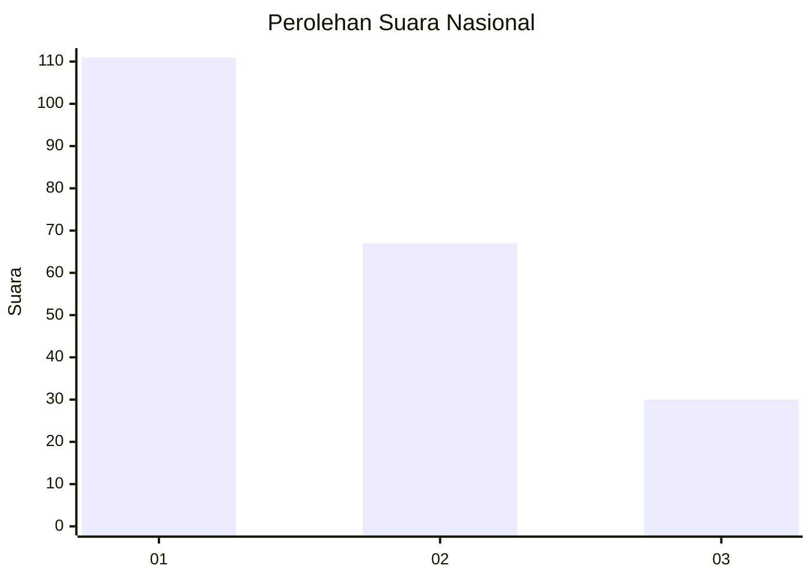
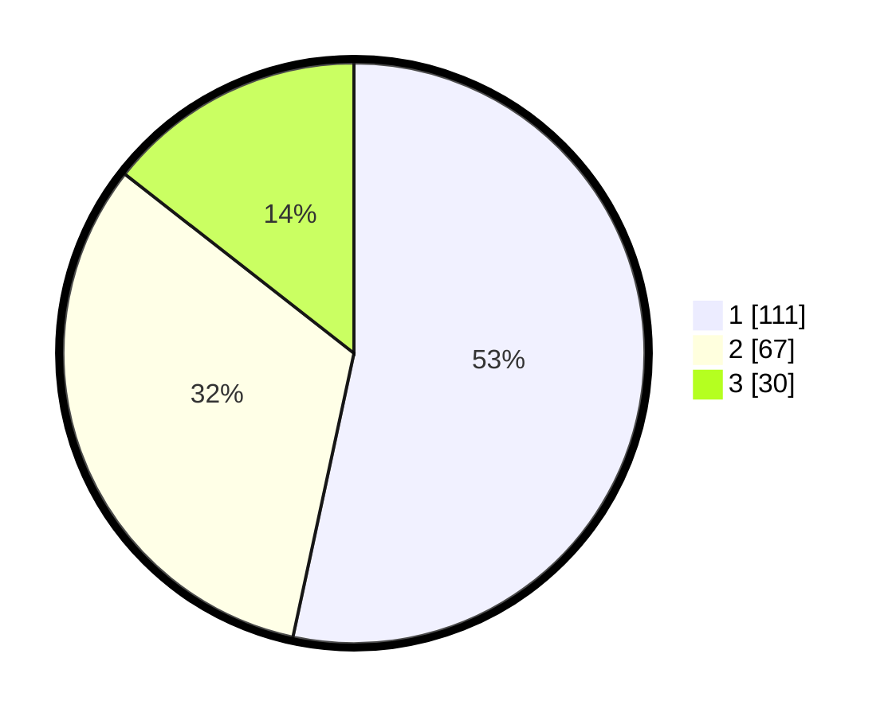

# Hasil

## Grafik

## Tabel

| No.    | Nama Paslon    | Suara | Suara (raw) | Persentase |
|:------ |:-------------- | -----:| -----------:| ----------:|
| 100025 | ANIES MUHAIMIN | 111   | [111][p-1]  | 53,37      |
| 100026 | PRABOWO GIBRAN | 67    | [67][p-2]   | 32,21      |
| 100027 | GANJAR MAHFUD  | 30    | [30][p-3]   | 14,42      |

[p-1]: https://github.com/gigit-pemilu/pemilu-2024/blob/main/pilpres/hitung-suara/sub/31-dki-jakarta/sub/75-jakarta-timur/sub/01-matraman/sub/1006-utan-kayu-selatan/sub/051-tps/sub/paslon-1.txt
[p-2]: https://github.com/gigit-pemilu/pemilu-2024/blob/main/pilpres/hitung-suara/sub/31-dki-jakarta/sub/75-jakarta-timur/sub/01-matraman/sub/1006-utan-kayu-selatan/sub/051-tps/sub/paslon-2.txt
[p-3]: https://github.com/gigit-pemilu/pemilu-2024/blob/main/pilpres/hitung-suara/sub/31-dki-jakarta/sub/75-jakarta-timur/sub/01-matraman/sub/1006-utan-kayu-selatan/sub/051-tps/sub/paslon-3.txt

## Foto C Plano

https://sirekap-obj-formc.kpu.go.id/a5ae/pemilu/ppwp/31/75/01/10/06/3175011006051-20240214-222101--9d9b6d87-570c-44c2-961c-38c4f7fade8f.jpg

https://sirekap-obj-formc.kpu.go.id/a5ae/pemilu/ppwp/31/75/01/10/06/3175011006051-20240214-222251--027389c2-e278-460c-99a1-274761902870.jpg

https://sirekap-obj-formc.kpu.go.id/a5ae/pemilu/ppwp/31/75/01/10/06/3175011006051-20240214-222502--24b52406-dbe6-4182-8078-e35608373aeb.jpg

## Metadata

| Key        | Value               |
| ---------- | ------------------- |
| Time Stamp | 2024-02-15 17:00:25 |

