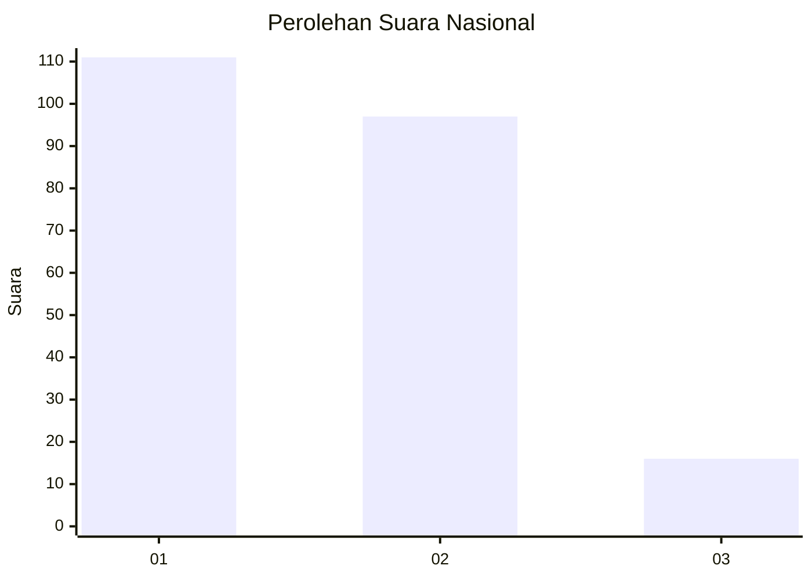
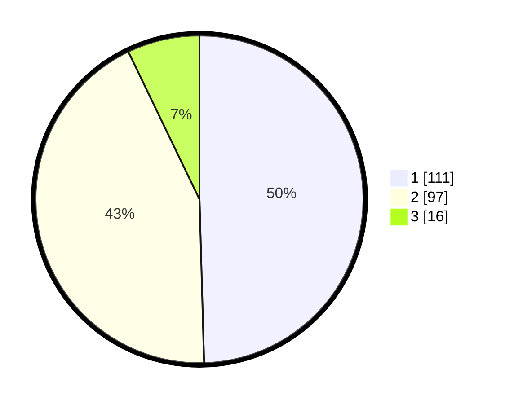

# Hasil

## Grafik

## Tabel

| No.    | Nama Paslon    | Suara | Suara (raw) | Persentase |
|:------ |:-------------- | -----:| -----------:| ----------:|
| 100025 | ANIES MUHAIMIN | 111   | [111][p-1]  | 49,55      |
| 100026 | PRABOWO GIBRAN | 97    | [97][p-2]   | 43,30      |
| 100027 | GANJAR MAHFUD  | 16    | [16][p-3]   | 7,14       |

[p-1]: https://github.com/gigit-pemilu/pemilu-2024/blob/main/pilpres/hitung-suara/sub/31-dki-jakarta/sub/75-jakarta-timur/sub/01-matraman/sub/1006-utan-kayu-selatan/sub/054-tps/sub/paslon-1.txt
[p-2]: https://github.com/gigit-pemilu/pemilu-2024/blob/main/pilpres/hitung-suara/sub/31-dki-jakarta/sub/75-jakarta-timur/sub/01-matraman/sub/1006-utan-kayu-selatan/sub/054-tps/sub/paslon-2.txt
[p-3]: https://github.com/gigit-pemilu/pemilu-2024/blob/main/pilpres/hitung-suara/sub/31-dki-jakarta/sub/75-jakarta-timur/sub/01-matraman/sub/1006-utan-kayu-selatan/sub/054-tps/sub/paslon-3.txt

## Foto C Plano

https://sirekap-obj-formc.kpu.go.id/7d11/pemilu/ppwp/31/75/01/10/06/3175011006054-20240215-024011--b3fd4383-aef0-41a6-b915-d543f9b75555.jpg

https://sirekap-obj-formc.kpu.go.id/7d11/pemilu/ppwp/31/75/01/10/06/3175011006054-20240215-024059--397c8625-d162-4d76-b42e-771526e18dfc.jpg

https://sirekap-obj-formc.kpu.go.id/7d11/pemilu/ppwp/31/75/01/10/06/3175011006054-20240215-024148--51f4337f-8014-4eb7-a521-231b64e142d7.jpg

## Metadata

| Key        | Value               |
| ---------- | ------------------- |
| Time Stamp | 2024-02-15 15:00:29 |

