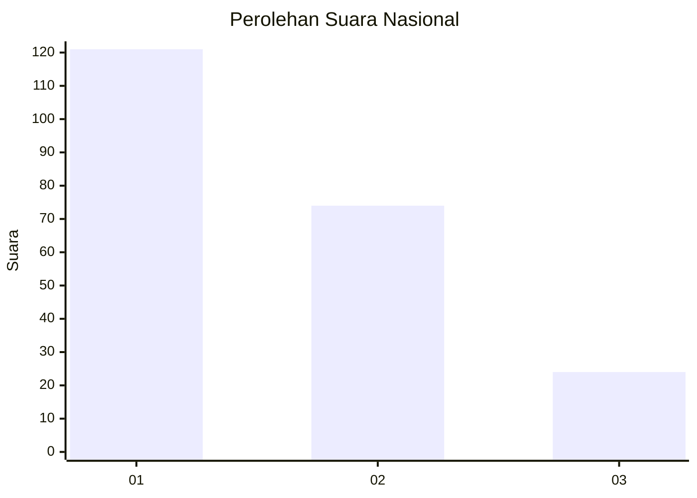
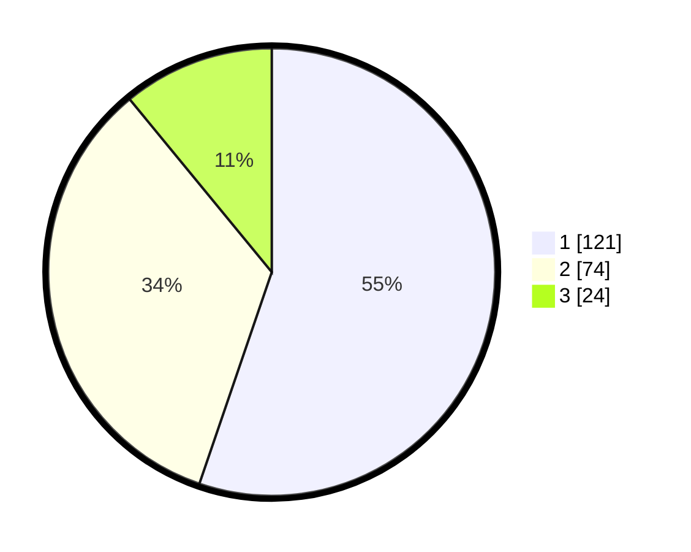

# Hasil

## Grafik

## Tabel

| No.    | Nama Paslon    | Suara | Suara (raw) | Persentase |
|:------ |:-------------- | -----:| -----------:| ----------:|
| 100025 | ANIES MUHAIMIN | 121   | [121][p-1]  | 55,25      |
| 100026 | PRABOWO GIBRAN | 74    | [74][p-2]   | 33,79      |
| 100027 | GANJAR MAHFUD  | 24    | [24][p-3]   | 10,96      |

[p-1]: https://github.com/gigit-pemilu/pemilu-2024/blob/main/pilpres/hitung-suara/sub/31-dki-jakarta/sub/75-jakarta-timur/sub/01-matraman/sub/1006-utan-kayu-selatan/sub/056-tps/sub/paslon-1.txt
[p-2]: https://github.com/gigit-pemilu/pemilu-2024/blob/main/pilpres/hitung-suara/sub/31-dki-jakarta/sub/75-jakarta-timur/sub/01-matraman/sub/1006-utan-kayu-selatan/sub/056-tps/sub/paslon-2.txt
[p-3]: https://github.com/gigit-pemilu/pemilu-2024/blob/main/pilpres/hitung-suara/sub/31-dki-jakarta/sub/75-jakarta-timur/sub/01-matraman/sub/1006-utan-kayu-selatan/sub/056-tps/sub/paslon-3.txt

## Foto C Plano

https://sirekap-obj-formc.kpu.go.id/9c7b/pemilu/ppwp/31/75/01/10/06/3175011006056-20240215-024046--e13e9b9d-07fc-407f-bb65-9268784c86fa.jpg

https://sirekap-obj-formc.kpu.go.id/9c7b/pemilu/ppwp/31/75/01/10/06/3175011006056-20240215-024209--f38fef88-e195-4bf1-8f25-5fcf409359d6.jpg

https://sirekap-obj-formc.kpu.go.id/9c7b/pemilu/ppwp/31/75/01/10/06/3175011006056-20240215-024312--f41cb9a1-bbb9-4504-8899-65d7e7d8d747.jpg

## Metadata

| Key        | Value               |
| ---------- | ------------------- |
| Time Stamp | 2024-02-17 17:30:00 |

