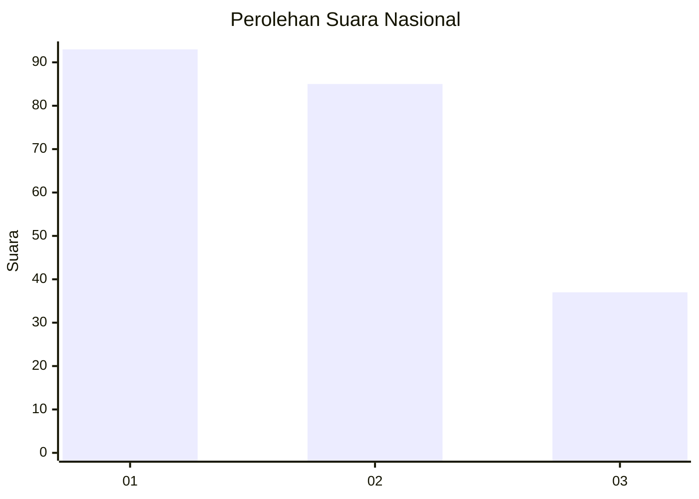
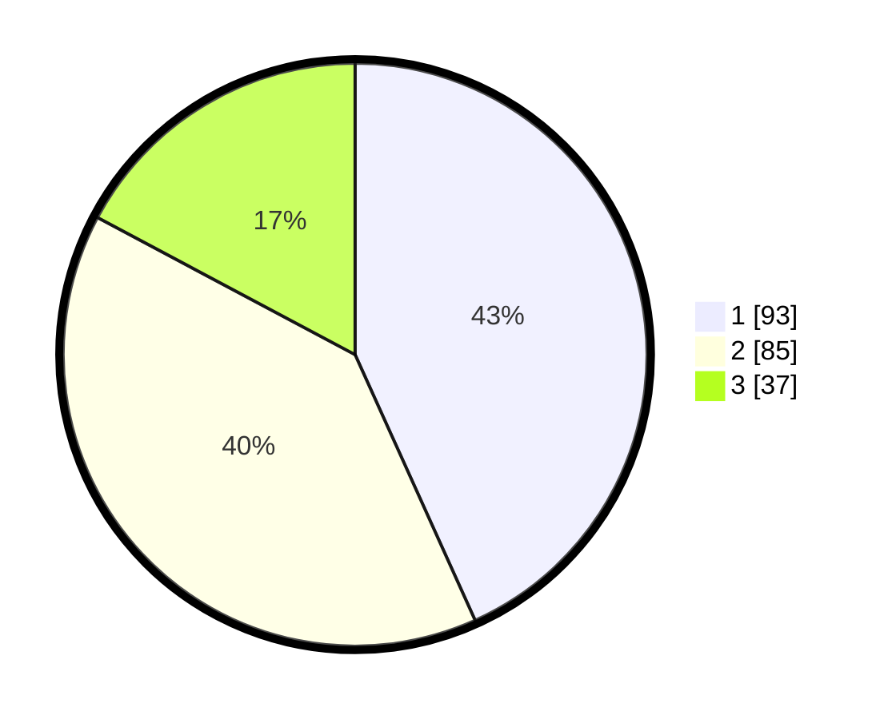

# Hasil

## Grafik

## Tabel

| No.    | Nama Paslon    | Suara | Suara (raw) | Persentase |
|:------ |:-------------- | -----:| -----------:| ----------:|
| 100025 | ANIES MUHAIMIN | 93    | [93][p-1]   | 43,26      |
| 100026 | PRABOWO GIBRAN | 85    | [85][p-2]   | 39,53      |
| 100027 | GANJAR MAHFUD  | 37    | [37][p-3]   | 17,21      |

[p-1]: https://github.com/gigit-pemilu/pemilu-2024/blob/main/pilpres/hitung-suara/sub/31-dki-jakarta/sub/75-jakarta-timur/sub/01-matraman/sub/1006-utan-kayu-selatan/sub/066-tps/sub/paslon-1.txt
[p-2]: https://github.com/gigit-pemilu/pemilu-2024/blob/main/pilpres/hitung-suara/sub/31-dki-jakarta/sub/75-jakarta-timur/sub/01-matraman/sub/1006-utan-kayu-selatan/sub/066-tps/sub/paslon-2.txt
[p-3]: https://github.com/gigit-pemilu/pemilu-2024/blob/main/pilpres/hitung-suara/sub/31-dki-jakarta/sub/75-jakarta-timur/sub/01-matraman/sub/1006-utan-kayu-selatan/sub/066-tps/sub/paslon-3.txt

## Foto C Plano

https://sirekap-obj-formc.kpu.go.id/e865/pemilu/ppwp/31/75/01/10/06/3175011006066-20240214-230316--a538d3e4-01b8-4189-a325-d5c363955470.jpg

https://sirekap-obj-formc.kpu.go.id/e865/pemilu/ppwp/31/75/01/10/06/3175011006066-20240214-205236--858d14d5-3ecd-47a2-ad38-fc963fab6648.jpg

https://sirekap-obj-formc.kpu.go.id/e865/pemilu/ppwp/31/75/01/10/06/3175011006066-20240214-230409--660efeee-d869-4ad5-a104-803345197b4f.jpg

## Metadata

| Key        | Value               |
| ---------- | ------------------- |
| Time Stamp | 2024-02-15 12:00:28 |

