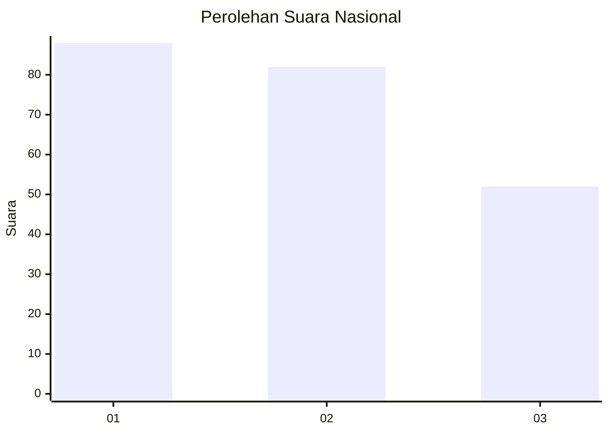
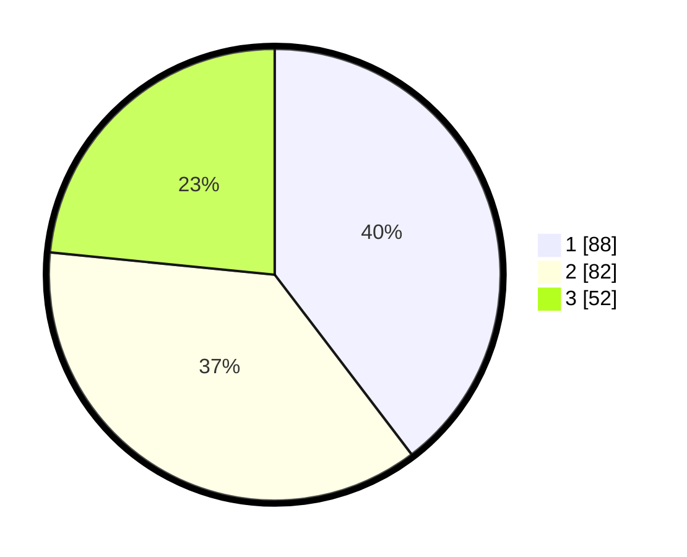

# Hasil

## Grafik

## Tabel

| No.    | Nama Paslon    | Suara | Suara (raw) | Persentase |
|:------ |:-------------- | -----:| -----------:| ----------:|
| 100025 | ANIES MUHAIMIN | 88    | [88][p-1]   | 39,64      |
| 100026 | PRABOWO GIBRAN | 82    | [82][p-2]   | 36,94      |
| 100027 | GANJAR MAHFUD  | 52    | [52][p-3]   | 23,42      |

[p-1]: https://github.com/gigit-pemilu/pemilu-2024/blob/main/pilpres/hitung-suara/sub/31-dki-jakarta/sub/75-jakarta-timur/sub/01-matraman/sub/1006-utan-kayu-selatan/sub/077-tps/sub/paslon-1.txt
[p-2]: https://github.com/gigit-pemilu/pemilu-2024/blob/main/pilpres/hitung-suara/sub/31-dki-jakarta/sub/75-jakarta-timur/sub/01-matraman/sub/1006-utan-kayu-selatan/sub/077-tps/sub/paslon-2.txt
[p-3]: https://github.com/gigit-pemilu/pemilu-2024/blob/main/pilpres/hitung-suara/sub/31-dki-jakarta/sub/75-jakarta-timur/sub/01-matraman/sub/1006-utan-kayu-selatan/sub/077-tps/sub/paslon-3.txt

## Foto C Plano

https://sirekap-obj-formc.kpu.go.id/9a68/pemilu/ppwp/31/75/01/10/06/3175011006077-20240214-215106--bc0fb8f7-951b-498d-85a1-2b106ff91732.jpg

https://sirekap-obj-formc.kpu.go.id/9a68/pemilu/ppwp/31/75/01/10/06/3175011006077-20240214-215656--a791f8b3-deb2-4a2c-bf91-9520f2686743.jpg

https://sirekap-obj-formc.kpu.go.id/9a68/pemilu/ppwp/31/75/01/10/06/3175011006077-20240214-215424--fa3cdb75-96f0-49d6-8552-1a28ec092bbe.jpg

## Metadata

| Key        | Value               |
| ---------- | ------------------- |
| Time Stamp | 2024-02-16 21:01:00 |

