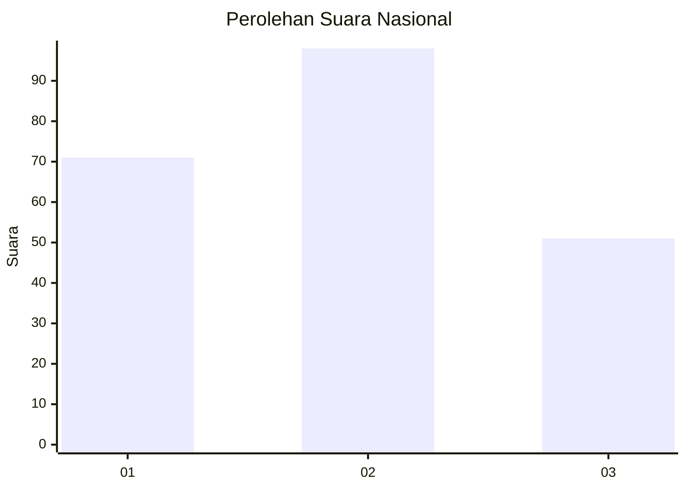
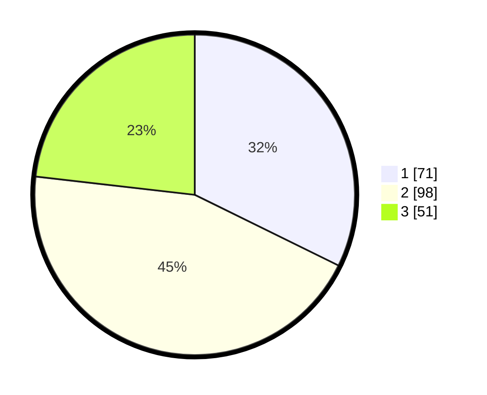

# Hasil

## Grafik

## Tabel

| No.    | Nama Paslon    | Suara | Suara (raw) | Persentase |
|:------ |:-------------- | -----:| -----------:| ----------:|
| 100025 | ANIES MUHAIMIN | 71    | [71][p-1]   | 32,27      |
| 100026 | PRABOWO GIBRAN | 98    | [98][p-2]   | 44,55      |
| 100027 | GANJAR MAHFUD  | 51    | [51][p-3]   | 23,18      |

[p-1]: https://github.com/gigit-pemilu/pemilu-2024/blob/main/pilpres/hitung-suara/sub/31-dki-jakarta/sub/75-jakarta-timur/sub/01-matraman/sub/1006-utan-kayu-selatan/sub/078-tps/sub/paslon-1.txt
[p-2]: https://github.com/gigit-pemilu/pemilu-2024/blob/main/pilpres/hitung-suara/sub/31-dki-jakarta/sub/75-jakarta-timur/sub/01-matraman/sub/1006-utan-kayu-selatan/sub/078-tps/sub/paslon-2.txt
[p-3]: https://github.com/gigit-pemilu/pemilu-2024/blob/main/pilpres/hitung-suara/sub/31-dki-jakarta/sub/75-jakarta-timur/sub/01-matraman/sub/1006-utan-kayu-selatan/sub/078-tps/sub/paslon-3.txt

## Foto C Plano

https://sirekap-obj-formc.kpu.go.id/8c18/pemilu/ppwp/31/75/01/10/06/3175011006078-20240214-224721--1842c67e-e46b-4b9f-bccf-fb5e38597439.jpg

https://sirekap-obj-formc.kpu.go.id/8c18/pemilu/ppwp/31/75/01/10/06/3175011006078-20240214-215111--9a9bd192-77d6-4792-a28a-578868ea1b4e.jpg

https://sirekap-obj-formc.kpu.go.id/8c18/pemilu/ppwp/31/75/01/10/06/3175011006078-20240214-215222--ffd5dcd1-2056-4558-a2ce-ef0960f5ca4e.jpg

## Metadata

| Key        | Value               |
| ---------- | ------------------- |
| Time Stamp | 2024-02-15 17:00:25 |

