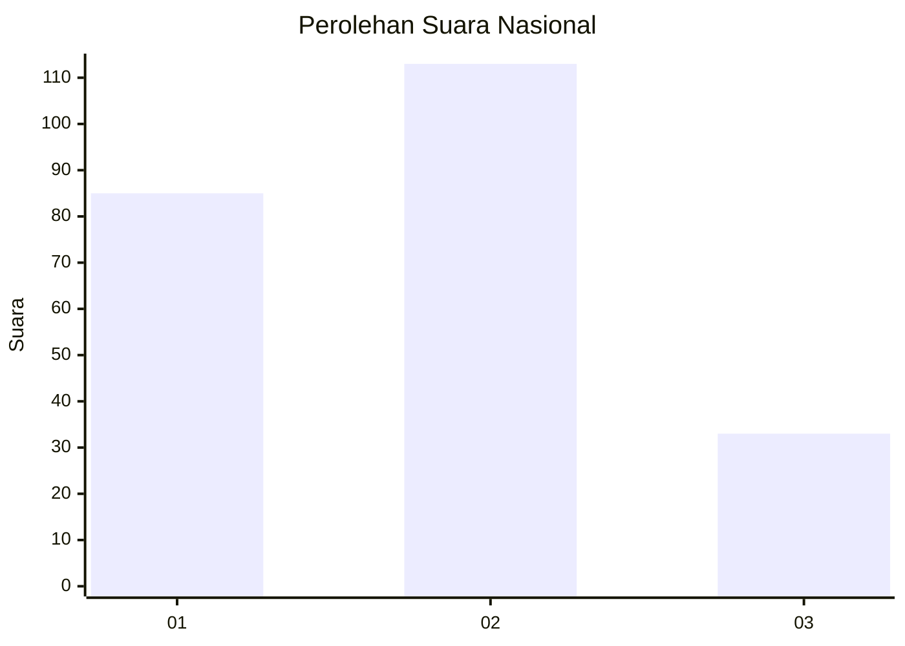
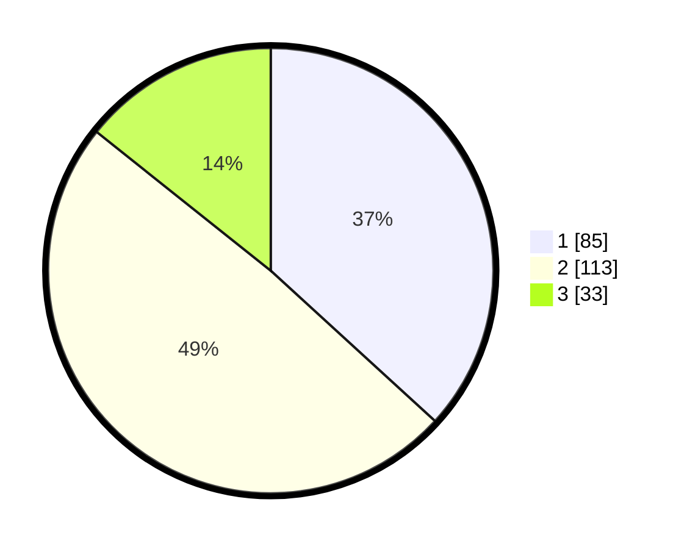

# Hasil

## Grafik

## Tabel

| No.    | Nama Paslon    | Suara | Suara (raw) | Persentase |
|:------ |:-------------- | -----:| -----------:| ----------:|
| 100025 | ANIES MUHAIMIN | 85    | [85][p-1]   | 36,80      |
| 100026 | PRABOWO GIBRAN | 113   | [113][p-2]  | 48,92      |
| 100027 | GANJAR MAHFUD  | 33    | [33][p-3]   | 14,29      |

[p-1]: https://github.com/gigit-pemilu/pemilu-2024/blob/main/pilpres/hitung-suara/sub/31-dki-jakarta/sub/75-jakarta-timur/sub/01-matraman/sub/1006-utan-kayu-selatan/sub/087-tps/sub/paslon-1.txt
[p-2]: https://github.com/gigit-pemilu/pemilu-2024/blob/main/pilpres/hitung-suara/sub/31-dki-jakarta/sub/75-jakarta-timur/sub/01-matraman/sub/1006-utan-kayu-selatan/sub/087-tps/sub/paslon-2.txt
[p-3]: https://github.com/gigit-pemilu/pemilu-2024/blob/main/pilpres/hitung-suara/sub/31-dki-jakarta/sub/75-jakarta-timur/sub/01-matraman/sub/1006-utan-kayu-selatan/sub/087-tps/sub/paslon-3.txt

## Foto C Plano

https://sirekap-obj-formc.kpu.go.id/2a02/pemilu/ppwp/31/75/01/10/06/3175011006087-20240214-205707--28695c42-ee0e-48b3-af3b-be3fd3d50601.jpg

https://sirekap-obj-formc.kpu.go.id/2a02/pemilu/ppwp/31/75/01/10/06/3175011006087-20240214-205657--810b2ac5-c5f8-4d93-9b2e-7a81f5e005cd.jpg

https://sirekap-obj-formc.kpu.go.id/2a02/pemilu/ppwp/31/75/01/10/06/3175011006087-20240214-205650--5dca586f-1000-416e-be81-f2da46c5961d.jpg

## Metadata

| Key        | Value               |
| ---------- | ------------------- |
| Time Stamp | 2024-02-24 22:31:28 |

