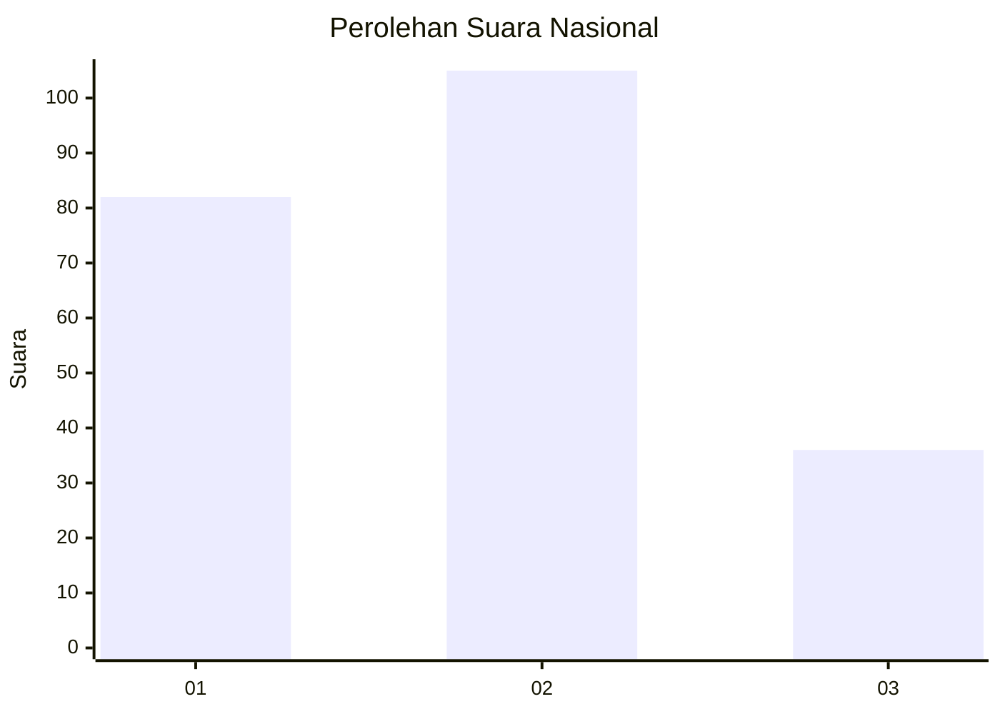
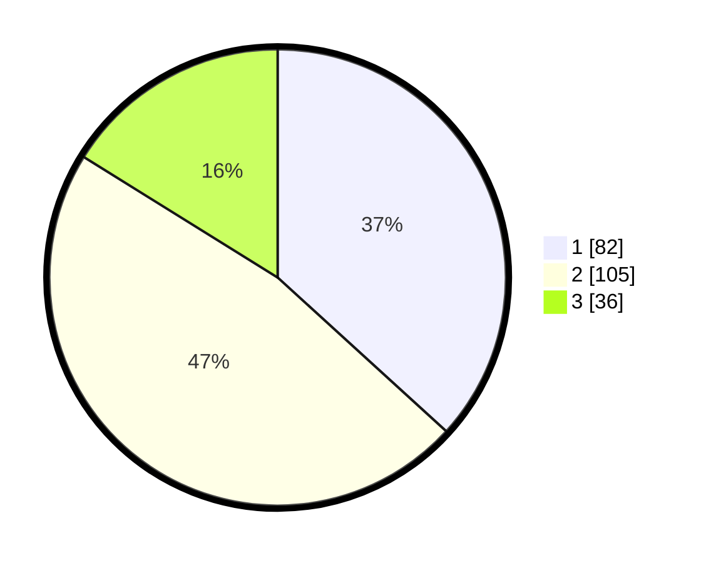

# Hasil

## Grafik

## Tabel

| No.    | Nama Paslon    | Suara | Suara (raw) | Persentase |
|:------ |:-------------- | -----:| -----------:| ----------:|
| 100025 | ANIES MUHAIMIN | 82    | [82][p-1]   | 36,77      |
| 100026 | PRABOWO GIBRAN | 105   | [105][p-2]  | 47,09      |
| 100027 | GANJAR MAHFUD  | 36    | [36][p-3]   | 16,14      |

[p-1]: https://github.com/gigit-pemilu/pemilu-2024/blob/main/pilpres/hitung-suara/sub/31-dki-jakarta/sub/75-jakarta-timur/sub/01-matraman/sub/1006-utan-kayu-selatan/sub/090-tps/sub/paslon-1.txt
[p-2]: https://github.com/gigit-pemilu/pemilu-2024/blob/main/pilpres/hitung-suara/sub/31-dki-jakarta/sub/75-jakarta-timur/sub/01-matraman/sub/1006-utan-kayu-selatan/sub/090-tps/sub/paslon-2.txt
[p-3]: https://github.com/gigit-pemilu/pemilu-2024/blob/main/pilpres/hitung-suara/sub/31-dki-jakarta/sub/75-jakarta-timur/sub/01-matraman/sub/1006-utan-kayu-selatan/sub/090-tps/sub/paslon-3.txt

## Foto C Plano

https://sirekap-obj-formc.kpu.go.id/bf23/pemilu/ppwp/31/75/01/10/06/3175011006090-20240215-041949--7b3d4dff-b0c1-4d86-b01c-704592402285.jpg

https://sirekap-obj-formc.kpu.go.id/bf23/pemilu/ppwp/31/75/01/10/06/3175011006090-20240215-042034--56afa594-e7e8-43a1-9aba-316228dadf92.jpg

https://sirekap-obj-formc.kpu.go.id/bf23/pemilu/ppwp/31/75/01/10/06/3175011006090-20240215-042214--b7fc0267-06d6-4766-9a65-da79eed575ae.jpg

## Metadata

| Key        | Value               |
| ---------- | ------------------- |
| Time Stamp | 2024-02-15 18:00:26 |

