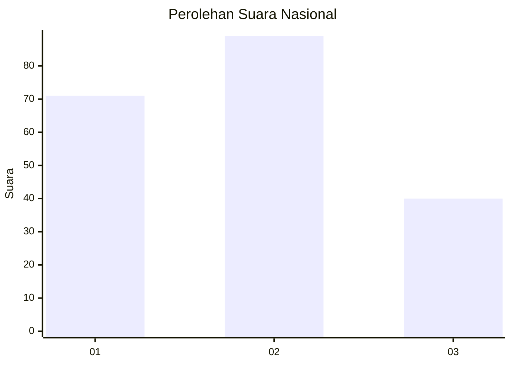
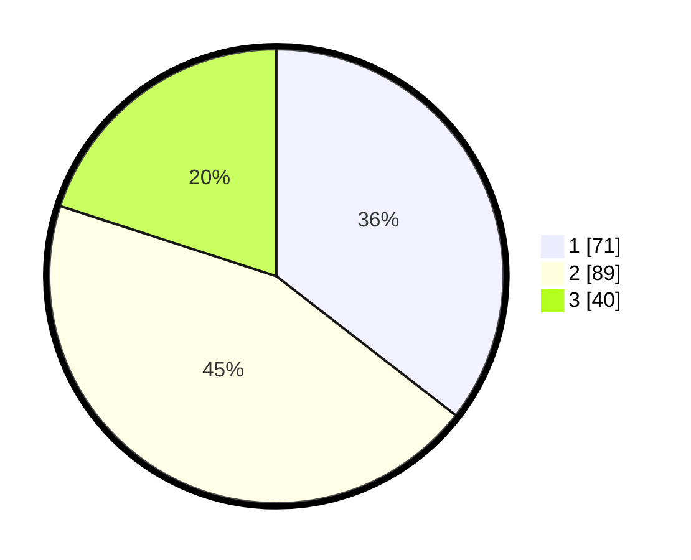

# Hasil

## Grafik

## Tabel

| No.    | Nama Paslon    | Suara | Suara (raw) | Persentase |
|:------ |:-------------- | -----:| -----------:| ----------:|
| 100025 | ANIES MUHAIMIN | 71    | [71][p-1]   | 35,50      |
| 100026 | PRABOWO GIBRAN | 89    | [89][p-2]   | 44,50      |
| 100027 | GANJAR MAHFUD  | 40    | [40][p-3]   | 20,00      |

[p-1]: https://github.com/gigit-pemilu/pemilu-2024/blob/main/pilpres/hitung-suara/sub/31-dki-jakarta/sub/75-jakarta-timur/sub/01-matraman/sub/1006-utan-kayu-selatan/sub/098-tps/sub/paslon-1.txt
[p-2]: https://github.com/gigit-pemilu/pemilu-2024/blob/main/pilpres/hitung-suara/sub/31-dki-jakarta/sub/75-jakarta-timur/sub/01-matraman/sub/1006-utan-kayu-selatan/sub/098-tps/sub/paslon-2.txt
[p-3]: https://github.com/gigit-pemilu/pemilu-2024/blob/main/pilpres/hitung-suara/sub/31-dki-jakarta/sub/75-jakarta-timur/sub/01-matraman/sub/1006-utan-kayu-selatan/sub/098-tps/sub/paslon-3.txt

## Foto C Plano

https://sirekap-obj-formc.kpu.go.id/d61e/pemilu/ppwp/31/75/01/10/06/3175011006098-20240214-230010--084c9a07-e1d8-408b-a55f-21e6a1429650.jpg

https://sirekap-obj-formc.kpu.go.id/d61e/pemilu/ppwp/31/75/01/10/06/3175011006098-20240214-230132--07aae0a4-2237-4711-beac-70230d246055.jpg

https://sirekap-obj-formc.kpu.go.id/d61e/pemilu/ppwp/31/75/01/10/06/3175011006098-20240214-230557--bcf87009-ae79-457e-a322-17bd1ca0fc1e.jpg

## Metadata

| Key        | Value               |
| ---------- | ------------------- |
| Time Stamp | 2024-02-16 21:01:00 |

