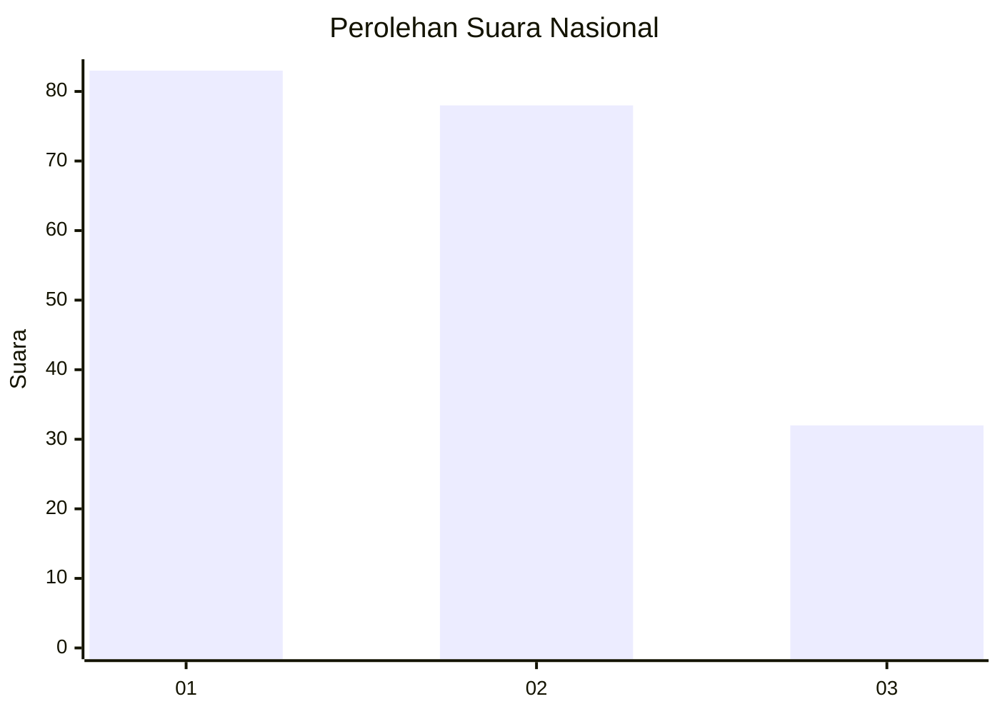
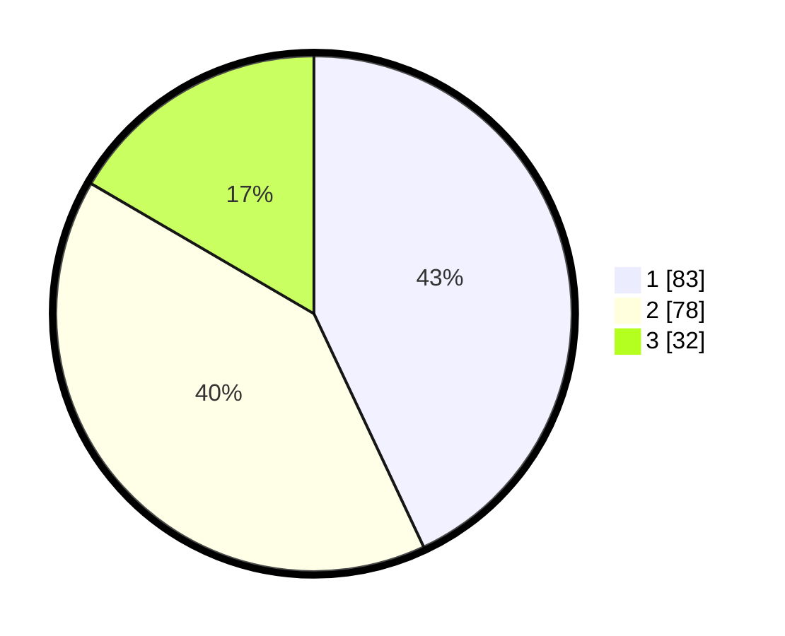

# Hasil

## Grafik

## Tabel

| No.    | Nama Paslon    | Suara | Suara (raw) | Persentase |
|:------ |:-------------- | -----:| -----------:| ----------:|
| 100025 | ANIES MUHAIMIN | 83    | [83][p-1]   | 43,01      |
| 100026 | PRABOWO GIBRAN | 78    | [78][p-2]   | 40,41      |
| 100027 | GANJAR MAHFUD  | 32    | [32][p-3]   | 16,58      |

[p-1]: https://github.com/gigit-pemilu/pemilu-2024/blob/main/pilpres/hitung-suara/sub/31-dki-jakarta/sub/75-jakarta-timur/sub/02-pulogadung/sub/1001-pulo-gadung/sub/005-tps/sub/paslon-1.txt
[p-2]: https://github.com/gigit-pemilu/pemilu-2024/blob/main/pilpres/hitung-suara/sub/31-dki-jakarta/sub/75-jakarta-timur/sub/02-pulogadung/sub/1001-pulo-gadung/sub/005-tps/sub/paslon-2.txt
[p-3]: https://github.com/gigit-pemilu/pemilu-2024/blob/main/pilpres/hitung-suara/sub/31-dki-jakarta/sub/75-jakarta-timur/sub/02-pulogadung/sub/1001-pulo-gadung/sub/005-tps/sub/paslon-3.txt

## Foto C Plano

https://sirekap-obj-formc.kpu.go.id/1837/pemilu/ppwp/31/75/02/10/01/3175021001005-20240226-153144--9d9cac81-dd83-42f9-9fb3-ff662b5b9b08.jpg

https://sirekap-obj-formc.kpu.go.id/1837/pemilu/ppwp/31/75/02/10/01/3175021001005-20240226-153209--7652b533-4de3-4238-bdc6-4d27b0a7773c.jpg

https://sirekap-obj-formc.kpu.go.id/1837/pemilu/ppwp/31/75/02/10/01/3175021001005-20240226-153237--8f0d6a3c-466a-40b3-98da-6442091c6260.jpg

## Metadata

| Key        | Value               |
| ---------- | ------------------- |
| Time Stamp | 2024-02-26 21:00:00 |

