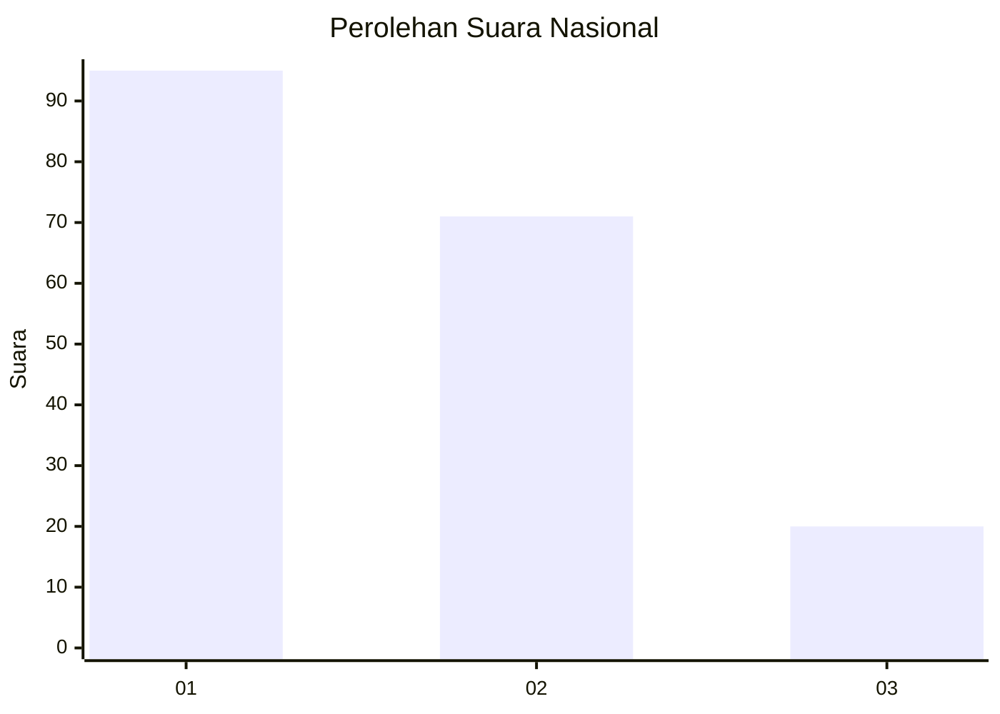
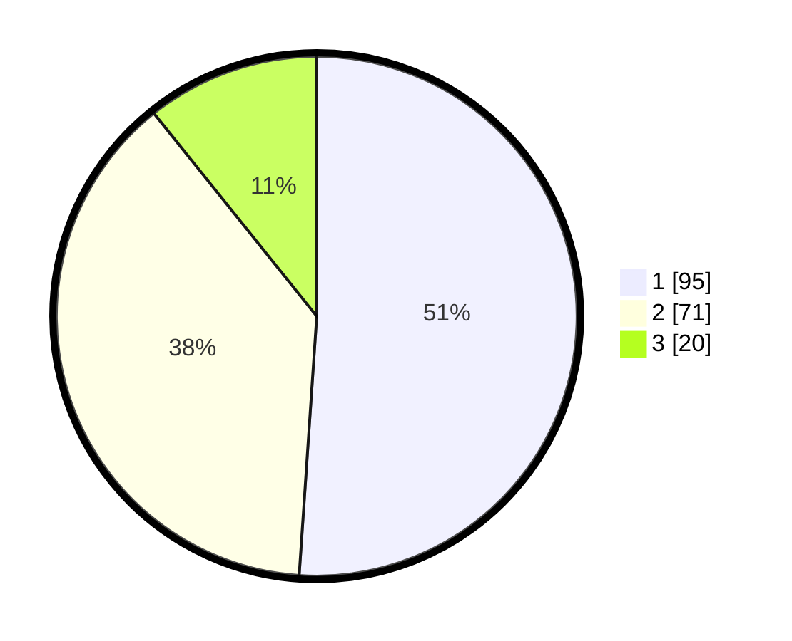

# Hasil

## Grafik

## Tabel

| No.    | Nama Paslon    | Suara | Suara (raw) | Persentase |
|:------ |:-------------- | -----:| -----------:| ----------:|
| 100025 | ANIES MUHAIMIN | 95    | [95][p-1]   | 51,08      |
| 100026 | PRABOWO GIBRAN | 71    | [71][p-2]   | 38,17      |
| 100027 | GANJAR MAHFUD  | 20    | [20][p-3]   | 10,75      |

[p-1]: https://github.com/gigit-pemilu/pemilu-2024/blob/main/pilpres/hitung-suara/sub/31-dki-jakarta/sub/75-jakarta-timur/sub/02-pulogadung/sub/1001-pulo-gadung/sub/010-tps/sub/paslon-1.txt
[p-2]: https://github.com/gigit-pemilu/pemilu-2024/blob/main/pilpres/hitung-suara/sub/31-dki-jakarta/sub/75-jakarta-timur/sub/02-pulogadung/sub/1001-pulo-gadung/sub/010-tps/sub/paslon-2.txt
[p-3]: https://github.com/gigit-pemilu/pemilu-2024/blob/main/pilpres/hitung-suara/sub/31-dki-jakarta/sub/75-jakarta-timur/sub/02-pulogadung/sub/1001-pulo-gadung/sub/010-tps/sub/paslon-3.txt

## Foto C Plano

https://sirekap-obj-formc.kpu.go.id/543e/pemilu/ppwp/31/75/02/10/01/3175021001010-20240226-124317--aa14d6bb-b1a3-4a4a-88eb-d181314f30f9.jpg

https://sirekap-obj-formc.kpu.go.id/543e/pemilu/ppwp/31/75/02/10/01/3175021001010-20240226-124358--5c49bbdc-e9ce-4677-8fe2-b7429dd5d2a3.jpg

https://sirekap-obj-formc.kpu.go.id/543e/pemilu/ppwp/31/75/02/10/01/3175021001010-20240226-124507--6cf7e4c7-77a6-4db6-9219-375e0df4062f.jpg

## Metadata

| Key        | Value               |
| ---------- | ------------------- |
| Time Stamp | 2024-02-26 22:00:00 |

