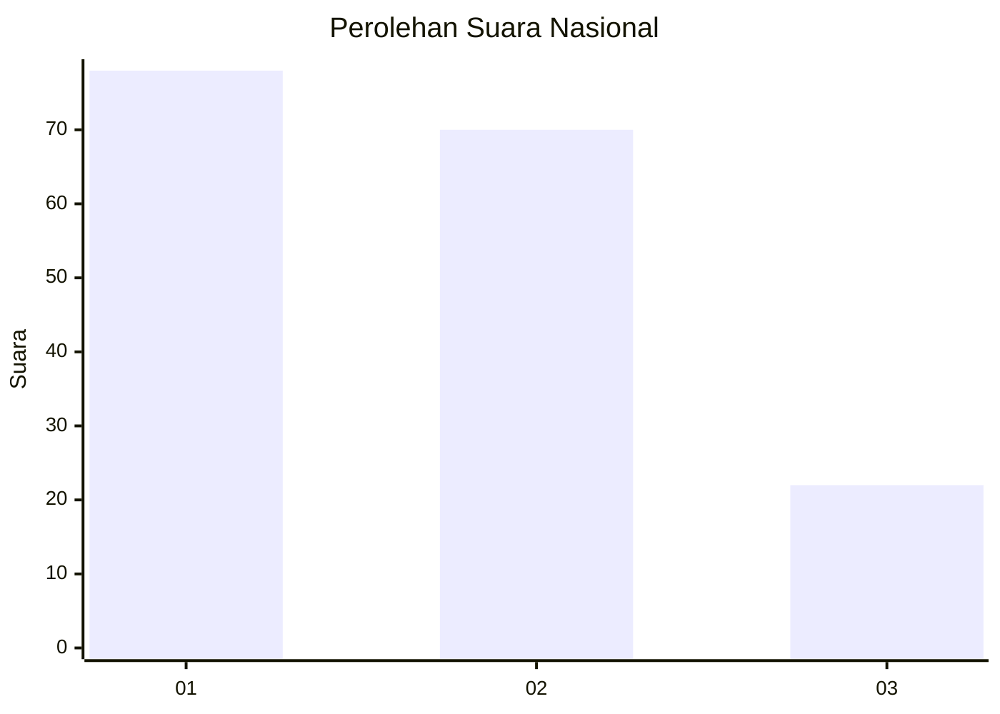
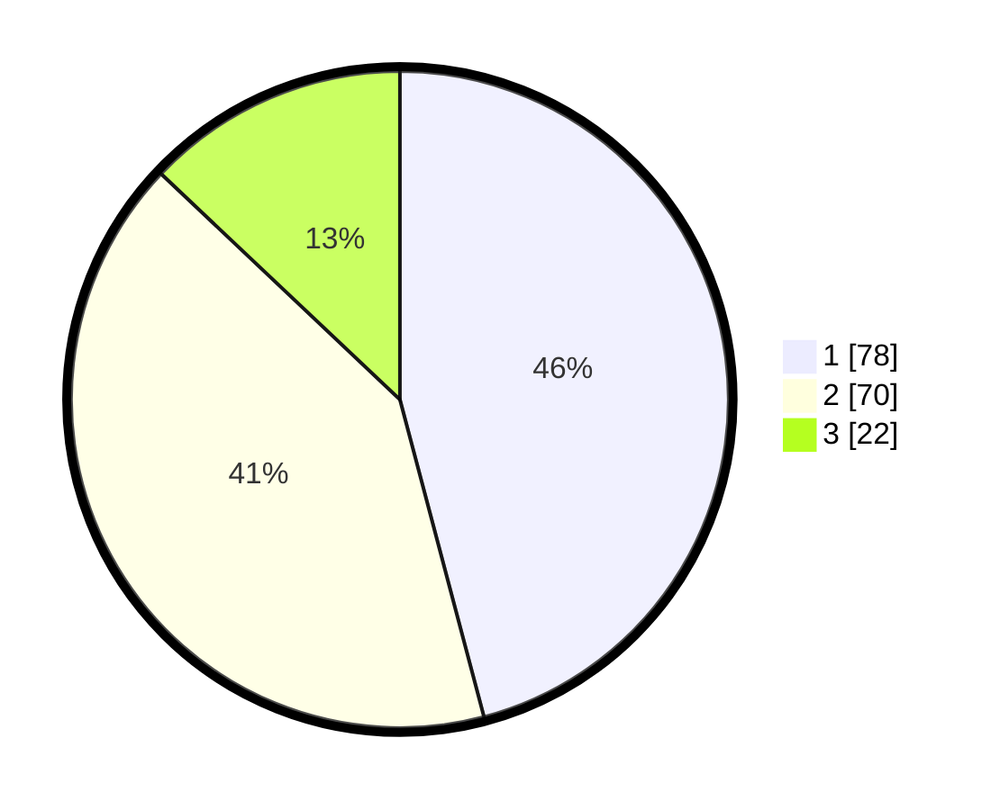

# Hasil

## Grafik

## Tabel

| No.    | Nama Paslon    | Suara | Suara (raw) | Persentase |
|:------ |:-------------- | -----:| -----------:| ----------:|
| 100025 | ANIES MUHAIMIN | 78    | [78][p-1]   | 45,88      |
| 100026 | PRABOWO GIBRAN | 70    | [70][p-2]   | 41,18      |
| 100027 | GANJAR MAHFUD  | 22    | [22][p-3]   | 12,94      |

[p-1]: https://github.com/gigit-pemilu/pemilu-2024/blob/main/pilpres/hitung-suara/sub/31-dki-jakarta/sub/75-jakarta-timur/sub/02-pulogadung/sub/1001-pulo-gadung/sub/018-tps/sub/paslon-1.txt
[p-2]: https://github.com/gigit-pemilu/pemilu-2024/blob/main/pilpres/hitung-suara/sub/31-dki-jakarta/sub/75-jakarta-timur/sub/02-pulogadung/sub/1001-pulo-gadung/sub/018-tps/sub/paslon-2.txt
[p-3]: https://github.com/gigit-pemilu/pemilu-2024/blob/main/pilpres/hitung-suara/sub/31-dki-jakarta/sub/75-jakarta-timur/sub/02-pulogadung/sub/1001-pulo-gadung/sub/018-tps/sub/paslon-3.txt

## Foto C Plano

https://sirekap-obj-formc.kpu.go.id/3703/pemilu/ppwp/31/75/02/10/01/3175021001018-20240214-220407--f8d71e85-3918-49c2-99c1-f61209bd5525.jpg

https://sirekap-obj-formc.kpu.go.id/3703/pemilu/ppwp/31/75/02/10/01/3175021001018-20240214-220706--ee73fdb5-2368-4ec1-b345-24a3e43cb68c.jpg

https://sirekap-obj-formc.kpu.go.id/3703/pemilu/ppwp/31/75/02/10/01/3175021001018-20240214-221000--0c652b88-77ee-49b7-8d3a-91177663b98e.jpg

## Metadata

| Key        | Value               |
| ---------- | ------------------- |
| Time Stamp | 2024-02-16 21:01:00 |

