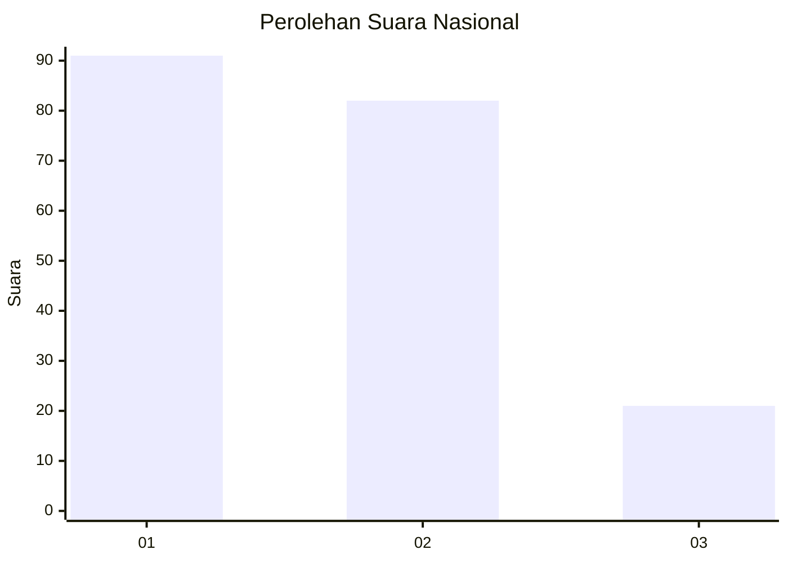
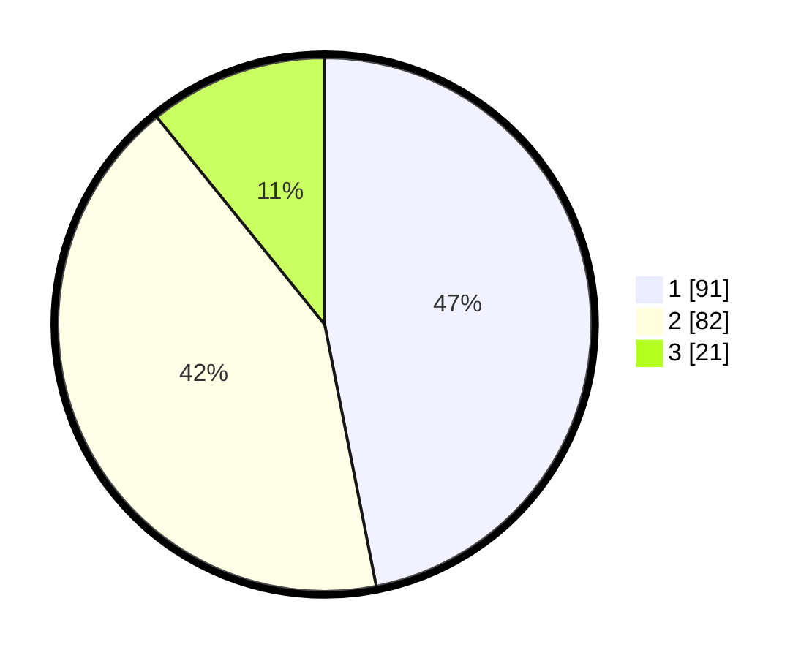

# Hasil

## Grafik

## Tabel

| No.    | Nama Paslon    | Suara | Suara (raw) | Persentase |
|:------ |:-------------- | -----:| -----------:| ----------:|
| 100025 | ANIES MUHAIMIN | 91    | [91][p-1]   | 46,91      |
| 100026 | PRABOWO GIBRAN | 82    | [82][p-2]   | 42,27      |
| 100027 | GANJAR MAHFUD  | 21    | [21][p-3]   | 10,82      |

[p-1]: https://github.com/gigit-pemilu/pemilu-2024/blob/main/pilpres/hitung-suara/sub/31-dki-jakarta/sub/75-jakarta-timur/sub/02-pulogadung/sub/1001-pulo-gadung/sub/050-tps/sub/paslon-1.txt
[p-2]: https://github.com/gigit-pemilu/pemilu-2024/blob/main/pilpres/hitung-suara/sub/31-dki-jakarta/sub/75-jakarta-timur/sub/02-pulogadung/sub/1001-pulo-gadung/sub/050-tps/sub/paslon-2.txt
[p-3]: https://github.com/gigit-pemilu/pemilu-2024/blob/main/pilpres/hitung-suara/sub/31-dki-jakarta/sub/75-jakarta-timur/sub/02-pulogadung/sub/1001-pulo-gadung/sub/050-tps/sub/paslon-3.txt

## Foto C Plano

https://sirekap-obj-formc.kpu.go.id/46de/pemilu/ppwp/31/75/02/10/01/3175021001050-20240302-182012--672c95b0-fb8c-48bc-a7fb-1f9425b7bc71.jpg

https://sirekap-obj-formc.kpu.go.id/46de/pemilu/ppwp/31/75/02/10/01/3175021001050-20240214-195528--45a9525a-ee67-4995-86c0-535423f0d3eb.jpg

https://sirekap-obj-formc.kpu.go.id/46de/pemilu/ppwp/31/75/02/10/01/3175021001050-20240214-202325--98f25275-e18a-4fa7-a5cb-68d4340a2ac2.jpg

## Metadata

| Key        | Value               |
| ---------- | ------------------- |
| Time Stamp | 2024-03-02 19:00:00 |

