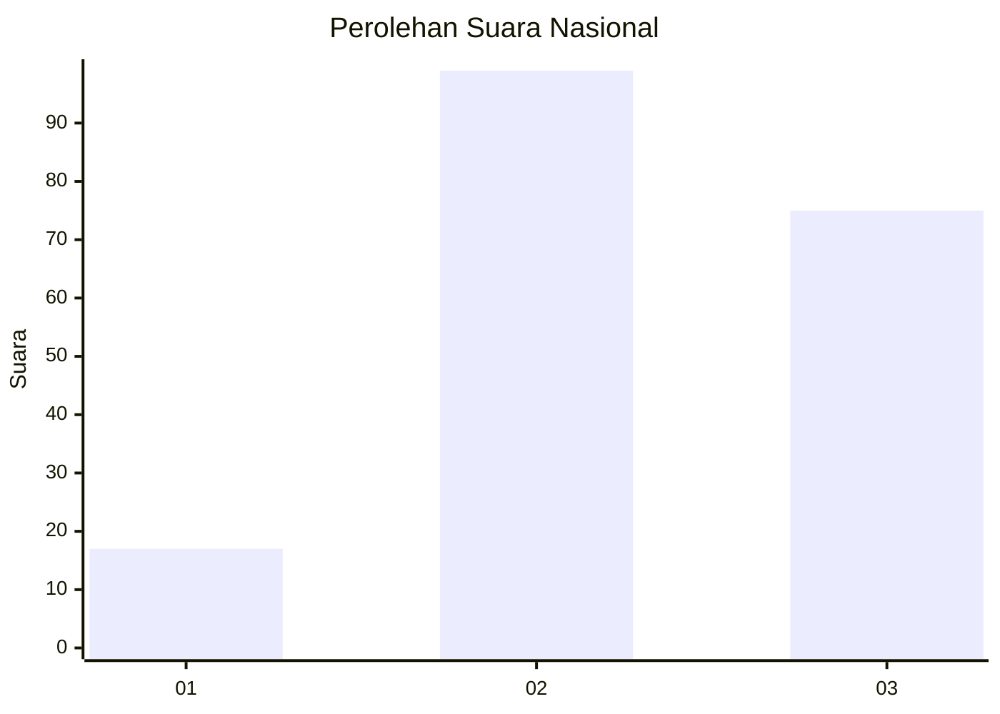
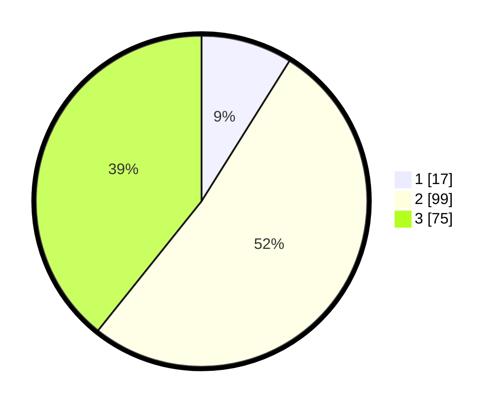

# Hasil

## Grafik

## Tabel

| No.    | Nama Paslon    | Suara | Suara (raw) | Persentase |
|:------ |:-------------- | -----:| -----------:| ----------:|
| 100025 | ANIES MUHAIMIN | 17    | [17][p-1]   | 8,90       |
| 100026 | PRABOWO GIBRAN | 99    | [99][p-2]   | 51,83      |
| 100027 | GANJAR MAHFUD  | 75    | [75][p-3]   | 39,27      |

[p-1]: https://github.com/gigit-pemilu/pemilu-2024/blob/main/pilpres/hitung-suara/sub/31-dki-jakarta/sub/75-jakarta-timur/sub/02-pulogadung/sub/1001-pulo-gadung/sub/053-tps/sub/paslon-1.txt
[p-2]: https://github.com/gigit-pemilu/pemilu-2024/blob/main/pilpres/hitung-suara/sub/31-dki-jakarta/sub/75-jakarta-timur/sub/02-pulogadung/sub/1001-pulo-gadung/sub/053-tps/sub/paslon-2.txt
[p-3]: https://github.com/gigit-pemilu/pemilu-2024/blob/main/pilpres/hitung-suara/sub/31-dki-jakarta/sub/75-jakarta-timur/sub/02-pulogadung/sub/1001-pulo-gadung/sub/053-tps/sub/paslon-3.txt

## Foto C Plano

https://sirekap-obj-formc.kpu.go.id/8113/pemilu/ppwp/31/75/02/10/01/3175021001053-20240226-151958--a46cbe33-4389-4644-b2c0-8725587ca3fa.jpg

https://sirekap-obj-formc.kpu.go.id/8113/pemilu/ppwp/31/75/02/10/01/3175021001053-20240226-152020--b746a05a-fcd9-456d-8de6-2d450ef6ec2b.jpg

https://sirekap-obj-formc.kpu.go.id/8113/pemilu/ppwp/31/75/02/10/01/3175021001053-20240226-152047--a3ace526-3824-468a-b33f-cb54718d5e52.jpg

## Metadata

| Key        | Value               |
| ---------- | ------------------- |
| Time Stamp | 2024-02-26 18:00:00 |

