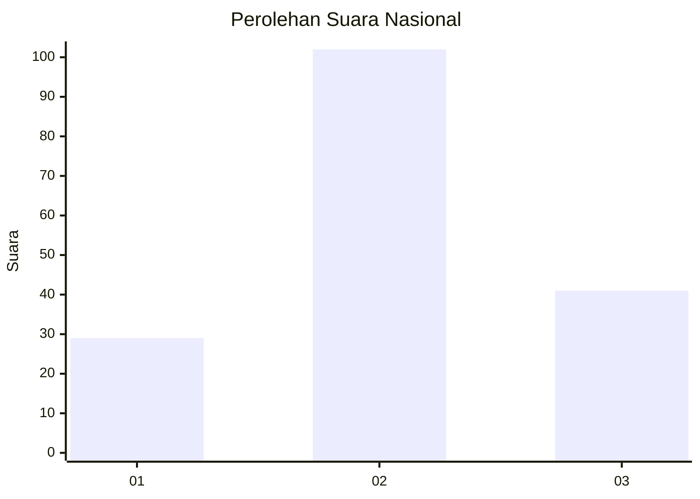
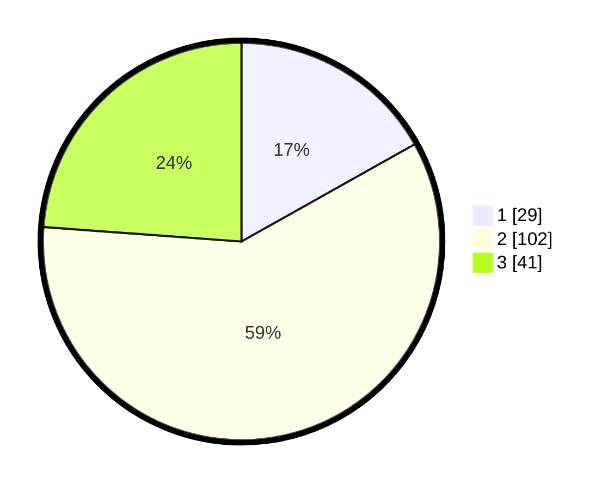

# Hasil

## Grafik

## Tabel

| No.    | Nama Paslon    | Suara | Suara (raw) | Persentase |
|:------ |:-------------- | -----:| -----------:| ----------:|
| 100025 | ANIES MUHAIMIN | 29    | [29][p-1]   | 16,86      |
| 100026 | PRABOWO GIBRAN | 102   | [102][p-2]  | 59,30      |
| 100027 | GANJAR MAHFUD  | 41    | [41][p-3]   | 23,84      |

[p-1]: https://github.com/gigit-pemilu/pemilu-2024/blob/main/pilpres/hitung-suara/sub/31-dki-jakarta/sub/75-jakarta-timur/sub/02-pulogadung/sub/1001-pulo-gadung/sub/094-tps/sub/paslon-1.txt
[p-2]: https://github.com/gigit-pemilu/pemilu-2024/blob/main/pilpres/hitung-suara/sub/31-dki-jakarta/sub/75-jakarta-timur/sub/02-pulogadung/sub/1001-pulo-gadung/sub/094-tps/sub/paslon-2.txt
[p-3]: https://github.com/gigit-pemilu/pemilu-2024/blob/main/pilpres/hitung-suara/sub/31-dki-jakarta/sub/75-jakarta-timur/sub/02-pulogadung/sub/1001-pulo-gadung/sub/094-tps/sub/paslon-3.txt

## Foto C Plano

https://sirekap-obj-formc.kpu.go.id/a00f/pemilu/ppwp/31/75/02/10/01/3175021001094-20240214-155136--9ffdbb46-67d5-43c1-a936-902721eb9477.jpg

https://sirekap-obj-formc.kpu.go.id/a00f/pemilu/ppwp/31/75/02/10/01/3175021001094-20240214-190012--65f0b433-bba0-4926-b70e-38454099447b.jpg

https://sirekap-obj-formc.kpu.go.id/a00f/pemilu/ppwp/31/75/02/10/01/3175021001094-20240214-185203--bb734553-d1ab-48d3-96d2-58262c650f06.jpg

## Metadata

| Key        | Value               |
| ---------- | ------------------- |
| Time Stamp | 2024-02-16 02:00:27 |

