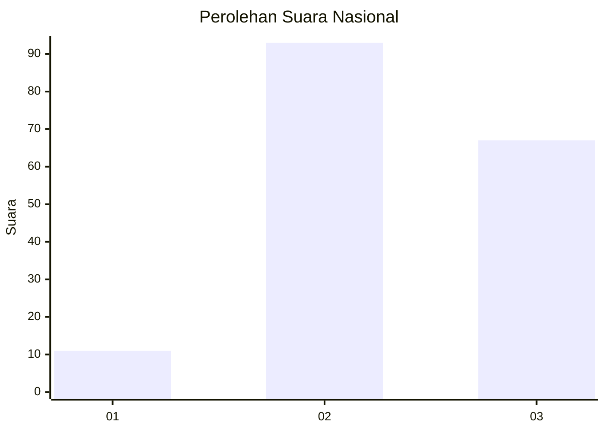
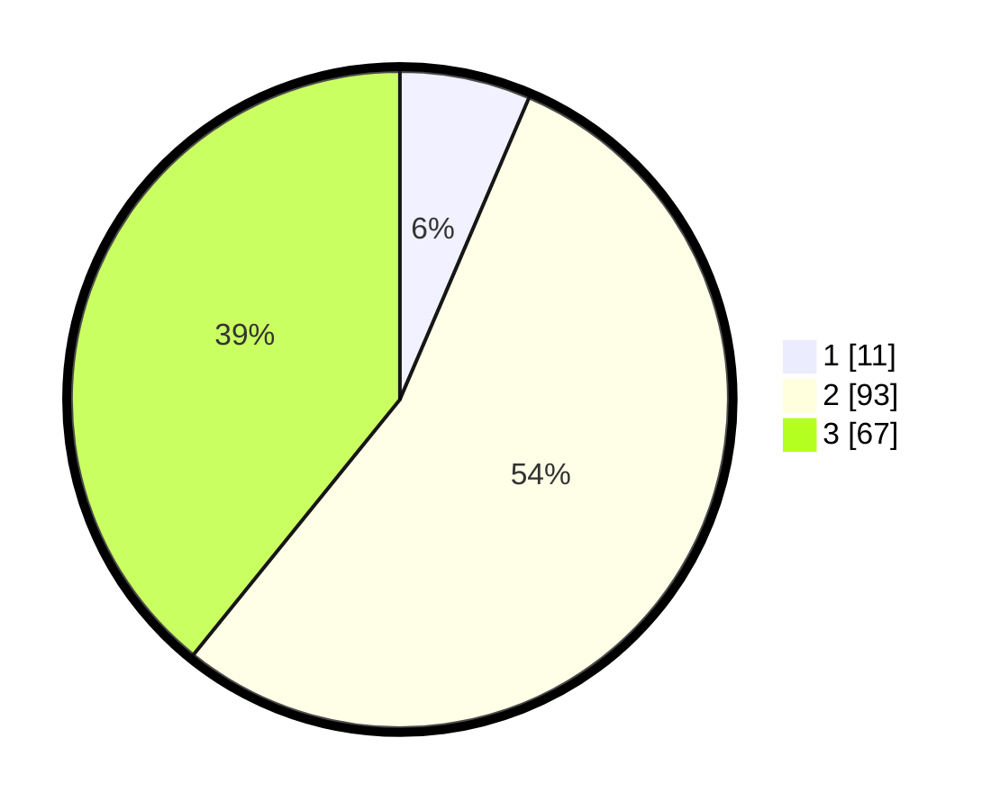

# Hasil

## Grafik

## Tabel

| No.    | Nama Paslon    | Suara | Suara (raw) | Persentase |
|:------ |:-------------- | -----:| -----------:| ----------:|
| 100025 | ANIES MUHAIMIN | 11    | [11][p-1]   | 6,43       |
| 100026 | PRABOWO GIBRAN | 93    | [93][p-2]   | 54,39      |
| 100027 | GANJAR MAHFUD  | 67    | [67][p-3]   | 39,18      |

[p-1]: https://github.com/gigit-pemilu/pemilu-2024/blob/main/pilpres/hitung-suara/sub/31-dki-jakarta/sub/75-jakarta-timur/sub/02-pulogadung/sub/1001-pulo-gadung/sub/099-tps/sub/paslon-1.txt
[p-2]: https://github.com/gigit-pemilu/pemilu-2024/blob/main/pilpres/hitung-suara/sub/31-dki-jakarta/sub/75-jakarta-timur/sub/02-pulogadung/sub/1001-pulo-gadung/sub/099-tps/sub/paslon-2.txt
[p-3]: https://github.com/gigit-pemilu/pemilu-2024/blob/main/pilpres/hitung-suara/sub/31-dki-jakarta/sub/75-jakarta-timur/sub/02-pulogadung/sub/1001-pulo-gadung/sub/099-tps/sub/paslon-3.txt

## Foto C Plano

https://sirekap-obj-formc.kpu.go.id/96c1/pemilu/ppwp/31/75/02/10/01/3175021001099-20240225-211704--9edea5a4-f16b-424d-b6c0-d181405bd70e.jpg

https://sirekap-obj-formc.kpu.go.id/96c1/pemilu/ppwp/31/75/02/10/01/3175021001099-20240214-235208--9311330a-3780-4bbf-b2d6-f0597dc32ca0.jpg

https://sirekap-obj-formc.kpu.go.id/96c1/pemilu/ppwp/31/75/02/10/01/3175021001099-20240214-234951--3772936a-c2d8-48fd-a4e4-5573950560d4.jpg

## Metadata

| Key        | Value               |
| ---------- | ------------------- |
| Time Stamp | 2024-02-25 22:00:00 |

