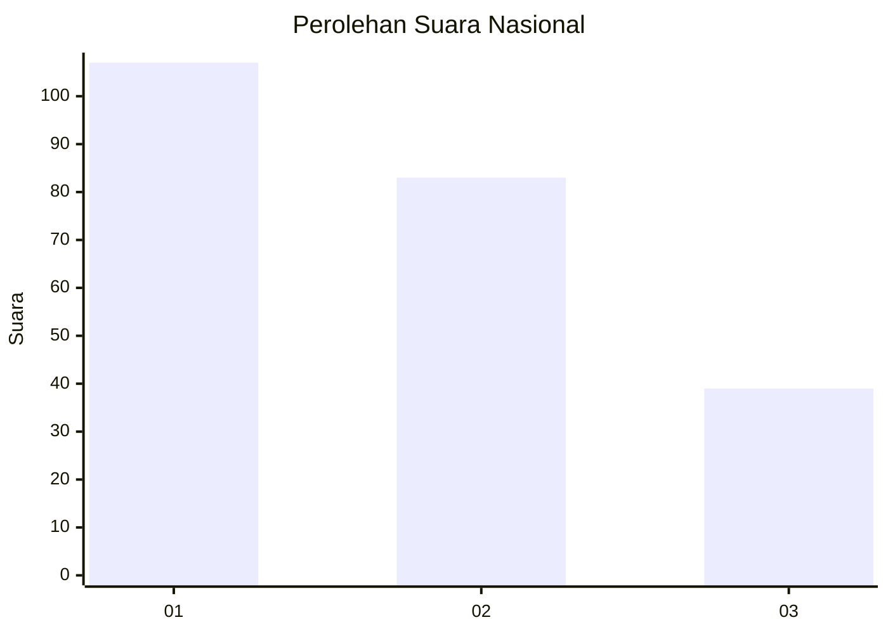
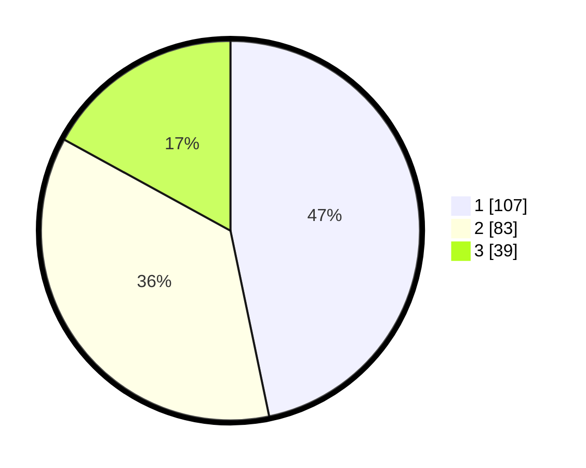

# Hasil

## Grafik

## Tabel

| No.    | Nama Paslon    | Suara | Suara (raw) | Persentase |
|:------ |:-------------- | -----:| -----------:| ----------:|
| 100025 | ANIES MUHAIMIN | 107   | [107][p-1]  | 46,72      |
| 100026 | PRABOWO GIBRAN | 83    | [83][p-2]   | 36,24      |
| 100027 | GANJAR MAHFUD  | 39    | [39][p-3]   | 17,03      |

[p-1]: https://github.com/gigit-pemilu/pemilu-2024/blob/main/pilpres/hitung-suara/sub/31-dki-jakarta/sub/75-jakarta-timur/sub/02-pulogadung/sub/1002-pisangan-timur/sub/006-tps/sub/paslon-1.txt
[p-2]: https://github.com/gigit-pemilu/pemilu-2024/blob/main/pilpres/hitung-suara/sub/31-dki-jakarta/sub/75-jakarta-timur/sub/02-pulogadung/sub/1002-pisangan-timur/sub/006-tps/sub/paslon-2.txt
[p-3]: https://github.com/gigit-pemilu/pemilu-2024/blob/main/pilpres/hitung-suara/sub/31-dki-jakarta/sub/75-jakarta-timur/sub/02-pulogadung/sub/1002-pisangan-timur/sub/006-tps/sub/paslon-3.txt

## Foto C Plano

https://sirekap-obj-formc.kpu.go.id/07b2/pemilu/ppwp/31/75/02/10/02/3175021002006-20240214-195524--72910f28-1b3c-435b-9f6b-b4706153cfe8.jpg

https://sirekap-obj-formc.kpu.go.id/07b2/pemilu/ppwp/31/75/02/10/02/3175021002006-20240222-110719--6d21c2db-f9c7-4411-ab94-0dd51a9498ee.jpg

https://sirekap-obj-formc.kpu.go.id/07b2/pemilu/ppwp/31/75/02/10/02/3175021002006-20240214-193413--11657ebb-29eb-457b-bb4b-d3a87d9fe135.jpg

## Metadata

| Key        | Value               |
| ---------- | ------------------- |
| Time Stamp | 2024-02-24 22:31:28 |

